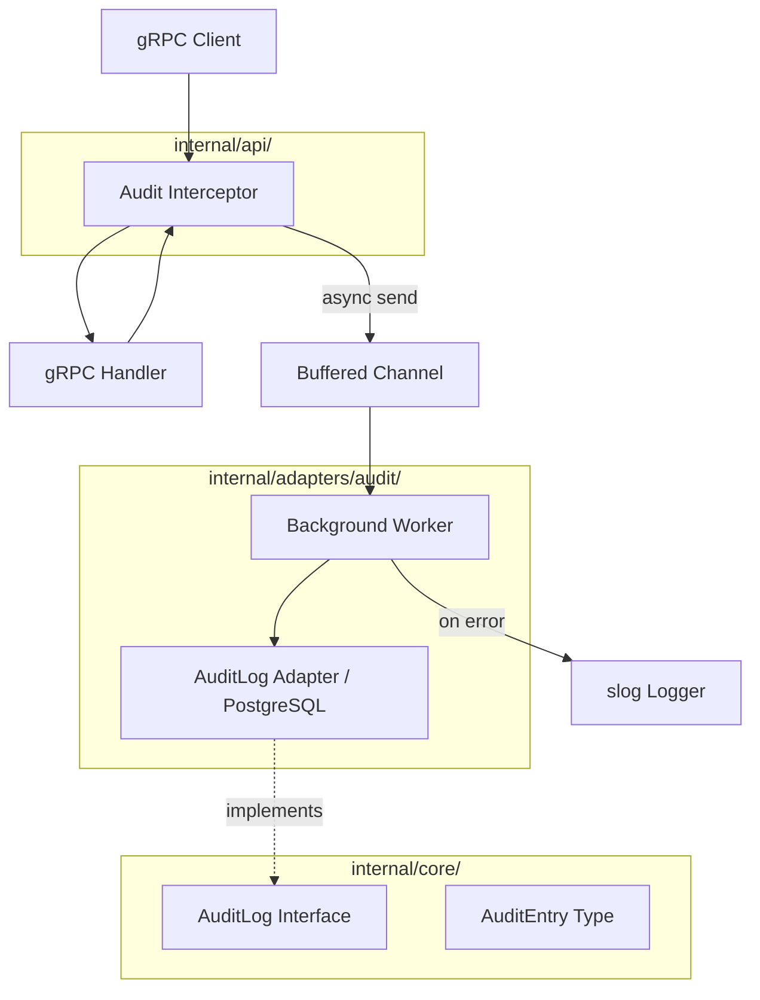

# Дизайн-документ: Аудит-логирование

## Обзор

Аудит-логирование реализуется как сквозная функциональность (cross-cutting concern) через gRPC UnaryServerInterceptor. Интерсептор перехватывает все unary-вызовы, измеряет длительность, извлекает метаданные из контекста и ответа, а затем асинхронно отправляет аудит-запись в буферизированный канал. Фоновый воркер читает из канала и записывает в PostgreSQL через интерфейс `AuditLog`.

Такой подход обеспечивает:
- Нулевое влияние на латентность gRPC-вызовов (асинхронная запись)
- Отсутствие изменений в бизнес-логике (Core остаётся без зависимости от аудита)
- Простую замену хранилища (интерфейс `AuditLog` в domain.go)
- Graceful degradation при сбоях записи

## Архитектура



Поток данных:
1. gRPC-запрос поступает в `AuditInterceptor`
2. Интерсептор извлекает peer-адрес, запоминает время начала, вызывает handler
3. После завершения handler интерсептор формирует `AuditEntry` (включая длительность, статус, метаданные из ответа)
4. `AuditEntry` отправляется в буферизированный канал (неблокирующий `select`)
5. Фоновый воркер читает из канала и вызывает `AuditLog.Save()`
6. При ошибке записи — логирование через slog, при полном канале — логирование предупреждения и отброс события

### Решение: Интерсептор vs. Middleware в Core

Аудит реализуется на уровне gRPC-интерсептора, а не в Core, потому что:
- Аудит — инфраструктурная задача, не бизнес-логика
- Интерсептор имеет доступ к gRPC-контексту (peer address, method name, status codes)
- Не требуется модификация Core или API handlers
- Легко включить/отключить через конфигурацию сервера

### Решение: Один воркер vs. Пул воркеров

Используется один фоновый воркер (горутина), читающий из канала. Это достаточно для текущей нагрузки и проще в реализации. При необходимости масштабирования можно запустить несколько воркеров без изменения интерфейса.

## Компоненты и интерфейсы

### 1. Доменный слой (`internal/core/domain.go`)

Добавляются тип `AuditEntry` и интерфейс `AuditLog`:

```go
// AuditEntry представляет одну запись аудит-журнала.
type AuditEntry struct {
    ID            uuid.UUID
    OperationType string    // "GENERATE_CODE" или "LIST_PLUGINS"
    PluginName    string    // nullable: "group/name:version"
    CallerAddress string
    Status        string    // "success" или "error"
    ErrorCode     string    // nullable: gRPC status code
    ErrorMessage  string    // nullable
    DurationMs    int64
    Metadata      map[string]any // доп. данные: file_count, plugin_count
    CreatedAt     time.Time
}

// AuditLog определяет интерфейс для записи аудит-событий.
type AuditLog interface {
    // Save сохраняет аудит-запись в хранилище.
    Save(ctx context.Context, entry AuditEntry) error
}
```

### 2. Аудит-интерсептор (`internal/api/audit_interceptor.go`)

```go
// AuditInterceptor создаёт gRPC UnaryServerInterceptor для аудит-логирования.
type AuditInterceptor struct {
    entries chan<- core.AuditEntry
    logger  *slog.Logger
}

// UnaryServerInterceptor возвращает grpc.UnaryServerInterceptor.
func (a *AuditInterceptor) UnaryServerInterceptor() grpc.UnaryServerInterceptor
```

Логика интерсептора:
- Извлекает peer address через `peer.FromContext(ctx)`
- Маппинг метода: `/api.generator.v1.ServiceAPI/GenerateCode` → `GENERATE_CODE`, `/api.generator.v1.ServiceAPI/Plugins` → `LIST_PLUGINS`
- Измеряет длительность через `time.Since(start)`
- Извлекает метаданные из ответа: `file_count` из `GenerateCodeResponse`, `plugin_count` из `PluginsResponse`
- Отправляет `AuditEntry` в канал через неблокирующий `select` с `default` (при полном канале — логирует предупреждение)

### 3. Аудит-адаптер (`internal/adapters/audit/audit.go`)

```go
// Store реализует core.AuditLog для PostgreSQL.
type Store struct {
    db     *sqlx.DB
    logger *slog.Logger
}

// New создаёт новый Store.
func New(db *sqlx.DB, logger *slog.Logger) *Store

// Save реализует core.AuditLog.
func (s *Store) Save(ctx context.Context, entry core.AuditEntry) error
```

### 4. Background Worker (`internal/adapters/audit/worker.go`)

```go
// Worker читает аудит-события из канала и записывает их в хранилище.
type Worker struct {
    store   core.AuditLog
    entries <-chan core.AuditEntry
    logger  *slog.Logger
    done    chan struct{}
}

// NewWorker создаёт воркер с буферизированным каналом.
func NewWorker(store core.AuditLog, bufferSize int, logger *slog.Logger) (*Worker, chan<- core.AuditEntry)

// Run запускает воркер. Блокирует до закрытия канала entries.
func (w *Worker) Run(ctx context.Context)

// Shutdown закрывает канал и ожидает завершения записи с таймаутом 5 секунд.
func (w *Worker) Shutdown(timeout time.Duration) int
```

`Shutdown` возвращает количество потерянных событий (если таймаут истёк).

### 5. Интеграция в `cmd/main.go`

```go
// В функции run():
auditStore := audit.New(r.DB(), log)
auditWorker, auditCh := audit.NewWorker(auditStore, 1000, log)

go auditWorker.Run(ctx)

grpcSrv := api.New(ctx, module, auditCh) // передаём канал в api.New

// При завершении:
lost := auditWorker.Shutdown(5 * time.Second)
if lost > 0 {
    log.Warn("audit events lost on shutdown", "count", lost)
}
```

### 6. Изменение `api.New` — цепочка интерсепторов

Текущий `api.New` использует `grpc.UnaryInterceptor` (один интерсептор). Для добавления аудит-интерсептора используем `grpc.ChainUnaryInterceptor`:

```go
func New(ctx context.Context, applications *core.Core, auditCh chan<- core.AuditEntry) *grpc.Server {
    log := monitor.FromContext(ctx)

    auditInterceptor := &AuditInterceptor{entries: auditCh, logger: log}

    srv := grpc.NewServer(
        grpc.ChainUnaryInterceptor(
            auditInterceptor.UnaryServerInterceptor(), // аудит первый — измеряет полную длительность
            errorInterceptor(log),                      // обработка ошибок
        ),
    )
    // ...
}
```

Аудит-интерсептор идёт первым в цепочке, чтобы измерять полную длительность включая обработку ошибок.

## Модели данных

### Таблица `audit_log` (PostgreSQL)

```sql
-- migrate/3.audit_log.sql
CREATE TABLE IF NOT EXISTS audit_log (
    id              UUID        NOT NULL DEFAULT gen_random_uuid(),
    operation_type  TEXT        NOT NULL,
    plugin_name     TEXT,
    caller_address  TEXT        NOT NULL,
    status          TEXT        NOT NULL,
    error_code      TEXT,
    error_message   TEXT,
    duration_ms     BIGINT      NOT NULL,
    metadata        JSONB       NOT NULL DEFAULT '{}',
    created_at      TIMESTAMPTZ NOT NULL DEFAULT now(),

    PRIMARY KEY (id)
);

CREATE INDEX IF NOT EXISTS idx_audit_log_created_at ON audit_log (created_at);
CREATE INDEX IF NOT EXISTS idx_audit_log_operation_type ON audit_log (operation_type);
```

Файл миграции следует существующему паттерну: `migrate/3.audit_log.sql` (после `1.init.sql` и `2.example_plugins.sql`).

### Маппинг gRPC-метод → Operation Type

| gRPC Full Method | Operation Type |
|---|---|
| `/api.generator.v1.ServiceAPI/GenerateCode` | `GENERATE_CODE` |
| `/api.generator.v1.ServiceAPI/Plugins` | `LIST_PLUGINS` |

Неизвестные методы (health check, reflection) игнорируются интерсептором.

### Поле `metadata` (JSONB)

Для `GENERATE_CODE`:
```json
{"file_count": 5}
```

Для `LIST_PLUGINS`:
```json
{"plugin_count": 12}
```


## Свойства корректности (Correctness Properties)

*Свойство (property) — это характеристика или поведение, которое должно выполняться при всех допустимых исполнениях системы. По сути, это формальное утверждение о том, что система должна делать. Свойства служат мостом между человекочитаемыми спецификациями и машинно-проверяемыми гарантиями корректности.*

### Property 1: Корректность формирования аудит-записи интерсептором

*Для любого* gRPC unary-вызова к известному методу (GenerateCode или Plugins) с произвольным peer-адресом в контексте, интерсептор должен сформировать `AuditEntry`, в которой: `operation_type` соответствует маппингу метода, `caller_address` равен peer-адресу из контекста, `duration_ms` >= 0 и отражает реальное время выполнения handler, `status` равен "success" при отсутствии ошибки и "error" при наличии.

**Validates: Requirements 1.1, 2.1, 5.2, 5.3**

### Property 2: Корректность извлечения метаданных из ответа

*Для любого* завершённого gRPC-вызова: если вызов GenerateCode завершился с ошибкой, `AuditEntry` должна содержать `error_code` и `error_message` из gRPC status; если GenerateCode завершился успешно, `metadata` должна содержать `file_count` равный количеству файлов в `CodeGeneratorResponse`; если Plugins завершился успешно, `metadata` должна содержать `plugin_count` равный количеству плагинов в ответе.

**Validates: Requirements 1.2, 1.3, 2.2**

### Property 3: Round-trip сохранения аудит-записи

*Для любой* валидной `AuditEntry` с произвольными значениями полей, после вызова `AuditLog.Save()` и последующего чтения записи из таблицы `audit_log` по `id`, все поля должны совпадать с исходными значениями (включая корректную сериализацию/десериализацию `metadata` JSONB).

**Validates: Requirements 3.1**

### Property 4: Маппинг gRPC-метода в Operation Type

*Для любого* полного имени gRPC-метода из набора известных методов, функция маппинга должна возвращать корректный `operation_type`: `/api.generator.v1.ServiceAPI/GenerateCode` → `GENERATE_CODE`, `/api.generator.v1.ServiceAPI/Plugins` → `LIST_PLUGINS`. Для неизвестных методов функция должна возвращать пустую строку (метод игнорируется).

**Validates: Requirements 5.4**

### Property 5: Graceful degradation при ошибке записи

*Для любой* последовательности `AuditEntry`, если `AuditLog.Save()` возвращает ошибку для некоторых записей, воркер должен залогировать ошибку и продолжить обработку оставшихся записей из канала без остановки.

**Validates: Requirements 4.1**

### Property 6: Неблокирующая отправка в канал

*Для любой* `AuditEntry`, отправка в буферизированный канал из интерсептора не должна блокировать выполнение gRPC-вызова. Если канал заполнен, событие отбрасывается, и интерсептор возвращает управление немедленно.

**Validates: Requirements 4.2, 4.3**

### Property 7: Полный сброс буфера при завершении

*Для любого* набора `AuditEntry` в буферизированном канале на момент получения сигнала завершения, если запись всех событий занимает менее 5 секунд, все события должны быть сохранены через `AuditLog.Save()`. Количество сохранённых записей должно равняться количеству записей в канале на момент закрытия.

**Validates: Requirements 7.1, 7.2**

## Обработка ошибок

| Сценарий | Поведение | Логирование |
|---|---|---|
| Ошибка `AuditLog.Save()` | Воркер логирует ошибку, продолжает обработку следующих событий | `slog.Error("audit save failed", "error", err, "entry_id", entry.ID)` |
| Канал заполнен | Интерсептор отбрасывает событие, не блокирует gRPC-вызов | `slog.Warn("audit buffer full, event dropped", "method", info.FullMethod)` |
| Peer address отсутствует в контексте | Используется значение `"unknown"` | — |
| Неизвестный gRPC-метод | Интерсептор пропускает аудит, вызывает handler без записи | — |
| Таймаут при shutdown (>5с) | Воркер прерывает запись, возвращает количество потерянных событий | `slog.Warn("audit shutdown timeout", "lost_events", count)` |
| Ошибка маршалинга metadata в JSON | Используется пустой `{}` | `slog.Error("audit metadata marshal failed", "error", err)` |

## Стратегия тестирования

### Подход

Используется двойной подход к тестированию:
- **Unit-тесты** — проверяют конкретные примеры, граничные случаи и интеграционные точки
- **Property-based тесты** — проверяют универсальные свойства на множестве сгенерированных входных данных

Оба подхода дополняют друг друга: unit-тесты ловят конкретные баги, property-тесты гарантируют общую корректность.

### Библиотека для property-based тестирования

Используется [rapid](https://github.com/flyingmutant/rapid) — библиотека property-based тестирования для Go. Она интегрируется с `testing.T`, поддерживает shrinking и генераторы.

### Конфигурация property-тестов

- Минимум 100 итераций на каждый property-тест
- Каждый тест помечается комментарием с ссылкой на свойство из дизайн-документа
- Формат тега: `Feature: audit-logging, Property {number}: {property_text}`

### Unit-тесты

| Тест | Что проверяет |
|---|---|
| `TestAuditInterceptor_GenerateCode_Success` | Конкретный пример: успешный GenerateCode создаёт корректную AuditEntry |
| `TestAuditInterceptor_GenerateCode_Error` | Конкретный пример: ошибочный GenerateCode записывает error_code и error_message |
| `TestAuditInterceptor_Plugins_Success` | Конкретный пример: успешный Plugins создаёт AuditEntry с plugin_count |
| `TestAuditInterceptor_UnknownMethod` | Граничный случай: неизвестный метод не создаёт аудит-запись |
| `TestAuditInterceptor_NoPeerAddress` | Граничный случай: отсутствие peer address → "unknown" |
| `TestWorker_BufferFull` | Граничный случай: полный буфер → событие отброшено, предупреждение залогировано |
| `TestWorker_ShutdownTimeout` | Граничный случай: таймаут при shutdown → возвращает количество потерянных событий |
| `TestMigration_AuditLogTable` | Пример: миграция создаёт таблицу с правильной схемой и индексами |

### Property-тесты

Каждое свойство корректности (Property 1–7) реализуется одним property-based тестом:

| Тест | Свойство |
|---|---|
| `TestProperty_InterceptorEntryCreation` | Property 1: Корректность формирования аудит-записи |
| `TestProperty_MetadataExtraction` | Property 2: Корректность извлечения метаданных |
| `TestProperty_SaveRoundTrip` | Property 3: Round-trip сохранения |
| `TestProperty_MethodToOperationMapping` | Property 4: Маппинг метода в operation type |
| `TestProperty_GracefulDegradation` | Property 5: Graceful degradation при ошибке |
| `TestProperty_NonBlockingSend` | Property 6: Неблокирующая отправка |
| `TestProperty_ShutdownFlush` | Property 7: Полный сброс при завершении |
