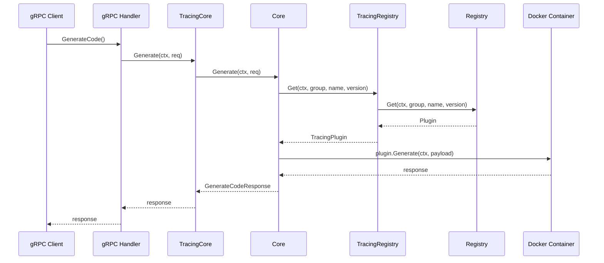
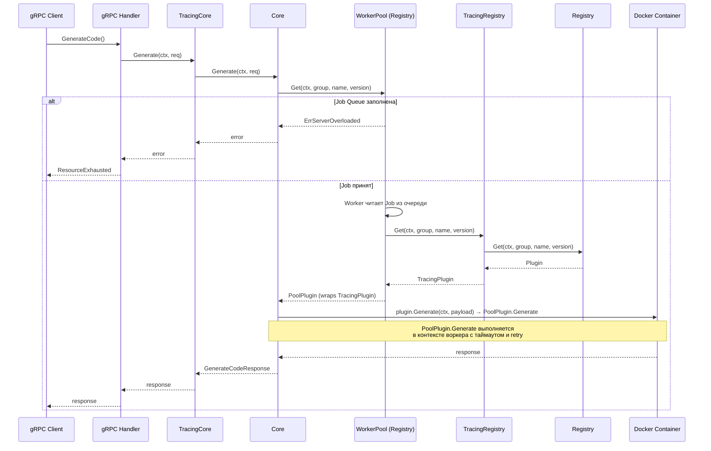

# Дизайн-документ: Generation Worker Pool

## Обзор

Данный дизайн описывает реализацию in-memory worker pool для ограничения параллелизма Docker-контейнеров при генерации protobuf/gRPC-кода. Текущая реализация `Core.Generate` вызывает `Registry.Get` → `plugin.Generate` (Docker) синхронно без контроля параллелизма. Worker pool вводит буферизированный канал (Job Queue) и фиксированное количество горутин-воркеров, ограничивая параллелизм на уровне Registry — именно там происходит обращение к БД и запуск Docker-контейнеров.

WorkerPool реализует интерфейс `Registry`, оборачивая реальный Registry (через TracingRegistry). Это позволяет контролировать параллелизм операций `Get` + `plugin.Generate` (Docker execution), не затрагивая `Core.Generate` и не меняя интерфейс `CoreService`.

Паттерн основан на существующем `audit.Worker` (`internal/adapters/audit/worker.go`), расширенном до N воркеров с поддержкой конфигурируемых таймаутов и повторных попыток.

### Ключевые решения

- WorkerPool реализует интерфейс `Registry`, а не `CoreService`. Это правильный уровень абстракции: параллелизм ограничивается именно на уровне Docker-выполнения (Registry.Get + plugin.Generate), а не на уровне бизнес-логики.
- `Core.Generate` остаётся без изменений — он вызывает `registry.Get` и `plugin.Generate` как раньше, но registry, которую он вызывает, это WorkerPool.
- Цепочка декораторов: `API → TracingCore → Core → WorkerPool(Registry) → TracingRegistry → Registry`. TracingCore span покрывает весь запрос, включая время ожидания в очереди.
- `ListPlugins` / `List` не проходит через очередь — WorkerPool проксирует `List()` напрямую во внутренний Registry.
- Файл реализации: `internal/core/pool.go` — WorkerPool оркестрирует бизнес-логику, связанную с ограничением ресурсов, и использует доменные типы из `core`.
- Конфигурация добавляется в существующий `config.yml` в секцию `worker_pool`.

## Архитектура

### Текущий поток запроса



### Новый поток запроса с Worker Pool




### Структура компонентов

```mermaid
graph TD
    A[config.yml] -->|worker_pool section| B[WorkerPoolConfig]
    B --> C[WorkerPool]
    C -->|implements| D[Registry interface]
    C -->|delegates to| E[TracingRegistry → Registry]
    C -->|manages| F[Worker goroutines]
    C -->|owns| G[Job Queue channel]
    F -->|reads from| G
    H[gRPC Handler] -->|calls| I[TracingCore]
    I -->|calls| J[Core]
    J -->|calls registry| C
```



### Место в цепочке декораторов

Текущая цепочка: `API → TracingCore → Core → TracingRegistry → Registry`

Новая цепочка: `API → TracingCore → Core → WorkerPool(Registry) → TracingRegistry → Registry`

WorkerPool встраивается между Core и TracingRegistry, реализуя интерфейс `Registry`. Core вызывает `registry.Get()` — но его registry теперь WorkerPool. WorkerPool ставит задание в очередь, воркер вызывает внутренний Registry (TracingRegistry → Registry), получает Plugin, оборачивает его в `poolPlugin` и возвращает Core. Когда Core вызывает `plugin.Generate()`, `poolPlugin` выполняет генерацию в контексте воркера с таймаутом и retry.

Метод `List()` проксируется напрямую во внутренний Registry без прохождения через очередь — он не запускает Docker-контейнеры.

TracingCore span теперь корректно покрывает весь запрос, включая время ожидания в очереди WorkerPool.

## Компоненты и интерфейсы

### WorkerPool

Файл: `internal/core/pool.go`

```go
// WorkerPool управляет пулом горутин для ограничения параллелизма Docker-выполнения.
// Реализует интерфейс Registry, оборачивая реальный Registry.
type WorkerPool struct {
    inner    Registry          // делегат (TracingRegistry → Registry)
    jobs     chan job           // буферизированный канал заданий
    cfg      WorkerPoolConfig
    logger   *slog.Logger
    wg       sync.WaitGroup
    closed   atomic.Bool
}
```

Методы:
- `NewWorkerPool(inner Registry, cfg WorkerPoolConfig, logger *slog.Logger) *WorkerPool` — конструктор, валидирует конфигурацию и применяет значения по умолчанию.
- `Start(ctx context.Context)` — запускает N горутин-воркеров, каждая читает из `jobs` канала.
- `Shutdown(timeout time.Duration) int` — закрывает канал `jobs`, ждёт завершения воркеров в пределах таймаута, возвращает количество потерянных заданий.
- `Get(ctx context.Context, pluginGroup, pluginName, pluginVersion string) (Plugin, error)` — создаёт Job, отправляет в очередь (non-blocking select), блокируется на канале ответа. Возвращает `poolPlugin`, который оборачивает реальный Plugin.
- `List(ctx context.Context, filter PluginFilter) ([]PluginInfo, error)` — проксирует напрямую в `inner.List`, без очереди.

### Job

```go
// job представляет единицу работы для воркера.
type job struct {
    ctx           context.Context
    pluginGroup   string
    pluginName    string
    pluginVersion string
    result        chan<- jobResult
}

// jobResult содержит результат обработки задания.
type jobResult struct {
    plugin Plugin
    err    error
}
```

Job содержит параметры уровня Registry (`pluginGroup`, `pluginName`, `pluginVersion`), а не `GenerateCodeRequest` — это соответствует интерфейсу `Registry.Get`.

### poolPlugin

```go
// poolPlugin оборачивает реальный Plugin, добавляя таймаут и retry при вызове Generate.
type poolPlugin struct {
    inner Plugin
    cfg   WorkerPoolConfig
    logger *slog.Logger
}
```

`poolPlugin` реализует интерфейс `Plugin`. Когда Core вызывает `plugin.Generate()`, `poolPlugin.Generate()` применяет `generation_timeout` и retry-логику:

```go
func (p *poolPlugin) Generate(ctx context.Context, req *pluginpb.CodeGeneratorRequest) (*pluginpb.CodeGeneratorResponse, error) {
    genCtx, cancel := context.WithTimeout(ctx, p.cfg.GenerationTimeout)
    defer cancel()

    var resp *pluginpb.CodeGeneratorResponse
    var err error

    maxAttempts := p.cfg.MaxRetries + 1
    for attempt := 1; attempt <= maxAttempts; attempt++ {
        if err := ctx.Err(); err != nil {
            return nil, err
        }

        resp, err = p.inner.Generate(genCtx, req)
        if err == nil {
            break
        }

        if !isTransient(err) || attempt == maxAttempts {
            break
        }

        p.logger.Warn("retrying generation",
            "attempt", attempt,
            "max_attempts", maxAttempts,
            "error", err,
        )
    }

    return resp, err
}

func (p *poolPlugin) Info(ctx context.Context) *PluginInfo {
    return p.inner.Info(ctx)
}
```

### WorkerPoolConfig

```go
// WorkerPoolConfig содержит параметры конфигурации worker pool.
type WorkerPoolConfig struct {
    Workers           int           `yaml:"workers" env:"WORKERS, default=4"`
    QueueSize         int           `yaml:"queue_size" env:"QUEUE_SIZE, default=16"`
    GenerationTimeout time.Duration `yaml:"generation_timeout" env:"GENERATION_TIMEOUT, default=120s"`
    MaxRetries        int           `yaml:"max_retries" env:"MAX_RETRIES, default=2"`
    ShutdownTimeout   time.Duration `yaml:"shutdown_timeout" env:"SHUTDOWN_TIMEOUT, default=30s"`
}
```

### Логика воркера (внутренняя функция)

```go
func (p *WorkerPool) worker(ctx context.Context) {
    defer p.wg.Done()
    for j := range p.jobs {
        p.processJob(ctx, j)
    }
}

func (p *WorkerPool) processJob(parentCtx context.Context, j job) {
    plugin, err := p.inner.Get(j.ctx, j.pluginGroup, j.pluginName, j.pluginVersion)
    if err != nil {
        j.result <- jobResult{err: err}
        return
    }

    // Оборачиваем Plugin в poolPlugin с таймаутом и retry
    wrapped := &poolPlugin{
        inner:  plugin,
        cfg:    p.cfg,
        logger: p.logger,
    }

    j.result <- jobResult{plugin: wrapped}
}
```

### Определение транзиентных ошибок

```go
// isTransient определяет, является ли ошибка временной (Docker daemon failure, timeout pull).
func isTransient(err error) bool {
    // exec.ExitError с определёнными кодами выхода Docker
    // context.DeadlineExceeded — таймаут
    // Ошибки, содержащие "connection refused", "daemon" и т.п.
}
```

### Backpressure (non-blocking send) — Get

```go
func (p *WorkerPool) Get(ctx context.Context, pluginGroup, pluginName, pluginVersion string) (Plugin, error) {
    if p.closed.Load() {
        return nil, ErrShuttingDown
    }

    resultCh := make(chan jobResult, 1)
    j := job{
        ctx:           ctx,
        pluginGroup:   pluginGroup,
        pluginName:    pluginName,
        pluginVersion: pluginVersion,
        result:        resultCh,
    }

    select {
    case p.jobs <- j:
        // Job принят в очередь
    default:
        p.logger.Warn("job queue full, rejecting request")
        return nil, ErrServerOverloaded
    }

    select {
    case res := <-resultCh:
        return res.plugin, res.err
    case <-ctx.Done():
        return nil, ctx.Err()
    }
}
```

### List — прямой проксирование

```go
func (p *WorkerPool) List(ctx context.Context, filter PluginFilter) ([]PluginInfo, error) {
    return p.inner.List(ctx, filter)
}
```

### Graceful Shutdown

```go
func (p *WorkerPool) Shutdown(timeout time.Duration) int {
    p.closed.Store(true)
    close(p.jobs)

    done := make(chan struct{})
    go func() {
        p.wg.Wait()
        close(done)
    }()

    select {
    case <-done:
        return 0
    case <-time.After(timeout):
        lost := len(p.jobs)
        p.logger.Warn("shutdown timeout, jobs lost", "count", lost)
        return lost
    }
}
```

### Интеграция в main.go

```go
// В функции run():
poolCfg := cfg.WorkerPool

// Wrap Registry в tracing decorator
tracedRegistry := telemetry.NewTracingRegistry(r)

// Wrap TracingRegistry в WorkerPool (ограничение параллелизма Docker)
pool := core.NewWorkerPool(tracedRegistry, poolCfg, log)
pool.Start(ctx)

defer func() {
    lost := pool.Shutdown(poolCfg.ShutdownTimeout)
    if lost > 0 {
        log.Warn("generation jobs lost on shutdown", "count", lost)
    }
}()

// Core получает pool как Registry — он не знает о WorkerPool
module := core.New(adapter_metrics.New(reg, namespace), pool)

// Wrap Core в tracing decorator
tracedCore := telemetry.NewTracingCore(module)
grpcSrv := api.New(ctx, tracedCore, auditCh)
```

Цепочка вызовов: `API → TracingCore → Core → WorkerPool(Registry) → TracingRegistry → Registry`

### Новые ошибки в domain.go

```go
var (
    ErrServerOverloaded = errors.New("server overloaded")
    ErrShuttingDown     = errors.New("server shutting down")
)
```

### Маппинг ошибок в apiError

Ошибки `ErrServerOverloaded` и `ErrShuttingDown` теперь возникают на уровне Registry (WorkerPool), но всплывают через `Core.Generate` → `TracingCore` → API. Функция `apiError` в `internal/api/api.go` должна быть расширена:

```go
func apiError(err error) *status.Status {
    if err == nil {
        return nil
    }

    code := codes.Internal
    switch {
    case errors.Is(err, core.ErrNotFound):
        code = codes.NotFound
    case errors.Is(err, core.ErrInvalidPluginName):
        code = codes.InvalidArgument
    case errors.Is(err, core.ErrGenerationFailed):
        code = codes.Internal
    case errors.Is(err, core.ErrServerOverloaded):
        code = codes.ResourceExhausted
    case errors.Is(err, core.ErrShuttingDown):
        code = codes.Unavailable
    case errors.Is(err, context.DeadlineExceeded):
        code = codes.DeadlineExceeded
    case errors.Is(err, context.Canceled):
        code = codes.Canceled
    }

    return status.New(code, err.Error())
}
```

## Модели данных

### Конфигурация (config.yml)

Новая секция `worker_pool` в `config.yml`:

```yaml
worker_pool:
  workers: 4              # количество горутин-воркеров
  queue_size: 16           # размер буфера Job Queue
  generation_timeout: 120s # таймаут генерации одного задания
  max_retries: 2           # максимальное количество повторных попыток
  shutdown_timeout: 30s    # таймаут graceful shutdown
```

### Структура config в main.go

Добавляется поле `WorkerPool` в структуру `config`:

```go
type config struct {
    Server     server           `yaml:"server" env:", prefix=SERVER_"`
    DB         dbConfig         `yaml:"db" env:", prefix=DB_"`
    Registry   registryConfig   `yaml:"registry" env:", prefix=REGISTRY_"`
    Telemetry  telemetryConfig  `yaml:"telemetry" env:", prefix=TELEMETRY_"`
    WorkerPool core.WorkerPoolConfig `yaml:"worker_pool" env:", prefix=WORKER_POOL_"`
}
```

### Значения по умолчанию

| Параметр | Значение по умолчанию | Условие применения |
|---|---|---|
| `workers` | 1 | Если значение < 1 |
| `queue_size` | 0 (unbuffered) | Если значение < 0 |
| `generation_timeout` | 120s | Если не задано или 0 |
| `max_retries` | 2 | Если не задано или 0 |
| `shutdown_timeout` | 30s | Если не задано или 0 |


## Корректностные свойства

*Свойство (property) — это характеристика или поведение, которое должно выполняться при всех допустимых исполнениях системы. По сути, это формальное утверждение о том, что система должна делать. Свойства служат мостом между человекочитаемыми спецификациями и машинно-верифицируемыми гарантиями корректности.*

### Свойство 1: Нормализация конфигурации

*Для любой* конфигурации `WorkerPoolConfig`, где `workers < 1`, `queue_size < 0`, `generation_timeout == 0`, `max_retries == 0` или `shutdown_timeout == 0`, после нормализации эффективные значения должны быть: `workers = 1`, `queue_size = 0`, `generation_timeout = 120s`, `max_retries = 2`, `shutdown_timeout = 30s` соответственно. Для валидных значений нормализация не должна их изменять.

**Validates: Requirements 1.3, 1.4, 4.4, 5.4**

### Свойство 2: Round-trip задания через пул

*Для любых* валидных параметров плагина (`pluginGroup`, `pluginName`, `pluginVersion`), если пул имеет свободную ёмкость и внутренний `Registry.Get` возвращает Plugin `P`, то `WorkerPool.Get` должен вернуть `poolPlugin`, оборачивающий `P`. При вызове `poolPlugin.Generate` с payload `R`, если внутренний `Plugin.Generate` возвращает результат `S`, то `poolPlugin.Generate` должен вернуть тот же результат `S`.

**Validates: Requirements 2.1, 2.2**

### Свойство 3: Backpressure при заполненной очереди

*Для любого* пула с `queue_size = 0` и единственным воркером, занятым обработкой задания, следующий вызов `Get` должен немедленно вернуть ошибку `ErrServerOverloaded`.

**Validates: Requirements 2.3**

### Свойство 4: Последовательная обработка в рамках одного воркера

*Для любого* пула с `workers = 1` и последовательности из N заданий, временные интервалы обработки заданий не должны пересекаться — каждое следующее задание начинает обработку только после завершения предыдущего.

**Validates: Requirements 3.3**

### Свойство 5: Таймаут генерации

*Для любого* задания, где внутренний `Plugin.Generate` выполняется дольше `generation_timeout`, `poolPlugin.Generate` должен вернуть ошибку `context.DeadlineExceeded`.

**Validates: Requirements 4.3**

### Свойство 6: Повторные попытки при транзиентных ошибках

*Для любого* задания, где внутренний `Plugin.Generate` возвращает транзиентную ошибку K раз подряд (K ≤ max_retries), а затем успех, `poolPlugin.Generate` должен вернуть успешный результат. Если все `max_retries + 1` попыток завершаются транзиентной ошибкой, должна быть возвращена последняя ошибка.

**Validates: Requirements 5.1, 5.3**

### Свойство 7: Отмена контекста прекращает повторные попытки

*Для любого* задания с отменённым контекстом, `poolPlugin.Generate` должен прекратить повторные попытки и вернуть ошибку отмены контекста. Количество фактических вызовов `Plugin.Generate` должно быть меньше `max_retries + 1`.

**Validates: Requirements 5.5**

### Свойство 8: Shutdown отклоняет новые задания

*Для любого* пула, после вызова `Shutdown`, все последующие вызовы `Get` должны возвращать ошибку `ErrShuttingDown`.

**Validates: Requirements 6.1**

### Свойство 9: Shutdown дожидается текущих заданий

*Для любого* пула с N заданиями в обработке, `Shutdown` с достаточным таймаутом должен дождаться завершения всех N заданий и вернуть 0 потерянных. При недостаточном таймауте `Shutdown` должен вернуть количество потерянных заданий > 0.

**Validates: Requirements 6.2, 6.3**

## Обработка ошибок

### Классификация ошибок

| Ошибка | Источник | Обработка | gRPC код |
|---|---|---|---|
| Очередь заполнена | `WorkerPool.Get` | Немедленный отказ, `ErrServerOverloaded` | `ResourceExhausted` |
| Сервер завершается | `WorkerPool.Get` | Немедленный отказ, `ErrShuttingDown` | `Unavailable` |
| Таймаут генерации | `poolPlugin.Generate` | Отмена контекста | `DeadlineExceeded` |
| Транзиентная ошибка Docker | `poolPlugin.Generate` | Retry до max_retries | Зависит от последней ошибки |
| Нетранзиентная ошибка | `poolPlugin.Generate` | Немедленный возврат | `Internal` |
| Контекст клиента отменён | `WorkerPool.Get` / `poolPlugin.Generate` | Прекращение обработки | `Canceled` |

### Путь ошибок через цепочку

Ошибки `ErrServerOverloaded` и `ErrShuttingDown` возникают в `WorkerPool.Get` (уровень Registry). Они всплывают через:
1. `WorkerPool.Get` → возвращает `ErrServerOverloaded` / `ErrShuttingDown`
2. `Core.Generate` → оборачивает в `fmt.Errorf("c.registry.Get: %w", err)`
3. `TracingCore.Generate` → записывает в span, возвращает дальше
4. `API.GenerateCode` → оборачивает в `fmt.Errorf("api.app.Generate: %w", err)`
5. `errorInterceptor` → вызывает `apiError(err)` → `errors.Is` находит sentinel через цепочку `%w`

### Определение транзиентных ошибок

Транзиентными считаются:
- `exec.ExitError` с кодами выхода 125 (Docker daemon error), 126 (permission denied), 127 (command not found — image pull failure)
- Ошибки, содержащие подстроки: `"connection refused"`, `"daemon"`, `"temporary failure"`
- `context.DeadlineExceeded` НЕ считается транзиентной (таймаут — это таймаут)

### Каскад ошибок при Shutdown

1. `Shutdown()` вызван → `closed = true` → новые `Get()` возвращают `ErrShuttingDown`
2. `close(jobs)` → воркеры завершают текущие задания и выходят из цикла `range`
3. Если таймаут истёк → `Shutdown` возвращает количество заданий, оставшихся в канале
4. Задания, чьи контексты были отменены клиентом, обрабатываются через `ctx.Done()` в `Get`

## Стратегия тестирования

### Подход

Используется двойной подход к тестированию:
- **Unit-тесты**: конкретные примеры, edge cases, интеграционные точки
- **Property-тесты**: универсальные свойства, проверяемые на множестве сгенерированных входных данных

### Библиотека для property-based тестирования

**[rapid](https://github.com/flyingmutant/rapid)** — библиотека property-based тестирования для Go. Выбрана за:
- Нативную интеграцию с `testing.T`
- Поддержку shrinking (минимизация контрпримеров)
- Активную поддержку и совместимость с Go modules

### Конфигурация property-тестов

- Минимум 100 итераций на каждый property-тест
- Каждый тест помечается комментарием с ссылкой на свойство из дизайн-документа
- Формат тега: **Feature: generation-worker-pool, Property {N}: {описание}**
- Каждое корректностное свойство реализуется ОДНИМ property-тестом

### Unit-тесты

Unit-тесты фокусируются на:
- Конкретные примеры конфигурации (workers=4, queue_size=16)
- Edge cases: workers=0, queue_size=-1, generation_timeout=0
- Интеграция с mock Registry и mock Plugin
- Проверка gRPC кодов ошибок (ResourceExhausted, DeadlineExceeded, Unavailable) через `apiError`
- Graceful shutdown с конкретными сценариями (0 заданий, 1 задание, таймаут)
- Проверка что `List()` проксируется напрямую без очереди

### Property-тесты

Каждое из 9 корректностных свойств реализуется отдельным property-тестом:

1. **TestProperty_ConfigNormalization** — генерация случайных конфигураций, проверка нормализации
2. **TestProperty_JobRoundTrip** — генерация случайных параметров плагина, проверка идентичности результата через WorkerPool.Get + poolPlugin.Generate
3. **TestProperty_BackpressureRejection** — генерация случайных размеров очереди, проверка отказа при переполнении
4. **TestProperty_SequentialProcessing** — генерация последовательностей заданий, проверка отсутствия пересечений
5. **TestProperty_GenerationTimeout** — генерация случайных таймаутов и задержек, проверка DeadlineExceeded
6. **TestProperty_TransientRetry** — генерация случайных последовательностей ошибок, проверка retry-логики
7. **TestProperty_ContextCancellationStopsRetries** — генерация случайных моментов отмены, проверка прекращения retry
8. **TestProperty_ShutdownRejectsNewJobs** — генерация случайных состояний пула, проверка отказа после shutdown
9. **TestProperty_ShutdownWaitsForInFlight** — генерация случайных количеств in-flight заданий, проверка ожидания

### Файловая структура тестов

```
internal/core/
├── pool.go           # реализация WorkerPool + poolPlugin
├── pool_test.go      # unit-тесты
└── pool_prop_test.go # property-тесты
```
