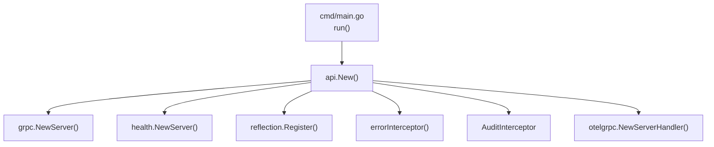
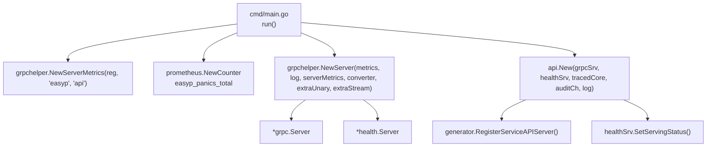
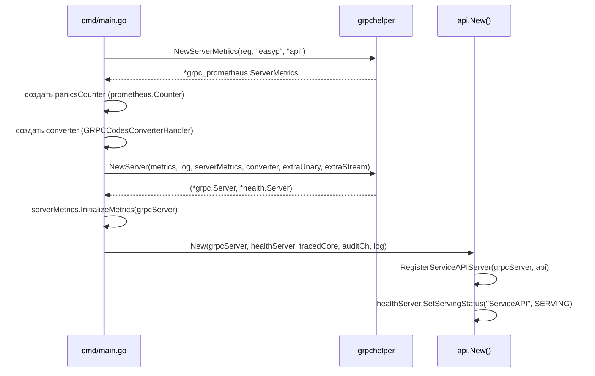

# Дизайн-документ: Интеграция grpchelper

## Обзор

Интеграция библиотеки `internal/grpchelper` в сервис `easyp-tech/service` для замены ручной настройки gRPC-сервера. Основные задачи:

1. Адаптация импортов grpchelper — замена `sipki-tech/back-template` на локальные пакеты проекта
2. Рефакторинг `internal/api/api.go` — делегирование создания gRPC-сервера в `cmd/main.go` через `grpchelper.NewServer()`
3. Реализация `GRPCCodesConverter` на основе существующей функции `apiError`
4. Обеспечение совместимости метрик с Grafana Dashboard

### Принципы проектирования

- Минимальные изменения в grpchelper — только замена импортов и определение локального интерфейса метрик
- Инверсия зависимостей — grpchelper определяет свой интерфейс `Metrics`, а не импортирует внешний
- Разделение ответственности — создание gRPC-сервера в `cmd/main.go`, регистрация обработчиков в `api.New()`

## Архитектура

### Текущая архитектура

### Целевая архитектура

### Поток данных при создании сервера

