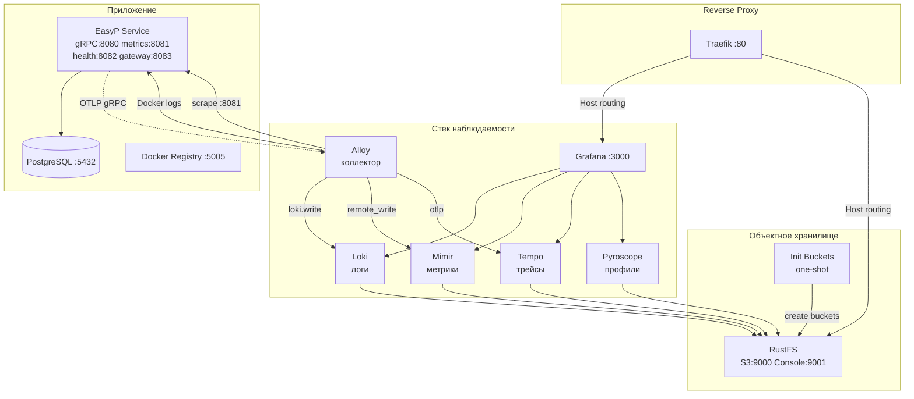
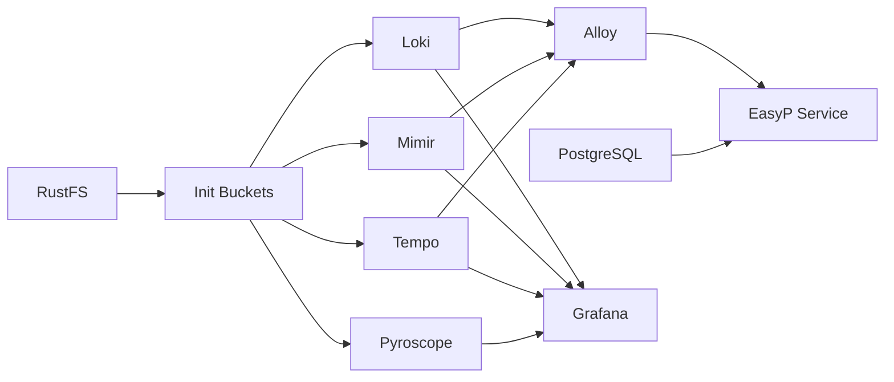

# Дизайн: Миграция стека наблюдаемости

## Обзор

Данный дизайн описывает миграцию инфраструктуры наблюдаемости EasyP с текущего стека (Prometheus + Loki + Promtail + Grafana) на полный стек Grafana LGTM+ (Loki, Grafana, Tempo, Mimir, Pyroscope) с Alloy в качестве унифицированного коллектора, RustFS как S3-совместимым хранилищем и Traefik как reverse proxy.

Область изменений — исключительно инфраструктурные файлы: `docker-compose.yml` и конфигурационные файлы в `./configs/`. Go-код сервиса EasyP не изменяется в рамках данного спека.

### Ключевые решения

1. **RustFS вместо MinIO** — легковесное S3-совместимое хранилище для локальной разработки
2. **Alloy вместо Promtail** — единый коллектор для логов, метрик (scrape + remote write) и трейсов (OTLP relay)
3. **Mimir вместо Prometheus** — масштабируемое хранилище метрик с S3-бэкендом
4. **Tempo** — распределённый трейсинг с S3-бэкендом (приём OTLP)
5. **Pyroscope** — непрерывное профилирование с S3-бэкендом
6. **Traefik** — reverse proxy с автоматическим обнаружением сервисов через Docker labels
7. **Директория `./configs/`** — замена `./infrastructure/` для единообразной структуры конфигов

## Архитектура

### Диаграмма сервисов



### Порядок запуска сервисов



Зависимости:
- `init-buckets` зависит от `rustfs` (`service_healthy`)
- `loki`, `mimir`, `tempo`, `pyroscope` зависят от `init-buckets` (`service_completed_successfully`)
- `alloy` зависит от `loki`, `mimir`, `tempo` (`service_started`)
- `grafana` зависит от `loki`, `mimir`, `tempo`, `pyroscope` (`service_started`)
- `service` зависит от `postgres`, `alloy` (`service_started`)
- `traefik`, `registry`, `postgres` — без зависимостей, запускаются сразу

## Компоненты и интерфейсы

### Структура файлов

```
docker-compose.yml                    # Обновлённый файл (замена текущего)
configs/
├── traefik/
│   └── traefik.yml                   # Статическая конфигурация Traefik
├── mimir/
│   └── mimir.yaml                    # Конфигурация Mimir
├── loki/
│   └── loki.yml                      # Обновлённая конфигурация Loki (S3)
├── tempo/
│   └── tempo.yaml                    # Конфигурация Tempo
├── alloy/
│   └── config.alloy                  # Конфигурация Alloy (River syntax)
├── pyroscope/
│   └── pyroscope.yaml                # Конфигурация Pyroscope
└── grafana/
    ├── config.ini                    # Конфигурация Grafana
    └── provisioning/
        ├── datasources/
        │   └── datasources.yaml      # Источники данных
        └── dashboards/
            ├── dashboards.yaml       # Провайдер дашбордов
            ├── logs/
            │   └── service.json      # Существующий дашборд (перенос)
            ├── metrics/
            │   └── service.json      # Существующий дашборд (перенос)
            └── service/
                └── service.json      # Существующий дашборд (перенос)
```

Старая директория `infrastructure/` остаётся в репозитории, но больше не используется в `docker-compose.yml`. Её удаление — отдельная задача.


### Описание сервисов docker-compose

#### 1. Traefik (reverse proxy)

```yaml
traefik:
  image: traefik:v3.4
  container_name: easyp-traefik
  restart: unless-stopped
  command:
    - "--configFile=/etc/traefik/traefik.yml"
  volumes:
    - "./configs/traefik/traefik.yml:/etc/traefik/traefik.yml:ro"
    - "/var/run/docker.sock:/var/run/docker.sock:ro"
  ports:
    - "${EASYP_TRAEFIK_PORT:-80}:80"
  networks:
    - easyp_network
```

Конфигурация `configs/traefik/traefik.yml`:
- `entryPoints.web.address: ":80"` — единственная точка входа
- `providers.docker.exposedByDefault: false` — сервисы маршрутизируются только при наличии label `traefik.enable=true`
- `providers.docker.network: easyp_network`
- `api.insecure: true` — дашборд Traefik доступен для отладки

#### 2. RustFS (S3-совместимое хранилище)

```yaml
rustfs:
  image: rustfs/rustfs:latest
  container_name: easyp-rustfs
  restart: unless-stopped
  environment:
    RUSTFS_ROOT_USER: rustfs
    RUSTFS_ROOT_PASSWORD: supersecret
  volumes:
    - rustfs-data:/data
  ports:
    - "9000:9000"
    - "9001:9001"
  healthcheck:
    test: ["CMD", "curl", "-f", "http://localhost:9000/minio/health/live"]
    interval: 5s
    timeout: 5s
    retries: 10
  labels:
    traefik.enable: "true"
    traefik.http.routers.rustfs.rule: "Host(`easyp.s3.localhost`)"
    traefik.http.services.rustfs.loadbalancer.server.port: "9001"
  networks:
    - easyp_network
```

#### 3. Init Buckets (инициализация бакетов)

```yaml
init-buckets:
  image: minio/mc:latest
  container_name: easyp-init-buckets
  depends_on:
    rustfs:
      condition: service_healthy
  entrypoint: /bin/sh -c
  command:
    - |
      until mc alias set rustfs http://rustfs:9000 rustfs supersecret; do
        echo "Waiting for RustFS..."
        sleep 2
      done
      mc mb --ignore-existing rustfs/mimir
      mc mb --ignore-existing rustfs/loki
      mc mb --ignore-existing rustfs/tempo
      mc mb --ignore-existing rustfs/pyroscope
      echo "All buckets created successfully"
  networks:
    - easyp_network
```

Сервис завершается после создания бакетов. Зависимые сервисы используют `condition: service_completed_successfully`.

#### 4. Mimir (метрики)

```yaml
mimir:
  image: grafana/mimir:2.16.0
  container_name: easyp-mimir
  restart: unless-stopped
  depends_on:
    init-buckets:
      condition: service_completed_successfully
  volumes:
    - "./configs/mimir/mimir.yaml:/etc/mimir/mimir.yaml:ro"
  command: ["-config.file=/etc/mimir/mimir.yaml"]
  networks:
    - easyp_network
```

Конфигурация `configs/mimir/mimir.yaml`:
- Monolithic mode (`target: all`)
- S3 backend: endpoint `rustfs:9000`, bucket `mimir`, access key `rustfs`/`supersecret`, `insecure: true`
- `blocks_storage.s3` — хранение блоков в RustFS
- `ruler_storage.s3` — хранение правил в RustFS
- Порт HTTP API: 9009

#### 5. Loki (логи, обновлённый)

```yaml
loki:
  image: grafana/loki:3.5.0
  container_name: easyp-loki
  restart: unless-stopped
  depends_on:
    init-buckets:
      condition: service_completed_successfully
  volumes:
    - "./configs/loki/loki.yml:/etc/loki/loki.yml:ro"
  command: ["-config.file=/etc/loki/loki.yml"]
  networks:
    - easyp_network
```

Конфигурация `configs/loki/loki.yml`:
- `storage_config.aws` — S3 endpoint `rustfs:9000`, bucket `loki`, `insecure: true`, `s3forcepathstyle: true`
- `schema_config` — store `tsdb`, object_store `s3`, schema `v13`
- `common.ring.kvstore.store: inmemory`, `replication_factor: 1`

#### 6. Tempo (трейсинг)

```yaml
tempo:
  image: grafana/tempo:2.7.2
  container_name: easyp-tempo
  restart: unless-stopped
  depends_on:
    init-buckets:
      condition: service_completed_successfully
  volumes:
    - "./configs/tempo/tempo.yaml:/etc/tempo/tempo.yaml:ro"
  command: ["-config.file=/etc/tempo/tempo.yaml"]
  networks:
    - easyp_network
```

Конфигурация `configs/tempo/tempo.yaml`:
- `distributor.receivers.otlp.protocols.grpc` (порт 4317) и `http` (порт 4318)
- `storage.trace.backend: s3` — endpoint `rustfs:9000`, bucket `tempo`, `insecure: true`
- `metrics_generator` — генерация метрик из трейсов, remote write в Mimir

#### 7. Alloy (унифицированный коллектор)

```yaml
alloy:
  image: grafana/alloy:v1.9.1
  container_name: easyp-alloy
  restart: unless-stopped
  depends_on:
    - loki
    - mimir
    - tempo
  volumes:
    - "./configs/alloy/config.alloy:/etc/alloy/config.alloy:ro"
    - "/var/run/docker.sock:/var/run/docker.sock:ro"
    - "/var/lib/docker/containers:/var/lib/docker/containers:ro"
  command:
    - "run"
    - "/etc/alloy/config.alloy"
    - "--storage.path=/var/lib/alloy/data"
  ports:
    - "12345:12345"
  networks:
    - easyp_network
```

Конфигурация `configs/alloy/config.alloy` (River syntax):
- **Логи**: `discovery.docker` → `loki.source.docker` → `loki.write` (endpoint: `http://loki:3100/loki/api/v1/push`)
- **Метрики**: `prometheus.scrape` (targets: `service:8081`) → `prometheus.remote_write` (endpoint: `http://mimir:9009/api/v1/push`)
- **Трейсы**: `otelcol.receiver.otlp` (gRPC :4317, HTTP :4318) → `otelcol.exporter.otlp` (endpoint: `tempo:4317`)

#### 8. Pyroscope (профилирование)

```yaml
pyroscope:
  image: grafana/pyroscope:1.13.5
  container_name: easyp-pyroscope
  restart: unless-stopped
  depends_on:
    init-buckets:
      condition: service_completed_successfully
  volumes:
    - "./configs/pyroscope/pyroscope.yaml:/etc/pyroscope/pyroscope.yaml:ro"
  command: ["-config.file=/etc/pyroscope/pyroscope.yaml"]
  networks:
    - easyp_network
```

Конфигурация `configs/pyroscope/pyroscope.yaml`:
- `storage.backend: s3` — endpoint `rustfs:9000`, bucket `pyroscope`, `insecure: true`
- HTTP API порт: 4040

#### 9. Grafana (обновлённая)

```yaml
grafana:
  image: grafana/grafana:12.3.0
  container_name: easyp-grafana
  restart: unless-stopped
  depends_on:
    - loki
    - mimir
    - tempo
    - pyroscope
  volumes:
    - "./configs/grafana/config.ini:/etc/grafana/grafana.ini:ro"
    - "./configs/grafana/provisioning:/etc/grafana/provisioning:ro"
    - grafana-data:/var/lib/grafana
  environment:
    GF_PATHS_CONFIG: "/etc/grafana/grafana.ini"
    GF_PATHS_PROVISIONING: "/etc/grafana/provisioning"
  ports:
    - "${EASYP_GRAFANA_PORT:-3000}:3000"
  labels:
    traefik.enable: "true"
    traefik.http.routers.grafana.rule: "Host(`easyp.grafana.localhost`)"
    traefik.http.services.grafana.loadbalancer.server.port: "3000"
  networks:
    - easyp_network
```

Конфигурация `configs/grafana/config.ini`:
- Анонимная авторизация включена для локальной разработки (`auth.anonymous.enabled = true`)
- Admin: `root`/`root`

Конфигурация `configs/grafana/provisioning/datasources/datasources.yaml`:
- Mimir (type: `prometheus`, url: `http://mimir:9009/prometheus`, isDefault: true)
- Loki (type: `loki`, url: `http://loki:3100`, jsonData с derivedFields для корреляции с Tempo)
- Tempo (type: `tempo`, url: `http://tempo:3200`, jsonData с tracesToLogs/tracesToMetrics)
- Pyroscope (type: `grafana-pyroscope-datasource`, url: `http://pyroscope:4040`)

#### 10. Registry (без изменений)

```yaml
registry:
  image: registry:3.0.0
  container_name: easyp-registry
  restart: unless-stopped
  volumes:
    - registry-data:/var/lib/registry
  ports:
    - "${EASYP_REGISTRY_PORT:-5005}:5000"
  networks:
    - easyp_network
```

#### 11. PostgreSQL (без изменений)

```yaml
postgres:
  image: postgres:17.4
  container_name: easyp-postgres
  restart: unless-stopped
  volumes:
    - postgres-data:/var/lib/postgresql/data
  environment:
    POSTGRES_DB: easyp_db
    POSTGRES_USER: easyp_svc
    POSTGRES_PASSWORD: easyp_pass
  ports:
    - "${EASYP_POSTGRES_PORT:-5432}:5432"
  networks:
    - easyp_network
```

#### 12. EasyP Service (адаптированный)

```yaml
service:
  build:
    context: .
    dockerfile: ./Dockerfile
  container_name: easyp-api-service
  restart: always
  depends_on:
    - postgres
    - alloy
  command: ["-cfg=/config.yml", "-log_level=debug"]
  volumes:
    - "./config.yml:/config.yml:ro"
    - "./migrate:/migrate:ro"
    - "/var/run/docker.sock:/var/run/docker.sock"
  environment:
    OTEL_EXPORTER_OTLP_ENDPOINT: "http://alloy:4317"
    OTEL_SERVICE_NAME: "easyp-api-service"
  ports:
    - "${EASYP_GRPC_PORT:-8080}:8080"
    - "${EASYP_METRICS_PORT:-8081}:8081"
    - "${EASYP_HEALTH_PORT:-8082}:8082"
    - "${EASYP_GATEWAY_PORT:-8083}:8083"
  labels:
    service: easyp-api-service
  networks:
    - easyp_network
```

### Сеть

```yaml
networks:
  easyp_network:
    name: easyp_network
    driver: bridge
```

### Volumes

```yaml
volumes:
  registry-data:
  postgres-data:
  rustfs-data:
  grafana-data:
```

Удалены volumes `loki-data` и `prometheus-data` — данные теперь хранятся в RustFS.

## Модели данных

Данный спек не вводит новых доменных типов или интерфейсов в Go-коде. Модели данных ограничены конфигурационными файлами инфраструктуры.

### Конфигурационные файлы

#### configs/traefik/traefik.yml

```yaml
api:
  insecure: true

entryPoints:
  web:
    address: ":80"

providers:
  docker:
    exposedByDefault: false
    network: easyp_network
```

#### configs/mimir/mimir.yaml

```yaml
target: all

multitenancy_enabled: false

server:
  http_listen_port: 9009

common:
  storage:
    backend: s3
    s3:
      endpoint: rustfs:9000
      access_key_id: rustfs
      secret_access_key: supersecret
      insecure: true
      bucket_name: mimir

blocks_storage:
  storage_prefix: blocks
  tsdb:
    dir: /data/tsdb

ruler_storage:
  storage_prefix: ruler

compactor:
  data_dir: /data/compactor
```

#### configs/loki/loki.yml

```yaml
auth_enabled: false

server:
  http_listen_port: 3100

common:
  ring:
    instance_addr: 127.0.0.1
    kvstore:
      store: inmemory
  replication_factor: 1
  path_prefix: /loki

schema_config:
  configs:
    - from: "2024-01-01"
      store: tsdb
      object_store: s3
      schema: v13
      index:
        prefix: index_
        period: 24h

storage_config:
  aws:
    endpoint: rustfs:9000
    access_key_id: rustfs
    secret_access_key: supersecret
    insecure: true
    s3forcepathstyle: true
    bucketnames: loki
```

#### configs/tempo/tempo.yaml

```yaml
server:
  http_listen_port: 3200

distributor:
  receivers:
    otlp:
      protocols:
        grpc:
          endpoint: "0.0.0.0:4317"
        http:
          endpoint: "0.0.0.0:4318"

storage:
  trace:
    backend: s3
    s3:
      endpoint: rustfs:9000
      access_key_id: rustfs
      secret_access_key: supersecret
      insecure: true
      bucket: tempo
    wal:
      path: /var/tempo/wal
    local:
      path: /var/tempo/blocks

metrics_generator:
  storage:
    path: /var/tempo/generator/wal
    remote_write:
      - url: http://mimir:9009/api/v1/push
  traces_storage:
    path: /var/tempo/generator/traces
```

#### configs/alloy/config.alloy

```river
// ===== Обнаружение Docker-контейнеров =====
discovery.docker "containers" {
  host = "unix:///var/run/docker.sock"
  refresh_interval = "5s"
}

// ===== Сбор логов =====
loki.source.docker "default" {
  host       = "unix:///var/run/docker.sock"
  targets    = discovery.docker.containers.targets
  forward_to = [loki.write.default.receiver]
  relabel_rules = loki.relabel.docker_labels.rules
}

loki.relabel "docker_labels" {
  forward_to = []

  rule {
    source_labels = ["__meta_docker_container_name"]
    target_label  = "container"
  }
  rule {
    source_labels = ["__meta_docker_container_label_service"]
    target_label  = "service"
  }
}

loki.write "default" {
  endpoint {
    url = "http://loki:3100/loki/api/v1/push"
  }
}

// ===== Скрейпинг метрик =====
prometheus.scrape "easyp_service" {
  targets = [{
    __address__ = "service:8081",
  }]
  forward_to = [prometheus.remote_write.mimir.receiver]
  scrape_interval = "15s"
}

prometheus.remote_write "mimir" {
  endpoint {
    url = "http://mimir:9009/api/v1/push"
  }
}

// ===== Приём и пересылка трейсов =====
otelcol.receiver.otlp "default" {
  grpc {
    endpoint = "0.0.0.0:4317"
  }
  http {
    endpoint = "0.0.0.0:4318"
  }
  output {
    traces = [otelcol.exporter.otlp.tempo.input]
  }
}

otelcol.exporter.otlp "tempo" {
  client {
    endpoint = "tempo:4317"
    tls {
      insecure = true
    }
  }
}
```

#### configs/pyroscope/pyroscope.yaml

```yaml
target: all

storage:
  backend: s3
  s3:
    endpoint: rustfs:9000
    access_key_id: rustfs
    secret_access_key: supersecret
    insecure: true
    bucket_name: pyroscope
```

#### configs/grafana/config.ini

```ini
[paths]
provisioning = /etc/grafana/provisioning

[server]
root_url = %(protocol)s://%(domain)s:%(http_port)s/

[log]
level = info

[log.console]
format = json

[security]
admin_user = root
admin_password = root

[auth.anonymous]
enabled = true
org_role = Admin

[users]
default_theme = dark
```

#### configs/grafana/provisioning/datasources/datasources.yaml

```yaml
apiVersion: 1

datasources:
  - name: Mimir
    type: prometheus
    access: proxy
    url: http://mimir:9009/prometheus
    isDefault: true
    jsonData:
      httpMethod: POST
      exemplarTraceIdDestinations:
        - name: traceID
          datasourceUid: tempo

  - name: Loki
    type: loki
    access: proxy
    url: http://loki:3100
    jsonData:
      derivedFields:
        - name: TraceID
          datasourceUid: tempo
          matcherRegex: '"traceID":"(\w+)"'
          url: "$${__value.raw}"

  - name: Tempo
    type: tempo
    access: proxy
    uid: tempo
    url: http://tempo:3200
    jsonData:
      tracesToLogsV2:
        datasourceUid: loki
        filterByTraceID: true
      tracesToMetrics:
        datasourceUid: mimir
      serviceMap:
        datasourceUid: mimir

  - name: Pyroscope
    type: grafana-pyroscope-datasource
    access: proxy
    url: http://pyroscope:4040
```

#### configs/grafana/provisioning/dashboards/dashboards.yaml

```yaml
apiVersion: 1

providers:
  - name: Logs
    folder: logs
    options:
      path: /etc/grafana/provisioning/dashboards/logs

  - name: Metrics
    folder: metrics
    options:
      path: /etc/grafana/provisioning/dashboards/metrics

  - name: Service
    folder: service
    options:
      path: /etc/grafana/provisioning/dashboards/service
```

Существующие JSON-дашборды из `infrastructure/grafana/dashboards/` копируются в `configs/grafana/provisioning/dashboards/` с сохранением структуры папок (logs, metrics, service). Дашборды могут потребовать обновления datasource UID с `Prometheus` на `Mimir`.

### Таблица портов

| Сервис | Внутренний порт | Переменная окружения | Значение по умолчанию |
|--------|----------------|---------------------|----------------------|
| Traefik | 80 | `EASYP_TRAEFIK_PORT` | 80 |
| Grafana | 3000 | `EASYP_GRAFANA_PORT` | 3000 |
| PostgreSQL | 5432 | `EASYP_POSTGRES_PORT` | 5432 |
| Registry | 5000 | `EASYP_REGISTRY_PORT` | 5005 |
| EasyP gRPC | 8080 | `EASYP_GRPC_PORT` | 8080 |
| EasyP metrics | 8081 | `EASYP_METRICS_PORT` | 8081 |
| EasyP health | 8082 | `EASYP_HEALTH_PORT` | 8082 |
| EasyP gateway | 8083 | `EASYP_GATEWAY_PORT` | 8083 |
| RustFS S3 | 9000 | — | 9000 |
| RustFS Console | 9001 | — | 9001 |
| Alloy UI | 12345 | — | 12345 |


## Свойства корректности

*Свойство (property) — это характеристика или поведение, которое должно оставаться истинным при всех допустимых выполнениях системы. По сути, это формальное утверждение о том, что система должна делать. Свойства служат мостом между человекочитаемыми спецификациями и машинно-проверяемыми гарантиями корректности.*

### Property 1: Веб-сервисы имеют Traefik-лейблы для маршрутизации

*Для любого* сервиса в docker-compose.yml, имеющего веб-интерфейс (Grafana, RustFS), этот сервис должен содержать лейблы `traefik.enable=true`, `traefik.http.routers.{name}.rule` с паттерном `Host(...)` и `traefik.http.services.{name}.loadbalancer.server.port`.

**Validates: Requirements 1.3, 8.5**

### Property 2: Внешние порты используют переменные окружения с значениями по умолчанию

*Для любого* сервиса в docker-compose.yml, экспортирующего порт наружу (в секции `ports`), маппинг порта должен использовать синтаксис `${EASYP_*:-default}` с префиксом `EASYP_` и корректным значением по умолчанию.

**Validates: Requirements 1.4, 9.3, 12.1, 12.3**

### Property 3: S3-зависимые сервисы указывают на RustFS

*Для любого* сервиса из множества {Mimir, Loki, Tempo, Pyroscope}, его конфигурационный файл должен содержать S3 endpoint `rustfs:9000`, access key `rustfs` и имя бакета, соответствующее имени сервиса.

**Validates: Requirements 2.2, 3.2, 4.1, 4.2, 5.2, 7.2**

### Property 4: Конфигурационные файлы монтируются из ./configs/

*Для любого* сервиса в docker-compose.yml, имеющего конфигурационный файл, volume mount должен ссылаться на путь `./configs/{service}/` и ни один volume mount не должен ссылаться на `./infrastructure/`.

**Validates: Requirements 3.4, 4.3, 5.4, 6.5, 7.3, 8.4, 11.1**

### Property 5: S3-зависимые сервисы ожидают создания бакетов

*Для любого* сервиса из множества {Mimir, Loki, Tempo, Pyroscope}, секция `depends_on` должна включать `init-buckets` с условием `service_completed_successfully`.

**Validates: Requirements 3.5, 4.4, 5.5, 7.4**

### Property 6: Init-buckets создаёт все необходимые бакеты

*Для любого* бакета из множества {mimir, loki, tempo, pyroscope}, команда сервиса init-buckets должна содержать `mc mb` с именем этого бакета.

**Validates: Requirements 2.3**

### Property 7: Grafana провизионирована со всеми источниками данных

*Для любого* источника данных из множества {Mimir (prometheus), Loki (loki), Tempo (tempo), Pyroscope (grafana-pyroscope-datasource)}, файл провизионирования datasources должен содержать запись с соответствующим типом и URL.

**Validates: Requirements 8.2**

### Property 8: Конфигурационные файлы существуют для всех сервисов

*Для любого* сервиса из множества {Traefik, Mimir, Loki, Tempo, Alloy, Pyroscope, Grafana}, в директории `./configs/` должен существовать соответствующий конфигурационный файл.

**Validates: Requirements 11.2**

## Обработка ошибок

### Сценарии ошибок

| Сценарий | Поведение | Механизм |
|----------|-----------|----------|
| RustFS недоступен при старте | Init-buckets повторяет попытки в цикле | `until mc alias set ...` с `sleep 2` |
| Бакет не создан | Зависимые сервисы не запускаются | `depends_on: condition: service_completed_successfully` |
| Конфигурационный файл отсутствует | Docker Compose завершается с ошибкой | Bind mount без `:ro` вызывает ошибку при отсутствии файла |
| Сервис наблюдаемости упал | Автоматический перезапуск | `restart: unless-stopped` |
| Порт занят | Docker Compose завершается с ошибкой | Пользователь переопределяет порт через `EASYP_*` переменную |

### Graceful degradation

- EasyP Service продолжает работать даже если стек наблюдаемости недоступен — метрики, логи и трейсы просто не собираются
- Grafana показывает ошибки подключения к datasource, но остаётся доступной
- Alloy буферизирует данные при временной недоступности бэкендов

## Стратегия тестирования

### Подход

Для инфраструктурного спека тестирование делится на два уровня:

1. **Unit/Example тесты** — проверка структуры конфигурационных файлов
2. **Property-based тесты** — проверка универсальных свойств docker-compose и конфигов

### Property-based тестирование

Библиотека: **fast-check** (JavaScript/TypeScript) для парсинга и валидации YAML/docker-compose файлов.

Альтернативно, если проект использует Go для тестов: **rapid** (`pgregory.net/rapid`).

Каждый property-тест должен выполнять минимум 100 итераций.

Каждый тест должен быть помечен комментарием:
```
// Feature: observability-stack-migration, Property N: <описание>
```

### Конкретные тесты

#### Property-based тесты (по свойствам корректности)

Каждое свойство корректности (Property 1–8) реализуется одним property-based тестом:

- **Property 1**: Генерируем случайные имена веб-сервисов из списка, проверяем наличие traefik-лейблов
- **Property 2**: Генерируем случайные имена сервисов с портами, проверяем формат `${EASYP_*:-N}`
- **Property 3**: Генерируем случайные имена S3-сервисов, парсим их конфиги, проверяем endpoint и bucket
- **Property 4**: Генерируем случайные имена сервисов с конфигами, проверяем путь монтирования
- **Property 5**: Генерируем случайные имена S3-сервисов, проверяем depends_on init-buckets
- **Property 6**: Генерируем случайные подмножества бакетов, проверяем наличие в команде init-buckets
- **Property 7**: Генерируем случайные имена datasources, проверяем наличие в provisioning файле
- **Property 8**: Генерируем случайные имена сервисов, проверяем существование конфиг-файлов

#### Unit/Example тесты

- Проверка что сервис `prometheus` отсутствует в docker-compose.yml
- Проверка что сервис `promtail` отсутствует в docker-compose.yml
- Проверка что `registry` и `postgres` сохранены
- Проверка конкретных значений портов по умолчанию (Req 12.2)
- Проверка что Grafana image >= 12.3.0 (Req 8.1)
- Проверка корреляции datasources (Loki → Tempo, Tempo → Loki/Mimir) (Req 8.3)
- Проверка что Alloy монтирует Docker socket (Req 6.6)
- Проверка что init-buckets имеет retry loop (Req 2.5)
- Проверка OTEL_EXPORTER_OTLP_ENDPOINT в service (Req 10.2)
- Проверка Tempo OTLP receivers (gRPC + HTTP) (Req 5.3)

#### Интеграционные тесты (ручные)

- `docker compose up -d` — все сервисы запускаются без ошибок
- Grafana доступна по `http://easyp.grafana.localhost` через Traefik
- RustFS Console доступна по `http://easyp.s3.localhost`
- Alloy скрейпит метрики с EasyP Service (проверка в Grafana → Explore → Mimir)
- Логи контейнеров видны в Grafana → Explore → Loki
