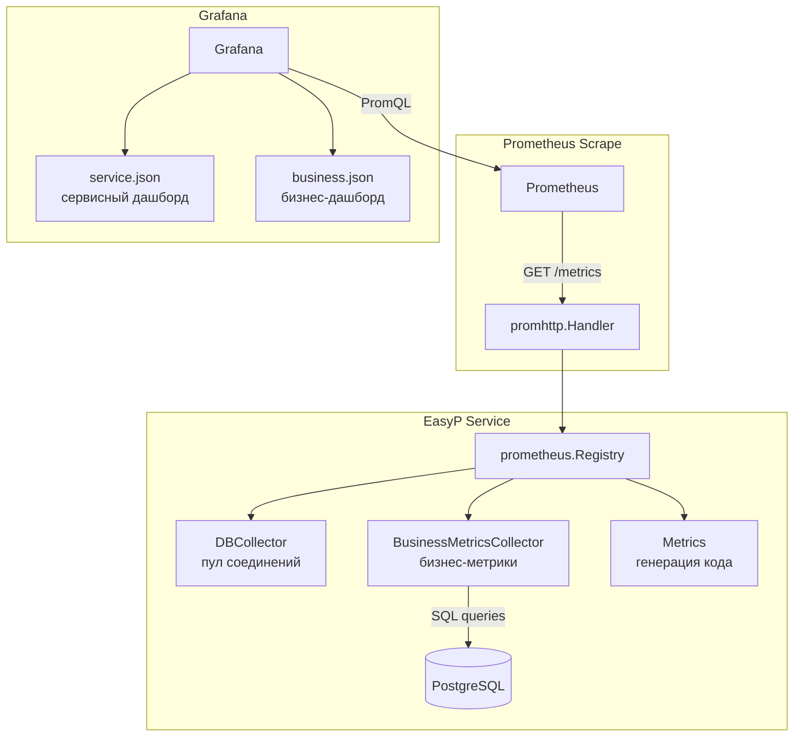

# Дизайн: Бизнес-метрики PostgreSQL для Grafana

## Обзор

Данный дизайн описывает реализацию `BusinessMetricsCollector` — Prometheus-коллектора, который при каждом scrape выполняет SQL-запросы к PostgreSQL и экспортирует бизнес-метрики. Коллектор следует паттерну существующего `DBCollector` (реализация интерфейса `prometheus.Collector`). Дополнительно создаётся JSON-дашборд Grafana для визуализации собранных метрик.

Ключевые решения:
- Коллектор реализует `prometheus.Collector` (методы `Describe`/`Collect`), аналогично `DBCollector`
- Каждый SQL-запрос выполняется независимо с контекстным таймаутом — сбой одного не блокирует остальные
- Коллектор принимает `*sql.DB` и `namespace` через конструктор, регистрируется в `prometheus.Registry` через `MustRegister`
- Дашборд размещается в `configs/grafana/provisioning/dashboards/metrics/` и автоматически подхватывается существующим провайдером "Metrics"

## Архитектура



Поток данных:
1. Prometheus выполняет scrape эндпоинта `/metrics`
2. `prometheus.Registry` вызывает `Collect()` у всех зарегистрированных коллекторов
3. `BusinessMetricsCollector.Collect()` выполняет SQL-запросы к PostgreSQL
4. Результаты экспортируются как gauge-метрики
5. Grafana визуализирует метрики через PromQL-запросы

## Компоненты и интерфейсы

### BusinessMetricsCollector

Файл: `internal/adapters/metrics/business_collector.go`

```go
type BusinessMetricsCollector struct {
    db  *sql.DB
    log *slog.Logger

    // Дескрипторы метрик
    pluginsTotal          *prometheus.Desc
    pluginsByGroup        *prometheus.Desc
    auditLogTotal         *prometheus.Desc
    auditLogByOperation   *prometheus.Desc
    auditLogByStatus      *prometheus.Desc
    pluginVersionsCount   *prometheus.Desc
    auditLogLast24h       *prometheus.Desc
}

func NewBusinessMetricsCollector(db *sql.DB, namespace string, log *slog.Logger) *BusinessMetricsCollector
func (c *BusinessMetricsCollector) Describe(ch chan<- *prometheus.Desc)
func (c *BusinessMetricsCollector) Collect(ch chan<- prometheus.Metric)
```

Конструктор `NewBusinessMetricsCollector` принимает:
- `*sql.DB` — прямое соединение с PostgreSQL (получается через `r.DB().UnderlyingDB()`)
- `namespace` — префикс метрик (используется `"easyp"`, но в дескрипторах subsystem будет `"business"`)
- `*slog.Logger` — логгер для записи ошибок SQL-запросов

Метод `Collect` выполняет каждый SQL-запрос в отдельной горутине или последовательно с контекстным таймаутом. При ошибке запроса — логирует и пропускает метрику, продолжая сбор остальных.

### Интеграция в main.go

Регистрация коллектора добавляется в функцию `run()` после создания `dbCollector`:

```go
businessCollector := adapter_metrics.NewBusinessMetricsCollector(r.DB().UnderlyingDB(), namespace, log)
reg.MustRegister(businessCollector)
```

### Grafana Dashboard

Файл: `configs/grafana/provisioning/dashboards/metrics/business.json`

JSON-дашборд содержит 7 панелей:
1. **Stat** — "Всего плагинов" (`easyp_business_plugins_total`)
2. **Stat** — "Всего записей аудит-лога" (`easyp_business_audit_log_total`)
3. **Stat** — "Активность за 24ч" (`easyp_business_audit_log_last_24h`)
4. **Pie Chart** — "Плагины по группам" (`easyp_business_plugins_by_group`)
5. **Pie Chart** — "Операции по типам" (`easyp_business_audit_log_by_operation`)
6. **Pie Chart** — "Аудит по статусам" (`easyp_business_audit_log_by_status`)
7. **Table** — "Версии плагинов" (`easyp_business_plugin_versions_count`)

Дашборд использует datasource `Prometheus` и автоматически подхватывается существующим провайдером "Metrics" из `dashboards.yaml`.

## Модели данных

### Метрики Prometheus

| Метрика | Тип | Labels | SQL-запрос |
|---------|-----|--------|------------|
| `easyp_business_plugins_total` | Gauge | — | `SELECT count(*) FROM plugins` |
| `easyp_business_plugins_by_group` | Gauge | `group` | `SELECT group_name, count(*) FROM plugins GROUP BY group_name` |
| `easyp_business_audit_log_total` | Gauge | — | `SELECT count(*) FROM audit_log` |
| `easyp_business_audit_log_by_operation` | Gauge | `operation` | `SELECT operation_type, count(*) FROM audit_log GROUP BY operation_type` |
| `easyp_business_audit_log_by_status` | Gauge | `status` | `SELECT status, count(*) FROM audit_log GROUP BY status` |
| `easyp_business_plugin_versions_count` | Gauge | `group`, `name` | `SELECT group_name, name, count(DISTINCT version) FROM plugins GROUP BY group_name, name` |
| `easyp_business_audit_log_last_24h` | Gauge | — | `SELECT count(*) FROM audit_log WHERE created_at > now() - interval '24 hours'` |

### Дескрипторы (prometheus.Desc)

Каждая метрика описывается через `prometheus.NewDesc` с использованием `prometheus.BuildFQName(namespace, "business", metricName)`:

```go
// Пример:
prometheus.NewDesc(
    prometheus.BuildFQName(namespace, "business", "plugins_total"),
    "Total number of registered plugins.",
    nil, nil,  // без variable labels
)

prometheus.NewDesc(
    prometheus.BuildFQName(namespace, "business", "plugins_by_group"),
    "Number of plugins per group.",
    []string{"group"}, nil,  // с label "group"
)
```

### Таймаут SQL-запросов

Каждый SQL-запрос выполняется с `context.WithTimeout` (рекомендуемое значение: 5 секунд). Таймаут может быть параметром конструктора или константой.

```go
const defaultQueryTimeout = 5 * time.Second
```

## Свойства корректности

*Свойство (property) — это характеристика или поведение, которое должно выполняться при всех допустимых выполнениях системы. По сути, это формальное утверждение о том, что система должна делать. Свойства служат мостом между человекочитаемыми спецификациями и машинно-верифицируемыми гарантиями корректности.*

### Свойство 1: Скалярные метрики отражают реальное количество записей

*Для любого* состояния таблиц `plugins` и `audit_log`, скалярные gauge-метрики (`easyp_business_plugins_total`, `easyp_business_audit_log_total`, `easyp_business_audit_log_last_24h`) должны возвращать значения, равные результатам соответствующих SQL-запросов `count(*)` (с учётом фильтра по времени для `last_24h`).

**Validates: Requirements 1.1, 3.1, 7.1**

### Свойство 2: Метрики с группировкой корректно отражают распределение

*Для любого* набора записей в таблицах `plugins` и `audit_log`, метрики с группировкой (`easyp_business_plugins_by_group`, `easyp_business_audit_log_by_operation`, `easyp_business_audit_log_by_status`) должны экспортировать ровно столько значений, сколько уникальных значений группирующего поля, и каждое значение метрики должно совпадать с `count(*)` для соответствующей группы.

**Validates: Requirements 2.1, 2.2, 4.1, 4.2, 5.1, 5.2**

### Свойство 3: Метрика версий плагинов корректно отражает count distinct

*Для любого* набора плагинов с произвольными комбинациями `group_name`, `name` и `version`, метрика `easyp_business_plugin_versions_count` должна экспортировать для каждой уникальной пары (`group`, `name`) значение, равное количеству уникальных версий этого плагина.

**Validates: Requirements 6.1**

### Свойство 4: Изоляция ошибок SQL-запросов

*Для любого* подмножества SQL-запросов коллектора, которые завершаются ошибкой, все остальные запросы должны выполниться успешно и экспортировать свои метрики. Количество экспортированных метрик должно соответствовать количеству успешных запросов.

**Validates: Requirements 10.1**

### Свойство 5: Дашборд содержит все требуемые панели с корректными метриками

*Для любого* валидного JSON-дашборда, он должен содержать все 7 панелей с правильными типами визуализации (stat, piechart, table) и PromQL-запросами, ссылающимися на соответствующие метрики `easyp_business_*`.

**Validates: Requirements 9.1, 9.2, 9.3, 9.4, 9.5, 9.6, 9.7**

## Обработка ошибок

### Ошибки SQL-запросов

- Каждый SQL-запрос в `Collect()` оборачивается в `context.WithTimeout` (5 секунд)
- При ошибке (включая таймаут) — запись в лог через `slog.Logger` с уровнем `Error`:
  ```go
  log.Error("failed to collect metric", "metric", metricName, "error", err)
  ```
- Метрика для данного запроса не экспортируется (не отправляется в `ch`)
- Выполнение продолжается к следующему запросу
- Prometheus корректно обрабатывает отсутствие метрики — на дашборде отобразится "No data"

### Ошибки регистрации

- `MustRegister` вызывает panic при дублировании метрик — это ожидаемое поведение при старте
- Дублирование невозможно при корректной конфигурации (один экземпляр коллектора)

### Ошибки Grafana

- Если метрика отсутствует в Prometheus, панель дашборда отображает "No data"
- Дашборд не требует специальной обработки ошибок — это стандартное поведение Grafana

## Стратегия тестирования

### Unit-тесты

Unit-тесты проверяют конкретные примеры и edge cases:

1. **Describe экспортирует все дескрипторы** — вызов `Describe()` должен отправить ровно 7 дескрипторов
2. **Collect с пустыми таблицами** — все скалярные метрики возвращают 0, метрики с группировкой не экспортируются
3. **Collect при ошибке БД** — метрика не экспортируется, ошибка логируется
4. **Collect при таймауте** — аналогично ошибке БД
5. **Регистрация в Registry** — `MustRegister` не вызывает panic
6. **Интерфейс prometheus.Collector** — compile-time проверка: `var _ prometheus.Collector = (*BusinessMetricsCollector)(nil)`
7. **Дашборд содержит все панели** — парсинг JSON и проверка наличия 7 панелей с правильными типами и метриками

Для тестирования SQL-запросов используется `sqlmock` или реальная тестовая БД (PostgreSQL в Docker через testcontainers).

### Property-based тесты

Библиотека: **[`pgregory.net/rapid`](https://github.com/flyingmutant/rapid)** — property-based testing для Go.

Конфигурация: минимум 100 итераций на каждый property-тест.

Каждый property-тест помечается комментарием с ссылкой на свойство из дизайна:

```go
// Feature: pg-business-metrics-dashboard, Property 1: Скалярные метрики отражают реальное количество записей
```

Property-тесты:

1. **Property 1**: Генерируем произвольное количество записей в mock-таблицах, вызываем `Collect()`, проверяем что скалярные метрики совпадают с ожидаемыми count.
2. **Property 2**: Генерируем записи с произвольными значениями группирующих полей, вызываем `Collect()`, проверяем что количество метрик = количество уникальных групп, и значения совпадают.
3. **Property 3**: Генерируем плагины с произвольными group/name/version, вызываем `Collect()`, проверяем count distinct versions для каждой пары.
4. **Property 4**: Генерируем произвольное подмножество запросов, которые возвращают ошибку, проверяем что остальные метрики экспортируются корректно.

Каждое свойство корректности реализуется ОДНИМ property-based тестом. Unit-тесты и property-тесты дополняют друг друга: unit-тесты покрывают конкретные edge cases и примеры, property-тесты проверяют универсальные свойства на множестве входных данных.
