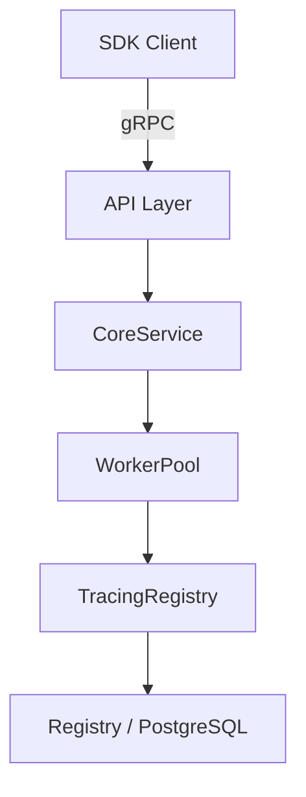

# Дизайн-документ: Plugin Tags

## Обзор

Фича добавляет поддержку тегов (массив строк) для плагинов в EasyP API Service. Теги позволяют категоризировать плагины (например, `go`, `grpc`, `official`, `community`) и фильтровать их при запросе списка. Изменения затрагивают все слои системы: схему БД, proto-определение, доменную модель, адаптер реестра, API-слой и SDK.

Основной принцип — минимальные изменения в каждом слое с сохранением обратной совместимости. Плагины без тегов продолжают работать как раньше (пустой массив по умолчанию).

## Архитектура

Текущая архитектура сервиса — многослойная:



Изменения проходят сквозь все слои, но не меняют архитектуру — только расширяют существующие структуры данных:

1. **БД** — новая колонка `tags text[]` в таблице `plugins`
2. **Proto** — новое поле `repeated string tags = 6` в `PluginInfo`
3. **Домен** — поле `Tags []string` в `PluginInfo` и `PluginFilter`
4. **Registry** — чтение `tags` из БД, фильтрация через `@>` оператор
5. **API** — маппинг `Tags` в protobuf-ответ
6. **SDK** — клиентская фильтрация по тегам

WorkerPool и TracingRegistry не требуют изменений — они проксируют вызовы и автоматически передают расширенные структуры.

## Компоненты и интерфейсы

### 1. Миграция БД (`migrate/4.plugin_tags.sql`)

Добавляет колонку `tags` типа `text[]` с дефолтным значением `'{}'` (пустой массив) в таблицу `plugins`. Создаёт GIN-индекс для эффективной фильтрации по тегам.

```sql
ALTER TABLE plugins ADD COLUMN tags text[] NOT NULL DEFAULT '{}';
CREATE INDEX idx_plugins_tags ON plugins USING GIN (tags);
```

### 2. Proto-определение (`api/generator/v1/generator.proto`)

Добавляется поле `repeated string tags = 6` в сообщение `PluginInfo`:

```protobuf
message PluginInfo {
  // ... существующие поля 1-5 ...
  repeated string tags = 6;
}
```

После изменения proto-файла необходимо перегенерировать Go-код (`generator.pb.go`) с помощью `protoc`. Это ручной шаг.

### 3. Доменная модель (`internal/core/domain.go`)

Расширение двух структур:

```go
type PluginInfo struct {
    ID        uuid.UUID
    Group     string
    Name      string
    Version   string
    Tags      []string  // новое поле
    CreatedAt time.Time
}

type PluginFilter struct {
    Group   string
    Name    string
    Version string
    Tags    []string  // новое поле
}
```

### 4. Адаптер реестра (`internal/adapters/registry/registry.go`)

Изменения в DB-модели и SQL-запросах:

- Структура `plugin` получает поле `Tags pq.StringArray \`db:"tags"\``
- Метод `Get`: SQL-запрос дополняется колонкой `tags`
- Метод `List`: SQL-запрос дополняется колонкой `tags` и условием фильтрации `tags @> $N` при непустом `filter.Tags`
- Метод `Info()`: маппит `p.Tags` → `core.PluginInfo.Tags` (приведение `[]string(p.Tags)`)

Для работы с PostgreSQL `text[]` используется `pq.StringArray` из пакета `github.com/lib/pq` (уже в `go.mod`).

### 5. API-слой (`internal/api/api.go`)

Метод `Plugins`: при формировании `generator.PluginInfo` добавляется маппинг `Tags: p.Tags`.

### 6. SDK (`sdk/filter.go`)

- Структура `PluginFilter` получает поле `Tags []string`
- Функция `applyFilter`: замена `filter == (PluginFilter{})` на проверку каждого поля отдельно (т.к. слайсы нельзя сравнивать через `==`), добавление фильтрации по тегам — все теги из фильтра должны присутствовать в тегах плагина
- Метод `ListPlugins` в `client.go`: аналогичная замена проверки пустого фильтра

```go
func (f PluginFilter) isEmpty() bool {
    return f.Group == "" && f.Name == "" && f.Version == "" && len(f.Tags) == 0
}
```

## Модели данных

### Таблица `plugins` (после миграции)

| Колонка     | Тип        | Ограничения                        |
|-------------|------------|------------------------------------|
| id          | uuid       | PK, NOT NULL, DEFAULT gen_random_uuid() |
| group_name  | text       | NOT NULL                           |
| name        | text       | NOT NULL                           |
| version     | text       | NOT NULL                           |
| config      | jsonb      | NOT NULL, DEFAULT '{}'             |
| tags        | text[]     | NOT NULL, DEFAULT '{}'             |
| created_at  | timestamp  | NOT NULL, DEFAULT now()            |

Уникальный индекс: `(group_name, name, version)`
GIN-индекс: `tags` (для оператора `@>`)

### Доменные структуры

```go
// core.PluginInfo — информация о плагине
type PluginInfo struct {
    ID        uuid.UUID
    Group     string
    Name      string
    Version   string
    Tags      []string
    CreatedAt time.Time
}

// core.PluginFilter — фильтр для списка плагинов
type PluginFilter struct {
    Group   string
    Name    string
    Version string
    Tags    []string
}
```

### DB-модель (registry)

```go
type plugin struct {
    ID        uuid.UUID       `db:"id"`
    GroupName string          `db:"group_name"`
    Name      string          `db:"name"`
    Version   string          `db:"version"`
    Config    json.RawMessage `db:"config"`
    Tags      pq.StringArray  `db:"tags"`
    CreatedAt time.Time       `db:"created_at"`
    // ...
}
```

### Protobuf

```protobuf
message PluginInfo {
  string id = 1;
  string group = 2;
  string name = 3;
  string version = 4;
  google.protobuf.Timestamp created_at = 5;
  repeated string tags = 6;
}
```

### SDK PluginFilter

```go
type PluginFilter struct {
    Group   string
    Name    string
    Version string
    Tags    []string
}
```


## Свойства корректности

*Свойство (property) — это характеристика или поведение, которое должно выполняться при всех допустимых выполнениях системы. По сути, это формальное утверждение о том, что система должна делать. Свойства служат мостом между человекочитаемыми спецификациями и машинно-проверяемыми гарантиями корректности.*

### Свойство 1: Round-trip тегов через БД

*Для любого* плагина с произвольным набором тегов (включая пустой массив), после сохранения в БД чтение через метод `List` или `Get` должно возвращать идентичный набор тегов в том же порядке.

**Validates: Requirements 4.1, 4.2**

### Свойство 2: Фильтрация по тегам в Registry возвращает только подходящие плагины

*Для любого* набора плагинов с произвольными тегами и любого фильтра с непустым полем `Tags`, все возвращённые методом `List` плагины должны содержать каждый тег из фильтра (т.е. теги фильтра являются подмножеством тегов каждого возвращённого плагина).

**Validates: Requirements 4.3**

### Свойство 3: Маппинг тегов в API-слое сохраняет данные

*Для любого* доменного `PluginInfo` с произвольным набором тегов, маппинг в protobuf `PluginInfo` должен сохранять все теги в том же порядке и без потерь.

**Validates: Requirements 5.1**

### Свойство 4: SDK-фильтрация по тегам возвращает только подходящие плагины

*Для любого* списка плагинов с произвольными тегами и любого фильтра с непустым полем `Tags`, функция `applyFilter` должна возвращать только те плагины, у которых все теги из фильтра присутствуют в поле `tags` плагина.

**Validates: Requirements 6.2**

## Обработка ошибок

| Ситуация | Слой | Поведение |
|----------|------|-----------|
| Пустая строка в `Tags` фильтра | Registry, SDK | Игнорируется — пустые строки отфильтровываются перед применением фильтра |
| Ошибка SQL-запроса с фильтром по тегам | Registry | Возвращается обёрнутая ошибка `fmt.Errorf("r.sql.SelectContext: %w", err)` с контекстом операции |
| `nil` значение `Tags` в фильтре | Registry, SDK | Эквивалентно пустому массиву — фильтрация по тегам не применяется |
| Плагин без тегов в БД | Registry | Возвращается пустой массив `[]string{}` (дефолт колонки `'{}'`) |
| `pq.StringArray` scan error | Registry | Ошибка пробрасывается через `sqlx` как часть ошибки `SelectContext`/`GetContext` |

## Стратегия тестирования

### Подход

Используется двойной подход к тестированию:
- **Unit-тесты** — проверяют конкретные примеры, граничные случаи и ошибки
- **Property-тесты** — проверяют универсальные свойства на множестве сгенерированных входных данных

### Библиотека для property-тестирования

Используется `testing/quick` из стандартной библиотеки Go (доступна без дополнительных зависимостей). Каждый property-тест запускается минимум на 100 итерациях.

### Unit-тесты

1. **SDK `applyFilter`** — расширение существующих тестов в `sdk/filter_test.go`:
   - Пустой фильтр с тегами возвращает все плагины
   - Фильтр по одному тегу возвращает только плагины с этим тегом
   - Фильтр по нескольким тегам — пересечение (AND-логика)
   - Фильтр с тегом, которого нет ни у одного плагина — пустой результат
   - Фильтр с пустой строкой в тегах — пустая строка игнорируется
   - Комбинация фильтра по Group + Tags

2. **Registry** (интеграционные тесты с тестовой БД):
   - `List` без фильтра по тегам возвращает все плагины с их тегами
   - `List` с фильтром по тегам возвращает только подходящие
   - `Get` возвращает теги плагина
   - Плагин без тегов возвращает пустой массив

3. **API маппинг**:
   - Маппинг `PluginInfo` с тегами в protobuf
   - Маппинг `PluginInfo` без тегов — пустой список

### Property-тесты

Каждый property-тест ссылается на соответствующее свойство из раздела «Свойства корректности» и запускается минимум на 100 итерациях.

1. **Feature: plugin-tags, Property 1: Tags round-trip through DB**
   Генерируем случайные наборы тегов, сохраняем в БД, читаем обратно через List/Get, проверяем идентичность.

2. **Feature: plugin-tags, Property 2: Registry tag filtering returns only matching plugins**
   Генерируем случайные плагины с случайными тегами, применяем случайный фильтр по тегам, проверяем что все результаты содержат все теги фильтра.

3. **Feature: plugin-tags, Property 3: API mapping preserves tags**
   Генерируем случайные `core.PluginInfo` с случайными тегами, маппим в protobuf, проверяем что теги совпадают.

4. **Feature: plugin-tags, Property 4: SDK tag filtering returns only matching plugins**
   Генерируем случайные списки `generator.PluginInfo` с случайными тегами и случайные фильтры, применяем `applyFilter`, проверяем что все результаты содержат все теги фильтра.
