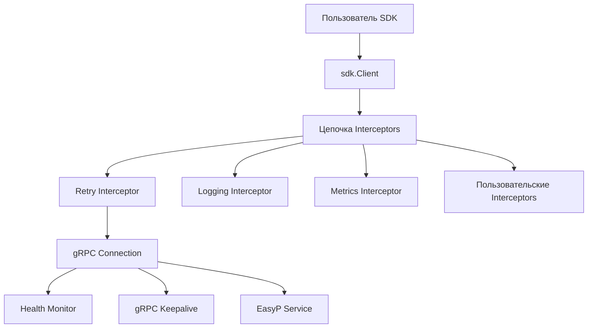
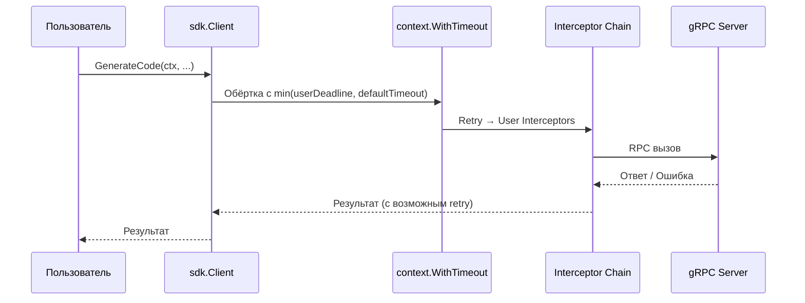
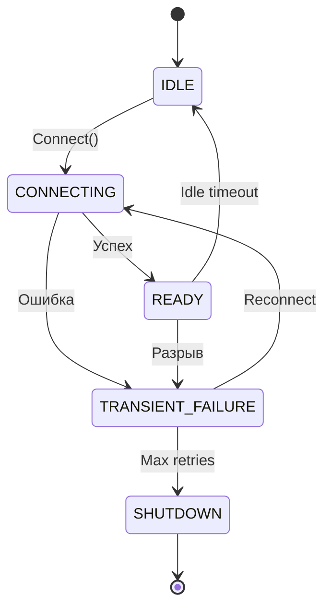

# Дизайн-документ: Улучшения SDK

## Обзор

Данный документ описывает техническое решение для улучшения Go SDK (`sdk/`) клиента EasyP API Service. Текущая реализация содержит баг компиляции (неиспользуемая переменная `ctx` в `NewClient`), а также не предоставляет механизмов повторных попыток, таймаутов, фильтрации, перехватчиков и проверки состояния соединения.

Все изменения затрагивают публичный пакет `sdk/` — API должен быть чистым и идиоматичным для Go. Основные принципы:

- Retry реализуется как gRPC unary interceptor, а не в каждом методе
- Таймауты оборачиваются через `context.WithTimeout`
- Перехватчики подключаются через `grpc.ChainUnaryInterceptor`
- Фильтрация плагинов — клиентская (до появления серверной поддержки в proto)
- Health check использует встроенный connectivity state gRPC и keepalive

## Архитектура

### Общая схема



### Порядок interceptors

Interceptors применяются через `grpc.ChainUnaryInterceptor` в следующем порядке:

1. Retry interceptor (встроенный, самый внешний — оборачивает всё)
2. Пользовательские interceptors (в порядке добавления)

Встроенные logging/metrics interceptors добавляются через опции `WithLoggingInterceptor()` / `WithMetricsInterceptor()` и попадают в цепочку пользовательских interceptors.

### Таймауты

Таймауты реализуются не как interceptor, а через обёртку `context.WithTimeout` в каждом публичном методе (`GenerateCode`, `ListPlugins`). Это позволяет задавать разные таймауты для разных методов. Если пользователь передал контекст с дедлайном, используется меньший из двух.



### Фильтрация плагинов

Текущий proto `PluginsRequest` не содержит полей фильтрации. Пока серверная фильтрация не добавлена, SDK выполняет фильтрацию на стороне клиента: запрашивает полный список и фильтрует по полям `Group`, `Name`, `Version` структуры `PluginFilter`.

Сигнатура метода меняется:

```go
// Было:
func (c *Client) ListPlugins(ctx context.Context) ([]*generator.PluginInfo, error)

// Стало:
func (c *Client) ListPlugins(ctx context.Context, filter ...PluginFilter) ([]*generator.PluginInfo, error)
```

Использование variadic `filter ...PluginFilter` обеспечивает обратную совместимость — вызов без аргумента фильтра возвращает полный список.

### Health Check и Keepalive

Проверка состояния соединения использует два механизма:

1. **gRPC Keepalive** — встроенный механизм поддержания соединения через `keepalive.ClientParameters`
2. **Connectivity State Monitor** — горутина, отслеживающая `conn.GetState()` и вызывающая `conn.Connect()` при `TRANSIENT_FAILURE` или `SHUTDOWN`



## Компоненты и интерфейсы

### Изменения в `sdk/config.go`

Структура `config` расширяется новыми полями:

```go
type config struct {
    transportCreds credentials.TransportCredentials

    // Retry
    maxRetries    int
    retryBaseDelay time.Duration
    retryMaxDelay  time.Duration

    // Timeouts
    generateCodeTimeout time.Duration
    listPluginsTimeout  time.Duration

    // Interceptors
    unaryInterceptors []grpc.UnaryClientInterceptor

    // Health check
    enableHealthCheck    bool
    healthCheckInterval  time.Duration

    // Keepalive
    keepaliveParams *keepalive.ClientParameters
}
```

### Новые Option-функции

```go
// Retry
func WithMaxRetries(n int) Option
func WithRetryBaseDelay(d time.Duration) Option

// Timeouts
func WithGenerateCodeTimeout(d time.Duration) Option
func WithListPluginsTimeout(d time.Duration) Option

// Interceptors
func WithUnaryInterceptor(i grpc.UnaryClientInterceptor) Option
func WithLoggingInterceptor(logger *slog.Logger) Option
func WithMetricsInterceptor(collector MetricsCollector) Option

// Health check & Keepalive
func WithHealthCheck(interval time.Duration) Option
func WithKeepaliveParams(params keepalive.ClientParameters) Option
```

### Retry Interceptor (`sdk/retry.go`)

Реализуется как `grpc.UnaryClientInterceptor`:

```go
func retryUnaryInterceptor(maxRetries int, baseDelay, maxDelay time.Duration) grpc.UnaryClientInterceptor
```

Логика:
- Проверяет, является ли ошибка транзиентной (коды `UNAVAILABLE`, `DEADLINE_EXCEEDED`, `RESOURCE_EXHAUSTED`)
- Вычисляет задержку: `min(baseDelay * 2^attempt + jitter, maxDelay)`
- Jitter — случайное значение до 25% от текущей задержки
- Уважает отмену контекста — при `ctx.Done()` немедленно возвращает ошибку контекста

### Logging Interceptor (`sdk/interceptors.go`)

```go
func loggingUnaryInterceptor(logger *slog.Logger) grpc.UnaryClientInterceptor
```

Записывает: метод RPC, длительность вызова, код статуса ответа.

### Metrics Interceptor (`sdk/interceptors.go`)

```go
// MetricsCollector — интерфейс для сбора метрик SDK.
type MetricsCollector interface {
    RecordCall(method string, duration time.Duration, code codes.Code)
}

func metricsUnaryInterceptor(collector MetricsCollector) grpc.UnaryClientInterceptor
```

Собирает: количество вызовов, длительность, коды ответов.

### Health Monitor (`sdk/health.go`)

```go
type healthMonitor struct {
    conn     *grpc.ClientConn
    interval time.Duration
    stopCh   chan struct{}
}

func (h *healthMonitor) start()
func (h *healthMonitor) stop()
```

Горутина с тикером, проверяющая `conn.GetState()`. При `TRANSIENT_FAILURE` вызывает `conn.Connect()`. Останавливается при вызове `Client.Close()`.

### Изменения в `sdk/client.go`

```go
type Client struct {
    conn      *grpc.ClientConn
    genClient generator.ServiceAPIClient
    cfg       *config
    health    *healthMonitor // nil если health check отключён
}
```

`NewClient` — удаляется неиспользуемый `ctx`. Interceptors собираются в цепочку:

```go
func NewClient(addr string, opts ...Option) (*Client, error) {
    cfg := defaultConfig()
    for _, opt := range opts {
        opt.apply(cfg)
    }

    // Собираем interceptors: retry первый, затем пользовательские
    interceptors := make([]grpc.UnaryClientInterceptor, 0, 1+len(cfg.unaryInterceptors))
    interceptors = append(interceptors, retryUnaryInterceptor(cfg.maxRetries, cfg.retryBaseDelay, cfg.retryMaxDelay))
    interceptors = append(interceptors, cfg.unaryInterceptors...)

    dialOpts := []grpc.DialOption{
        grpc.WithTransportCredentials(cfg.transportCreds),
        grpc.WithChainUnaryInterceptor(interceptors...),
    }

    if cfg.keepaliveParams != nil {
        dialOpts = append(dialOpts, grpc.WithKeepaliveParams(*cfg.keepaliveParams))
    }

    conn, err := grpc.NewClient(addr, dialOpts...)
    if err != nil {
        return nil, fmt.Errorf("grpc.NewClient %s: %w", addr, err)
    }

    c := &Client{conn: conn, genClient: generator.NewServiceAPIClient(conn), cfg: cfg}

    if cfg.enableHealthCheck {
        c.health = &healthMonitor{conn: conn, interval: cfg.healthCheckInterval, stopCh: make(chan struct{})}
        go c.health.start()
    }

    return c, nil
}
```

### Фильтрация в `ListPlugins`

```go
func (c *Client) ListPlugins(ctx context.Context, filter ...PluginFilter) ([]*generator.PluginInfo, error) {
    ctx, cancel := c.withTimeout(ctx, c.cfg.listPluginsTimeout)
    defer cancel()

    resp, err := c.genClient.Plugins(ctx, &generator.PluginsRequest{})
    if err != nil {
        return nil, fmt.Errorf("c.genClient.Plugins: %w", err)
    }

    if len(filter) == 0 || filter[0] == (PluginFilter{}) {
        return resp.Plugins, nil
    }

    return applyFilter(resp.Plugins, filter[0]), nil
}
```

### Вспомогательный метод таймаутов

```go
func (c *Client) withTimeout(ctx context.Context, defaultTimeout time.Duration) (context.Context, context.CancelFunc) {
    if _, ok := ctx.Deadline(); ok {
        // У пользователя уже есть дедлайн — используем min
        deadline := time.Now().Add(defaultTimeout)
        if userDeadline, _ := ctx.Deadline(); userDeadline.Before(deadline) {
            return ctx, func() {} // пользовательский дедлайн раньше
        }
        return context.WithDeadline(ctx, deadline)
    }
    return context.WithTimeout(ctx, defaultTimeout)
}
```

## Модели данных

### PluginFilter (переиспользуется из `internal/core/domain.go`)

SDK определяет собственный тип `PluginFilter` в пакете `sdk/`, чтобы не зависеть от internal-пакета:

```go
// PluginFilter задаёт критерии фильтрации плагинов.
// Пустые поля игнорируются (не участвуют в фильтрации).
type PluginFilter struct {
    Group   string
    Name    string
    Version string
}
```

### MetricsCollector (новый интерфейс)

```go
type MetricsCollector interface {
    RecordCall(method string, duration time.Duration, code codes.Code)
}
```

### Значения по умолчанию

| Параметр | Значение по умолчанию |
|---|---|
| `maxRetries` | 3 |
| `retryBaseDelay` | 100ms |
| `retryMaxDelay` | 5s |
| `generateCodeTimeout` | 30s |
| `listPluginsTimeout` | 10s |
| `healthCheckInterval` | 30s |
| `keepaliveTime` | 30s |
| `keepaliveTimeout` | 10s |

### Структура файлов

```
sdk/
├── client.go          # Client, NewClient, Close, GenerateCode, ListPlugins
├── config.go          # config, Option, все With* функции
├── doc.go             # Документация пакета
├── retry.go           # retryUnaryInterceptor
├── interceptors.go    # loggingUnaryInterceptor, metricsUnaryInterceptor, MetricsCollector
├── health.go          # healthMonitor
└── filter.go          # PluginFilter, applyFilter
```

## Correctness Properties

*Свойство корректности (property) — это характеристика или поведение, которое должно выполняться при всех допустимых исполнениях системы. По сути, это формальное утверждение о том, что система должна делать. Свойства служат мостом между человекочитаемыми спецификациями и машинно-верифицируемыми гарантиями корректности.*

### Property 1: Применение Option изменяет конфигурацию

*Для любого* валидного значения параметра (количество retry, длительность таймаута, параметры keepalive), применение соответствующей Option-функции к конфигурации по умолчанию должно установить соответствующее поле в переданное значение.

**Validates: Requirements 2.1, 3.3, 6.5**

### Property 2: Retry при транзиентных ошибках

*Для любого* gRPC-вызова, завершающегося с одним из транзиентных кодов (`UNAVAILABLE`, `DEADLINE_EXCEEDED`, `RESOURCE_EXHAUSTED`), retry interceptor должен повторить вызов. Количество фактических вызовов должно быть равно `min(maxRetries + 1, количество_последовательных_ошибок_до_успеха)`.

**Validates: Requirements 2.2**

### Property 3: Экспоненциальный backoff с jitter

*Для любого* номера попытки `n` (0 ≤ n < maxRetries), вычисленная задержка должна удовлетворять: `baseDelay * 2^n ≤ delay ≤ baseDelay * 2^n * 1.25` и `delay ≤ maxDelay`.

**Validates: Requirements 2.3**

### Property 4: Возврат последней ошибки после исчерпания попыток

*Для любой* последовательности транзиентных ошибок длиной больше `maxRetries`, retry interceptor должен вернуть именно последнюю полученную ошибку из последовательности.

**Validates: Requirements 2.5**

### Property 5: Выбор минимального дедлайна

*Для любых* двух дедлайнов (пользовательский и дефолтный), метод `withTimeout` должен вернуть контекст с дедлайном, равным меньшему из двух.

**Validates: Requirements 3.4**

### Property 6: Фильтрация возвращает только совпадающие плагины

*Для любого* списка плагинов и любого непустого `PluginFilter`, результат фильтрации должен содержать только те плагины, у которых каждое непустое поле фильтра совпадает с соответствующим полем плагина. Кроме того, все плагины из исходного списка, удовлетворяющие фильтру, должны присутствовать в результате (полнота).

**Validates: Requirements 4.2, 4.3, 4.4**

### Property 7: Пустой фильтр — тождественная операция

*Для любого* списка плагинов, фильтрация с пустым `PluginFilter` (все поля пустые) должна вернуть список, идентичный исходному.

**Validates: Requirements 4.5**

### Property 8: Порядок выполнения interceptors

*Для любой* последовательности interceptors, добавленных через `WithUnaryInterceptor`, они должны выполняться в порядке добавления при каждом gRPC-вызове. Если interceptor A добавлен до interceptor B, то A должен быть вызван раньше B.

**Validates: Requirements 5.2, 5.5**

## Обработка ошибок

### Retry

- Транзиентные ошибки (`UNAVAILABLE`, `DEADLINE_EXCEEDED`, `RESOURCE_EXHAUSTED`) — повторяются автоматически
- Нетранзиентные ошибки (`NOT_FOUND`, `INVALID_ARGUMENT`, `INTERNAL` и др.) — возвращаются немедленно без retry
- Отмена контекста во время retry — немедленный возврат `context.Canceled` или `context.DeadlineExceeded`

### Таймауты

- Истечение таймаута — возвращается gRPC-ошибка с кодом `DEADLINE_EXCEEDED`
- Пользовательский контекст с дедлайном — используется меньший из двух дедлайнов

### Фильтрация

- Невалидный фильтр (все поля пустые) — возвращается полный список (не ошибка)
- Ошибка gRPC при получении списка — пробрасывается вызывающему коду

### Health Check

- Невозможность переподключения — ошибка возвращается при следующем вызове метода
- `Client.Close()` — останавливает health monitor горутину

### Interceptors

- Паника в пользовательском interceptor — не перехватывается SDK (ответственность пользователя)
- Ошибка в interceptor — пробрасывается по цепочке

## Стратегия тестирования

### Подход

Используется двойной подход к тестированию:

1. **Unit-тесты** — проверяют конкретные примеры, граничные случаи и условия ошибок
2. **Property-based тесты** — проверяют универсальные свойства на множестве сгенерированных входных данных

Оба подхода дополняют друг друга: unit-тесты ловят конкретные баги, property-тесты верифицируют общую корректность.

### Библиотека для property-based тестирования

Используется библиотека [`pgregory.net/rapid`](https://github.com/flyingmutant/rapid) — зрелая PBT-библиотека для Go с хорошей поддержкой генераторов и shrinking.

### Конфигурация property-тестов

- Минимум 100 итераций на каждый property-тест
- Каждый тест помечается комментарием с ссылкой на свойство из дизайн-документа
- Формат тега: `Feature: sdk-improvements, Property {number}: {property_text}`
- Каждое свойство корректности реализуется одним property-based тестом

### Unit-тесты

| Область | Что тестируется |
|---|---|
| `NewClient` | Создание клиента с валидным адресом (1.2), компиляция без ошибок (1.1) |
| Retry | Значения по умолчанию (2.4), отмена контекста (2.6) |
| Таймауты | Дефолтные значения 30с/10с (3.1, 3.2), DEADLINE_EXCEEDED при истечении (3.5) |
| Фильтрация | Вызов без фильтра (4.6), принятие фильтра (4.1) |
| Interceptors | Добавление через Option (5.1), logging interceptor (5.3), metrics interceptor (5.4) |
| Health check | Включение через Option (6.1), реакция на TRANSIENT_FAILURE (6.3), keepalive config (6.4), ошибка после неудачного reconnect (6.6) |

### Property-тесты

| Property | Что генерируется | Что проверяется |
|---|---|---|
| Property 1 | Случайные значения параметров (int, duration) | Поле config установлено в переданное значение |
| Property 2 | Случайные транзиентные коды ошибок, случайное количество ошибок до успеха | Количество вызовов = min(maxRetries+1, errors_before_success) |
| Property 3 | Случайные номера попыток, baseDelay, maxDelay | Задержка в пределах [base*2^n, base*2^n*1.25] и ≤ maxDelay |
| Property 4 | Случайные последовательности ошибок длиной > maxRetries | Возвращённая ошибка = последняя в последовательности |
| Property 5 | Случайные пары дедлайнов (user, default) | Эффективный дедлайн = min(user, default) |
| Property 6 | Случайные списки PluginInfo, случайные непустые PluginFilter | Результат содержит ровно те плагины, что совпадают по всем непустым полям |
| Property 7 | Случайные списки PluginInfo | Фильтрация с пустым фильтром = исходный список |
| Property 8 | Случайные последовательности interceptors (1-10 шт.) | Порядок вызова совпадает с порядком добавления |
