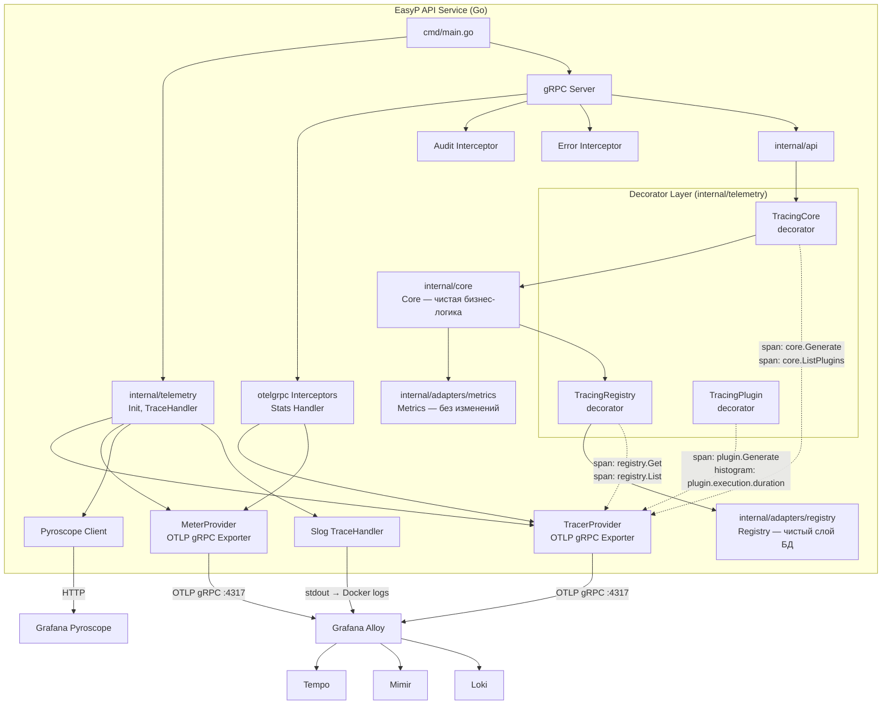
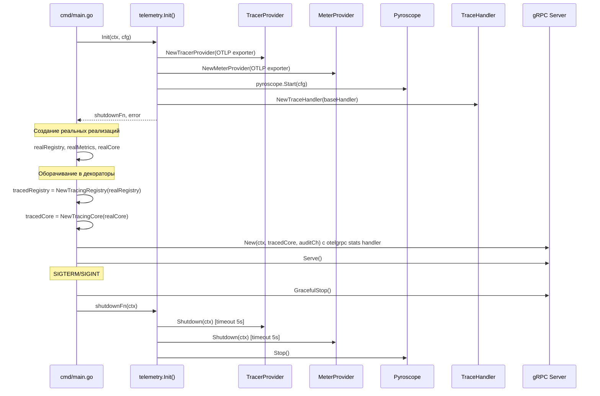

# Дизайн-документ: Инструментирование наблюдаемости сервиса

## Обзор

Данный документ описывает архитектуру и технический дизайн инструментирования Go gRPC-сервиса EasyP API Service средствами наблюдаемости. Цель — добавить распределённую трассировку (OpenTelemetry → Alloy → Tempo), расширить метрики (OTel + Prometheus), интегрировать непрерывное профилирование (Pyroscope) и обогатить структурированное логирование корреляцией trace context.

Инфраструктурный стек (Alloy, Tempo, Mimir, Loki, Pyroscope, Grafana) уже развёрнут. Alloy принимает OTLP на порту 4317 (gRPC) и маршрутизирует трейсы в Tempo, метрики в Mimir, логи в Loki. Задача — инструментировать код Go-сервиса, не меняя инфраструктуру.

### Ключевые решения

1. **Единый пакет `internal/telemetry`** — инициализация всех провайдеров OTel SDK и Pyroscope-клиента в одном месте, возврат единой функции `Shutdown()`.
2. **Паттерн Decorator/Proxy** — вся трассировка и OTel-метрики живут в декораторах (`internal/telemetry/`), которые проксируют вызовы в реальные реализации. Бизнес-логика (`internal/core/core.go`), адаптеры БД (`internal/adapters/registry/`) и метрик (`internal/adapters/metrics/`) остаются **полностью чистыми** от импортов и кода трассировки.
3. **`otelgrpc` interceptors** — автоматическая трассировка и метрики gRPC-вызовов через `go.opentelemetry.io/contrib/instrumentation/google.golang.org/grpc/otelgrpc`.
4. **Обёртка `slog.Handler`** — для инъекции `trace_id`/`span_id` из `context.Context` в каждую лог-запись.
5. **Pyroscope Go SDK** — для непрерывного профилирования CPU, памяти и горутин.
6. **Сохранение Prometheus-эндпоинта** — существующий `/metrics` на порту 8081 продолжает работать параллельно с OTLP-экспортом метрик.

## Архитектура

### Паттерн Decorator/Proxy

Ключевой архитектурный принцип: **ни одна строка кода трассировки не попадает в бизнес-логику или слой данных**. Вместо этого создаются декораторы, реализующие те же интерфейсы (`core.Registry`, `core.Metrics`, а также интерфейс, используемый API-слоем для обращения к Core), и проксирующие вызовы в реальные реализации, добавляя span-ы и OTel-метрики.

```
┌─────────────────────────────────────────────────────────────┐
│  cmd/main.go (wiring)                                       │
│                                                             │
│  realRegistry := registry.New(...)                          │
│  realMetrics  := metrics.New(...)                           │
│  realCore     := core.New(realMetrics, realRegistry)        │
│                                                             │
│  // Декораторы оборачивают реальные реализации              │
│  tracedRegistry := telemetry.NewTracingRegistry(realRegistry)│
│  tracedCore     := telemetry.NewTracingCore(realCore)       │
│                                                             │
│  grpcSrv := api.New(ctx, tracedCore, auditCh)              │
└─────────────────────────────────────────────────────────────┘
```

Реальные реализации (`core.Core`, `registry.Registry`, `metrics.Metrics`) **не изменяются** — в них нет импортов OTel, нет создания span-ов, нет записи OTel-метрик.

### Диаграмма потоков телеметрии



### Порядок инициализации и завершения



## Компоненты и интерфейсы

### 1. Пакет `internal/telemetry` — инициализация телеметрии

Новый пакет, отвечающий за создание и конфигурацию всех провайдеров телеметрии, а также за декораторы трассировки.

```go
package telemetry

// Config содержит настройки телеметрии, читаемые из переменных окружения.
type Config struct {
    OTLPEndpoint      string // OTEL_EXPORTER_OTLP_ENDPOINT, default "localhost:4317"
    ServiceName       string // OTEL_SERVICE_NAME, default "easyp-api-service"
    PyroscopeEndpoint string // PYROSCOPE_ENDPOINT, default "http://localhost:4040"
}

// Init инициализирует TracerProvider, MeterProvider, Pyroscope и TraceHandler.
// Возвращает функцию shutdown для корректного завершения.
// При ошибке инициализации экспортёров логирует предупреждение и продолжает работу.
func Init(ctx context.Context, cfg Config, baseHandler slog.Handler) (shutdownFn func(context.Context) error, logger *slog.Logger, err error)
```

Функция `Init`:
- Создаёт OTLP gRPC exporter (`otlptracegrpc`, `otlpmetricgrpc`) с `WithInsecure()` (внутренняя сеть Docker)
- Создаёт `resource.Resource` с атрибутами `service.name`, `service.version`
- Инициализирует `TracerProvider` с `BatchSpanProcessor`
- Инициализирует `MeterProvider` с `PeriodicReader` (интервал 15с)
- Регистрирует глобальные провайдеры через `otel.SetTracerProvider()` и `otel.SetMeterProvider()`
- Устанавливает `otel.SetTextMapPropagator(propagation.TraceContext{})` для W3C propagation
- Запускает Pyroscope-клиент с профилями CPU, alloc, goroutine
- Создаёт `TraceHandler` обёртку для slog
- Возвращает составную `shutdownFn`, которая вызывает `Shutdown()` для TP, MP и `Stop()` для Pyroscope

### 2. `TraceHandler` — обёртка slog.Handler

```go
package telemetry

// TraceHandler оборачивает slog.Handler, добавляя trace_id и span_id из context.
type TraceHandler struct {
    inner slog.Handler
}

func NewTraceHandler(inner slog.Handler) *TraceHandler

// Handle извлекает SpanContext из ctx и добавляет атрибуты trace_id, span_id.
func (h *TraceHandler) Handle(ctx context.Context, r slog.Record) error

// Enabled, WithAttrs, WithGroup делегируют inner handler.
func (h *TraceHandler) Enabled(ctx context.Context, level slog.Level) bool
func (h *TraceHandler) WithAttrs(attrs []slog.Attr) slog.Handler
func (h *TraceHandler) WithGroup(name string) slog.Handler
```

### 3. Интерфейс `CoreService` для API-слоя

Чтобы API-слой мог работать как с реальным `Core`, так и с его трассирующим декоратором, вводим интерфейс:

```go
package core

// CoreService определяет интерфейс бизнес-логики, используемый API-слоем.
type CoreService interface {
    Generate(ctx context.Context, req GenerateCodeRequest) (*GenerateCodeResponse, error)
    ListPlugins(ctx context.Context, filter PluginFilter) ([]PluginInfo, error)
}
```

Этот интерфейс размещается в `internal/core/domain.go`. Структура `core.Core` уже реализует его. API-слой (`internal/api/api.go`) меняет тип поля `app` с `*core.Core` на `core.CoreService`.

### 4. Декоратор `TracingRegistry` — трассировка слоя данных

Файл: `internal/telemetry/tracing_registry.go`

```go
package telemetry

import (
    "context"
    "go.opentelemetry.io/otel"
    "go.opentelemetry.io/otel/attribute"
    "go.opentelemetry.io/otel/codes"
    "go.opentelemetry.io/otel/trace"
    "github.com/easyp-tech/service/internal/core"
)

// TracingRegistry — декоратор core.Registry, добавляющий span-ы трассировки.
// Проксирует все вызовы в реальную реализацию Registry.
type TracingRegistry struct {
    inner  core.Registry
    tracer trace.Tracer
}

func NewTracingRegistry(inner core.Registry) *TracingRegistry {
    return &TracingRegistry{
        inner:  inner,
        tracer: otel.Tracer("registry"),
    }
}

func (r *TracingRegistry) Get(ctx context.Context, pluginGroup, pluginName, pluginVersion string) (core.Plugin, error) {
    ctx, span := r.tracer.Start(ctx, "registry.Get",
        trace.WithAttributes(
            attribute.String("db.system", "postgresql"),
            attribute.String("plugin.group", pluginGroup),
            attribute.String("plugin.name", pluginName),
            attribute.String("plugin.version", pluginVersion),
        ))
    defer span.End()

    plugin, err := r.inner.Get(ctx, pluginGroup, pluginName, pluginVersion)
    if err != nil {
        span.RecordError(err)
        span.SetStatus(codes.Error, err.Error())
        return nil, err
    }

    // Оборачиваем возвращённый Plugin в TracingPlugin
    return NewTracingPlugin(plugin, r.tracer), nil
}

func (r *TracingRegistry) List(ctx context.Context, filter core.PluginFilter) ([]core.PluginInfo, error) {
    ctx, span := r.tracer.Start(ctx, "registry.List")
    defer span.End()

    result, err := r.inner.List(ctx, filter)
    if err != nil {
        span.RecordError(err)
        span.SetStatus(codes.Error, err.Error())
        return nil, err
    }

    return result, nil
}
```

### 5. Декоратор `TracingPlugin` — трассировка выполнения плагина

Файл: `internal/telemetry/tracing_plugin.go`

```go
package telemetry

import (
    "context"
    "time"
    "go.opentelemetry.io/otel"
    "go.opentelemetry.io/otel/attribute"
    "go.opentelemetry.io/otel/codes"
    "go.opentelemetry.io/otel/metric"
    "go.opentelemetry.io/otel/trace"
    "google.golang.org/protobuf/types/pluginpb"
    "github.com/easyp-tech/service/internal/core"
)

// TracingPlugin — декоратор core.Plugin, добавляющий span и метрику длительности.
type TracingPlugin struct {
    inner    core.Plugin
    tracer   trace.Tracer
    duration metric.Float64Histogram // plugin.execution.duration
}

func NewTracingPlugin(inner core.Plugin, tracer trace.Tracer) *TracingPlugin {
    meter := otel.Meter("registry")
    hist, _ := meter.Float64Histogram("plugin.execution.duration",
        metric.WithUnit("s"),
        metric.WithDescription("Duration of plugin code generation"))
    return &TracingPlugin{inner: inner, tracer: tracer, duration: hist}
}

func (p *TracingPlugin) Generate(ctx context.Context, req *pluginpb.CodeGeneratorRequest) (*pluginpb.CodeGeneratorResponse, error) {
    info := p.inner.Info(ctx)
    imageName := info.Group + "/" + info.Name + ":" + info.Version

    ctx, span := p.tracer.Start(ctx, "plugin.Generate",
        trace.WithAttributes(attribute.String("plugin.image", imageName)))
    defer span.End()

    start := time.Now()
    resp, err := p.inner.Generate(ctx, req)
    elapsed := time.Since(start).Seconds()

    p.duration.Record(ctx, elapsed,
        metric.WithAttributes(attribute.String("plugin.name", info.Name)))

    if err != nil {
        span.RecordError(err)
        span.SetStatus(codes.Error, err.Error())
        return nil, err
    }

    return resp, nil
}

func (p *TracingPlugin) Info(ctx context.Context) *core.PluginInfo {
    return p.inner.Info(ctx)
}
```

### 6. Декоратор `TracingCore` — трассировка бизнес-логики

Файл: `internal/telemetry/tracing_core.go`

```go
package telemetry

import (
    "context"
    "go.opentelemetry.io/otel"
    "go.opentelemetry.io/otel/attribute"
    "go.opentelemetry.io/otel/codes"
    "go.opentelemetry.io/otel/trace"
    "github.com/easyp-tech/service/internal/core"
)

// TracingCore — декоратор core.CoreService, добавляющий span-ы трассировки.
// Проксирует все вызовы в реальный Core.
type TracingCore struct {
    inner  core.CoreService
    tracer trace.Tracer
}

func NewTracingCore(inner core.CoreService) *TracingCore {
    return &TracingCore{
        inner:  inner,
        tracer: otel.Tracer("core"),
    }
}

func (c *TracingCore) Generate(ctx context.Context, req core.GenerateCodeRequest) (*core.GenerateCodeResponse, error) {
    ctx, span := c.tracer.Start(ctx, "core.Generate",
        trace.WithAttributes(attribute.String("plugin.name", req.PluginName)))
    defer span.End()

    resp, err := c.inner.Generate(ctx, req)
    if err != nil {
        span.RecordError(err)
        span.SetStatus(codes.Error, err.Error())
        return nil, err
    }

    return resp, nil
}

func (c *TracingCore) ListPlugins(ctx context.Context, filter core.PluginFilter) ([]core.PluginInfo, error) {
    ctx, span := c.tracer.Start(ctx, "core.ListPlugins")
    defer span.End()

    result, err := c.inner.ListPlugins(ctx, filter)
    if err != nil {
        span.RecordError(err)
        span.SetStatus(codes.Error, err.Error())
        return nil, err
    }

    return result, nil
}
```

### 7. Изменения в `internal/api/api.go` — otelgrpc interceptors + интерфейс

Минимальные изменения:
- Тип поля `app` меняется с `*core.Core` на `core.CoreService`
- Добавляется `otelgrpc.NewServerHandler()` как stats handler

```go
// API provides the API server implementation.
type API struct {
    app core.CoreService  // было: *core.Core
}

func New(ctx context.Context, applications core.CoreService, auditCh chan<- core.AuditEntry) *grpc.Server {
    srv := grpc.NewServer(
        grpc.StatsHandler(otelgrpc.NewServerHandler()),  // OTel трассировка + метрики
        grpc.ChainUnaryInterceptor(
            auditInterceptor.UnaryServerInterceptor(),
            errorInterceptor(log),
        ),
    )
    // ...
}
```

`otelgrpc.NewServerHandler()` автоматически:
- Создаёт span с именем gRPC-метода
- Добавляет атрибуты `rpc.system`, `rpc.service`, `rpc.method`
- Устанавливает статус span (Error/Ok)
- Записывает метрики `rpc.server.duration`, `rpc.server.request.size`, `rpc.server.response.size`
- Поддерживает W3C TraceContext propagation

### 8. Изменения в `cmd/main.go` — wiring с декораторами

```go
func run(ctx context.Context, cfg config, reg *prometheus.Registry, namespace string) error {
    log := monitor.FromContext(ctx)

    // 1. Инициализация телеметрии
    telCfg := telemetry.Config{
        OTLPEndpoint:      os.Getenv("OTEL_EXPORTER_OTLP_ENDPOINT"),
        ServiceName:       os.Getenv("OTEL_SERVICE_NAME"),
        PyroscopeEndpoint: os.Getenv("PYROSCOPE_ENDPOINT"),
    }
    shutdownTelemetry, log, err := telemetry.Init(ctx, telCfg, baseHandler)
    if err != nil {
        return fmt.Errorf("telemetry.Init: %w", err)
    }
    defer func() {
        shutdownCtx, cancel := context.WithTimeout(context.Background(), 5*time.Second)
        defer cancel()
        shutdownTelemetry(shutdownCtx)
    }()

    // 2. Создание реальных реализаций (без трассировки)
    r, err := registry.New(ctx, reg, namespace, registry.Config{...})
    if err != nil {
        return fmt.Errorf("registry.New: %w", err)
    }
    defer r.Close()

    realMetrics := adapter_metrics.New(reg, namespace)
    realCore := core.New(realMetrics, telemetry.NewTracingRegistry(r))

    // 3. Оборачивание Core в трассирующий декоратор
    tracedCore := telemetry.NewTracingCore(realCore)

    // 4. Передача декоратора в API
    grpcSrv := api.New(ctx, tracedCore, auditCh)
    // ...
}
```

Обратите внимание на порядок оборачивания:
- `TracingRegistry` оборачивает реальный `Registry` и передаётся в `core.New()` — так Core вызывает `TracingRegistry.Get()`, который создаёт span и проксирует в реальный `Registry.Get()`
- `TracingCore` оборачивает реальный `Core` и передаётся в `api.New()` — так API вызывает `TracingCore.Generate()`, который создаёт span и проксирует в реальный `Core.Generate()`
- Реальные `Core`, `Registry`, `Metrics` **не содержат никакого кода трассировки**

### Что НЕ меняется

| Файл | Причина |
|------|---------|
| `internal/core/core.go` | Бизнес-логика остаётся чистой, без импортов OTel |
| `internal/adapters/registry/registry.go` | Слой БД/Docker остаётся чистым, без импортов OTel |
| `internal/adapters/metrics/metrics.go` | Prometheus-метрики работают как раньше |

## Модели данных

### Конфигурация телеметрии

```go
// telemetry.Config — конфигурация, читаемая из переменных окружения.
type Config struct {
    OTLPEndpoint      string `env:"OTEL_EXPORTER_OTLP_ENDPOINT, default=localhost:4317"`
    ServiceName       string `env:"OTEL_SERVICE_NAME, default=easyp-api-service"`
    PyroscopeEndpoint string `env:"PYROSCOPE_ENDPOINT, default=http://localhost:4040"`
}
```

### Атрибуты ресурса OTel

| Атрибут | Значение | Источник |
|---------|----------|----------|
| `service.name` | `easyp-api-service` | `OTEL_SERVICE_NAME` |
| `service.version` | `dev` | build-time |

### Span-ы и их атрибуты

| Span | Tracer | Атрибуты | Создаётся |
|------|--------|----------|-----------|
| `/{service}/{method}` | `otelgrpc` | `rpc.system`, `rpc.service`, `rpc.method`, `rpc.grpc.status_code` | Автоматически (stats handler) |
| `core.Generate` | `core` | `plugin.name` | `TracingCore.Generate()` |
| `core.ListPlugins` | `core` | — | `TracingCore.ListPlugins()` |
| `registry.Get` | `registry` | `db.system=postgresql`, `plugin.group`, `plugin.name`, `plugin.version` | `TracingRegistry.Get()` |
| `registry.List` | `registry` | — | `TracingRegistry.List()` |
| `plugin.Generate` | `registry` | `plugin.image` | `TracingPlugin.Generate()` |

### Метрики

| Метрика | Тип | Атрибуты | Источник |
|---------|-----|----------|----------|
| `rpc.server.duration` | Histogram | `rpc.method`, `rpc.grpc.status_code` | otelgrpc stats handler |
| `rpc.server.request.size` | Histogram | `rpc.method` | otelgrpc stats handler |
| `rpc.server.response.size` | Histogram | `rpc.method` | otelgrpc stats handler |
| `plugin.execution.duration` | Histogram | `plugin.name` | `TracingPlugin.Generate()` |
| `generated_plugin_code_total` | Counter (Prometheus) | `plugin` | `Metrics.GenerateCode()` (без изменений) |

### Профили Pyroscope

| Тип профиля | Описание |
|-------------|----------|
| `cpu` | CPU profiling |
| `alloc_objects` | Количество аллокаций |
| `alloc_space` | Объём аллокаций |
| `inuse_objects` | Объекты в памяти |
| `inuse_space` | Занятая память |
| `goroutine` | Профиль горутин |

### Атрибуты лог-записей (TraceHandler)

| Атрибут | Тип | Описание |
|---------|-----|----------|
| `trace_id` | string | 32-символьный hex trace ID из SpanContext |
| `span_id` | string | 16-символьный hex span ID из SpanContext |

Атрибуты добавляются только при наличии валидного SpanContext в `context.Context`.


## Свойства корректности

*Свойство (property) — это характеристика или поведение, которое должно выполняться при всех допустимых исполнениях системы. По сути, это формальное утверждение о том, что система должна делать. Свойства служат мостом между человекочитаемыми спецификациями и машинно-верифицируемыми гарантиями корректности.*

### Свойство 1: Конфигурация телеметрии с значениями по умолчанию

*Для любого* набора переменных окружения (`OTEL_EXPORTER_OTLP_ENDPOINT`, `OTEL_SERVICE_NAME`, `PYROSCOPE_ENDPOINT`), включая пустые и отсутствующие значения, результирующая конфигурация `telemetry.Config` должна содержать либо значение из переменной окружения (если оно непустое), либо значение по умолчанию (`localhost:4317`, `easyp-api-service`, `http://localhost:4040` соответственно).

**Validates: Requirements 7.1, 7.2, 7.3, 7.4**

### Свойство 2: Консистентность имени сервиса

*Для любого* непустого имени сервиса, переданного в `telemetry.Config.ServiceName`, атрибут `service.name` в OTel Resource и имя приложения в конфигурации Pyroscope-клиента должны совпадать с этим именем.

**Validates: Requirements 1.3, 5.4**

### Свойство 3: TraceHandler — корреляция trace context в логах

*Для любого* `context.Context` и любой `slog.Record`, если контекст содержит валидный `SpanContext` (с `IsValid() == true`), то после обработки `TraceHandler` лог-запись должна содержать атрибуты `trace_id` и `span_id`, совпадающие с `TraceID` и `SpanID` из `SpanContext`. Если контекст не содержит валидного `SpanContext`, атрибуты `trace_id` и `span_id` не должны присутствовать.

**Validates: Requirements 6.1, 6.2**

### Свойство 4: TraceHandler — прозрачность для существующих атрибутов

*Для любой* `slog.Record` с произвольным набором атрибутов (ключ-значение), после обработки `TraceHandler` все исходные атрибуты должны быть сохранены без изменений (ключи, значения, порядок).

**Validates: Requirements 6.3**

### Свойство 5: Декоратор TracingCore — span-ы core.Generate с корректными атрибутами

*Для любого* вызова `TracingCore.Generate` с произвольным `pluginName`, созданный span должен иметь имя `core.Generate` и содержать атрибут `plugin.name`, равный переданному `pluginName`. Результат вызова (ответ или ошибка) должен совпадать с результатом, возвращённым реальным `Core`.

**Validates: Requirements 3.1**

### Свойство 6: Декоратор TracingRegistry — span-ы registry.Get с атрибутами БД и плагина

*Для любого* вызова `TracingRegistry.Get` с произвольными `pluginGroup`, `pluginName`, `pluginVersion`, созданный span должен иметь имя `registry.Get` и содержать атрибуты `db.system=postgresql`, `plugin.group`, `plugin.name`, `plugin.version`, совпадающие с переданными аргументами.

**Validates: Requirements 3.3**

### Свойство 7: Декоратор TracingPlugin — span и метрика длительности

*Для любого* вызова `TracingPlugin.Generate`, созданный span должен иметь имя `plugin.Generate` и содержать атрибут `plugin.image`. Также должна быть записана точка данных гистограммы `plugin.execution.duration` с атрибутом `plugin.name`, и значение должно быть неотрицательным.

**Validates: Requirements 3.4, 4.4**

### Свойство 8: Статус span отражает результат операции в декораторах

*Для любой* трассируемой операции через декоратор (`TracingCore`, `TracingRegistry`, `TracingPlugin`), если проксируемая операция завершается ошибкой, статус span должен быть `Error` с записью описания ошибки. Если операция завершается успешно, статус span не должен быть `Error`.

**Validates: Requirements 2.3, 2.4, 3.5**

### Свойство 9: Propagation входящего trace context

*Для любого* валидного W3C TraceContext, переданного в gRPC-метаданных входящего запроса, корневой span gRPC-вызова должен иметь `TraceID`, совпадающий с `TraceID` из входящего контекста, и быть дочерним по отношению к переданному `SpanID`.

**Validates: Requirements 2.5**

### Свойство 10: Прозрачность декораторов — результат проксирования

*Для любого* вызова через декоратор (`TracingCore.Generate`, `TracingCore.ListPlugins`, `TracingRegistry.Get`, `TracingRegistry.List`, `TracingPlugin.Generate`), возвращаемый результат (значение и ошибка) должен быть идентичен результату, возвращённому реальной реализацией. Декоратор не должен изменять, подавлять или подменять результаты.

**Validates: Requirements 3.1, 3.2, 3.3, 3.4**

## Обработка ошибок

### Ошибки инициализации

| Ситуация | Поведение | Обоснование |
|----------|-----------|-------------|
| Alloy недоступен (OTLP exporter не может подключиться) | Логирование ошибки, продолжение работы без экспорта | Сервис не должен падать из-за недоступности телеметрии |
| Pyroscope недоступен | Логирование предупреждения, продолжение без профилирования | Профилирование — опциональная функция |
| Невалидный `OTEL_EXPORTER_OTLP_ENDPOINT` | Использование значения по умолчанию `localhost:4317` | Graceful degradation |

### Ошибки в runtime

| Ситуация | Поведение |
|----------|-----------|
| Ошибка экспорта span-ов (Alloy временно недоступен) | OTel SDK буферизирует и повторяет отправку (retry policy BatchSpanProcessor) |
| Ошибка экспорта метрик | OTel SDK повторяет отправку (retry policy PeriodicReader) |
| Ошибка записи span атрибутов | Игнорируется, span создаётся без атрибута |
| Ошибка в декораторе (создание span) | Не влияет на проксируемый вызов — OTel SDK не паникует при ошибках |

### Ошибки при shutdown

| Ситуация | Поведение |
|----------|-----------|
| `TracerProvider.Shutdown()` превышает таймаут 5с | Контекст отменяется, оставшиеся span-ы теряются, логируется предупреждение |
| `MeterProvider.Shutdown()` превышает таймаут 5с | Аналогично TracerProvider |
| `Pyroscope.Stop()` зависает | Не блокирует shutdown (вызывается без таймаута, но после TP/MP) |

### Порядок shutdown

Критически важно соблюдать порядок:
1. Остановка приёма новых gRPC-запросов (`GracefulStop()`)
2. Shutdown телеметрии (TP, MP, Pyroscope) — отправка накопленных данных
3. Закрытие соединения с БД
4. Остановка audit worker

Это гарантирует, что все span-ы и метрики от последних запросов будут отправлены.

## Стратегия тестирования

### Подход

Используется двойной подход к тестированию:
- **Unit-тесты** — для конкретных примеров, edge-case-ов и интеграционных точек
- **Property-based тесты** — для универсальных свойств, проверяемых на множестве сгенерированных входных данных

### Библиотека property-based тестирования

**`pgregory.net/rapid`** — библиотека property-based тестирования для Go. Выбрана за:
- Нативную поддержку Go
- Встроенные генераторы для стандартных типов
- Интеграцию с `testing.T`
- Минимальный boilerplate

Каждый property-тест должен выполнять минимум **100 итераций**.

### Property-based тесты

Каждое свойство корректности реализуется одним property-based тестом. Каждый тест помечается комментарием:

```go
// Feature: service-observability-instrumentation, Property N: <описание>
```

| Свойство | Тест | Генераторы |
|----------|------|------------|
| 1: Конфигурация с defaults | `TestProperty_ConfigDefaults` | Генерация случайных строк для env vars, включая пустые |
| 2: Консистентность имени | `TestProperty_ServiceNameConsistency` | Генерация случайных непустых строк для имени сервиса |
| 3: TraceHandler корреляция | `TestProperty_TraceHandlerCorrelation` | Генерация случайных TraceID/SpanID, случайных slog.Record |
| 4: TraceHandler прозрачность | `TestProperty_TraceHandlerTransparency` | Генерация случайных наборов slog.Attr (ключ-значение) |
| 5: TracingCore span-ы | `TestProperty_TracingCoreGenerateSpan` | Генерация случайных pluginName строк, mock CoreService |
| 6: TracingRegistry span-ы | `TestProperty_TracingRegistryGetSpan` | Генерация случайных group/name/version, mock Registry |
| 7: TracingPlugin span и метрика | `TestProperty_TracingPluginGenerateSpan` | Генерация случайных PluginInfo, mock Plugin |
| 8: Статус span в декораторах | `TestProperty_DecoratorSpanStatus` | Генерация случайных операций с случайным результатом (ok/error) через mock |
| 9: Propagation trace context | `TestProperty_TraceContextPropagation` | Генерация случайных валидных TraceID/SpanID |
| 10: Прозрачность декораторов | `TestProperty_DecoratorTransparency` | Генерация случайных входных данных и mock-ответов, проверка идентичности результатов |

### Тестирование декораторов

Декораторы тестируются с помощью:
- **In-memory SpanExporter** (`go.opentelemetry.io/otel/sdk/trace/tracetest`) — для проверки созданных span-ов без реального OTLP-коллектора
- **Mock-реализации интерфейсов** (`core.Registry`, `core.Plugin`, `core.CoreService`) — для изоляции декоратора от реальных зависимостей
- **In-memory MetricReader** (`go.opentelemetry.io/otel/sdk/metric/metricdata`) — для проверки записанных метрик

Пример теста декоратора:

```go
// Feature: service-observability-instrumentation, Property 5: Декоратор TracingCore — span-ы core.Generate
func TestProperty_TracingCoreGenerateSpan(t *testing.T) {
    rapid.Check(t, func(t *rapid.T) {
        pluginName := rapid.String().Draw(t, "pluginName")

        // Setup in-memory exporter
        exporter := tracetest.NewInMemoryExporter()
        tp := sdktrace.NewTracerProvider(sdktrace.WithSyncer(exporter))
        otel.SetTracerProvider(tp)

        // Mock inner CoreService
        mockCore := &mockCoreService{
            generateResult: &core.GenerateCodeResponse{},
        }

        traced := telemetry.NewTracingCore(mockCore)
        traced.Generate(context.Background(), core.GenerateCodeRequest{PluginName: pluginName})

        spans := exporter.GetSpans()
        require.Len(t, spans, 1)
        assert.Equal(t, "core.Generate", spans[0].Name)
        // Проверяем атрибут plugin.name
        // ...
    })
}
```

### Unit-тесты

| Тест | Описание | Покрывает |
|------|----------|-----------|
| `TestInit_Success` | Init() с валидной конфигурацией создаёт провайдеры | Req 1.1, 1.2 |
| `TestInit_InvalidEndpoint` | Init() с недоступным endpoint не возвращает fatal error | Req 1.5 |
| `TestShutdown_CallsAllProviders` | shutdownFn вызывает Shutdown для TP, MP и Stop для Pyroscope | Req 1.4, 8.1, 8.2, 8.3 |
| `TestShutdown_OrderBeforeDB` | Shutdown телеметрии вызывается до закрытия DB | Req 8.4 |
| `TestTraceHandler_NoContext` | Лог без SpanContext не содержит trace_id/span_id | Req 6.2 |
| `TestGRPCSpan_MethodName` | gRPC span имеет имя, соответствующее методу | Req 2.1 |
| `TestGRPCSpan_Attributes` | gRPC span содержит rpc.system, rpc.service, rpc.method | Req 2.2 |
| `TestTracingCore_ListPlugins_Span` | TracingCore.ListPlugins создаёт span "core.ListPlugins" | Req 3.2 |
| `TestPrometheusMetric_Preserved` | generated_plugin_code_total доступна через Prometheus endpoint | Req 4.3 |
| `TestDualMetricsExport` | Метрики доступны и через Prometheus, и через OTLP | Req 4.5 |
| `TestPyroscope_ProfileTypes` | Pyroscope запускается с CPU, alloc, goroutine профилями | Req 5.1, 5.2, 5.3 |
| `TestPyroscope_UnavailableGraceful` | Недоступный Pyroscope не вызывает fatal error | Req 5.6 |
| `TestPyroscope_Shutdown` | Pyroscope корректно останавливается при shutdown | Req 5.5 |
| `TestGlobalSlogHandler` | После Init() глобальный slog handler — TraceHandler | Req 6.4 |
| `TestTracingRegistry_WrapsPlugin` | TracingRegistry.Get() возвращает TracingPlugin, а не голый Plugin | Декоратор |
| `TestTracingPlugin_Info_Passthrough` | TracingPlugin.Info() проксирует без span-а | Декоратор |

### Зависимости для тестирования

```go
// go.mod (тестовые зависимости)
require (
    pgregory.net/rapid v1.2.0
    go.opentelemetry.io/otel/sdk v1.38.0
    go.opentelemetry.io/otel/sdk/metric v1.38.0
    go.opentelemetry.io/otel/exporters/otlp/otlptrace/otlptracegrpc v1.38.0
)
```

Для тестов span-ов используется `go.opentelemetry.io/otel/sdk/trace/tracetest` — in-memory SpanExporter, позволяющий проверять созданные span-ы без реального OTLP-коллектора.
