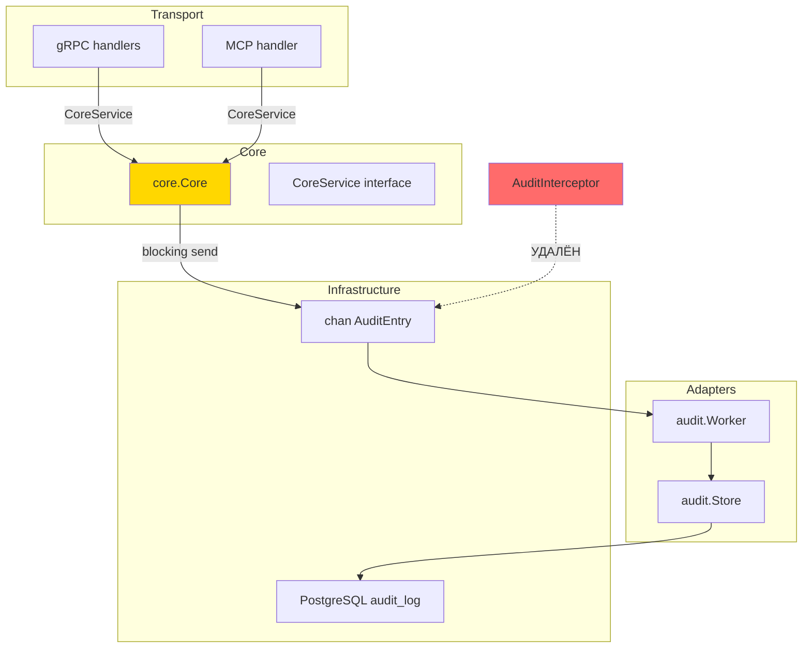

# Перенос аудита в бизнес-логику — Design

**Status:** Draft
**Author:** AI agent
**Date:** 2026-04-14

## 2.1 Обзор

Перенос формирования аудит-записей из gRPC interceptor'а (`AuditInterceptor`) в бизнес-методы `core.Core`. Каждый из 5 методов будет самостоятельно формировать `AuditEntry` с полным бизнес-контекстом и отправлять через blocking send в канал. Interceptor и связанные с ним функции (`extractMetadata`, `methodToOperationType`) удаляются.

Логические части:
1. Добавление audit-зависимости в `core.Core` и вспомогательного метода отправки
2. Встраивание audit-вызовов в каждый бизнес-метод
3. Вспомогательная функция для извлечения caller IP из context
4. Удаление `AuditInterceptor` из gRPC middleware chain
5. Обновление wiring в `cmd/main.go`
6. Тесты

## 2.2 Архитектура



**Порядок реализации:**
1. Вспомогательная функция caller IP из context (`internal/core/context.go`)
2. Добавление audit-зависимости и метода `sendAudit` в `core.Core`
3. Встраивание audit-вызовов в каждый бизнес-метод
4. Обновление `cmd/main.go` (прокидывание канала в Core)
5. Удаление `AuditInterceptor` из middleware chain и удаление файла
6. Тесты

## 2.3 Компоненты и интерфейсы

### Файлы, требующие изменений

| Файл | Тип изменения | Описание |
|------|---------------|----------|
| `internal/core/core.go` | `[MODIFIED]` | Добавление поля `auditCh chan<- AuditEntry` в struct `Core`, параметра в `New()`, метода `sendAudit(ctx, AuditEntry)`. Встраивание вызовов `sendAudit` в `Generate`, `ListPlugins`, `CreatePlugin`, `UpdatePlugin`, `DeletePlugin` |
| `internal/core/context.go` | `[NEW]` | Функции `CallerIPFromContext(ctx) string` и `WithCallerIP(ctx, ip) context.Context` — context key для caller IP |
| `internal/core/crud_test.go` | `[MODIFIED]` | Обновление вызовов `New()` — добавление audit-канала. Добавление тестов: проверка что каждый метод отправляет корректный `AuditEntry` в канал |
| `internal/api/audit_interceptor.go` | `[DELETED]` | Полное удаление файла |
| `internal/api/api_test.go` | `[MODIFIED]` | Удаление тестов, связанных с `AuditInterceptor` (если есть) |
| `cmd/main.go` | `[MODIFIED]` | Передача `auditCh` в `core.New()`. Удаление создания `AuditInterceptor`. Удаление `auditInterceptor.UnaryServerInterceptor()` из `extraUnary` slice. Добавление middleware для записи caller IP в context |
| `internal/grpchelper/server.go` | `[MODIFIED]` | Добавление caller IP middleware в unary/stream цепочку (извлечение из `peer.FromContext` → `core.WithCallerIP`) |

### Файлы, НЕ требующие изменений

| Файл | Причина |
|------|---------|
| `internal/adapters/audit/audit.go` | Store — consumer, не меняется |
| `internal/adapters/audit/worker.go` | Worker — consumer, не меняется |
| `internal/core/domain.go` | `AuditEntry`, `AuditLog`, константы операций — без изменений |
| `migrate/3.audit_log.sql` | Схема таблицы не меняется |
| `internal/api/license_interceptor.go` | Не связан с аудитом |
| `internal/api/mcp.go` | MCP handler вызывает `CoreService` — аудит подхватится автоматически |
| `internal/api/mcp_tools.go` | MCP tool handlers вызывают `CoreService` — не требует изменений |
| `internal/telemetry/tracing_core.go` | Tracing decorator проксирует `CoreService` — аудит происходит в `Core` ниже |

### Интерфейсы

**`core.New` (изменённая сигнатура):**
```go
func New(metrics Metrics, registry Registry, featureGate FeatureGate, auditCh chan<- AuditEntry) *Core
```
- Precondition: `auditCh` не nil
- Postcondition: возвращённый `Core` отправляет `AuditEntry` в `auditCh` из каждого бизнес-метода

**`core.CallerIPFromContext` (новая):**
```go
func CallerIPFromContext(ctx context.Context) string
```
- Возвращает caller IP из context, или `"unknown"` если не задан

**`core.WithCallerIP` (новая):**
```go
func WithCallerIP(ctx context.Context, ip string) context.Context
```
- Помещает caller IP в context

**`Core.sendAudit` (новый приватный метод):**
```go
func (c *Core) sendAudit(ctx context.Context, entry AuditEntry)
```
- Blocking send: `select { case c.auditCh <- entry: case <-ctx.Done(): }`
- При отмене context — логирует warning, не паникует

## 2.4 Ключевые решения (ADR)

### Decision 1: Прямые вызовы vs Decorator

- **Context:** Нужно перенести аудит из interceptor'а в core layer. Есть два варианта: decorator (как `TracingCore`) или прямые вызовы внутри методов.
- **Options:**
  1. Decorator `AuditCore` — обёртка вокруг `CoreService`
  2. Прямые вызовы `sendAudit` внутри каждого метода `Core`
- **Decision:** Вариант 2 — прямые вызовы
- **Rationale:** Decorator ограничен границей request/response. Прямые вызовы дают доступ к промежуточным бизнес-данным (parsed plugin info, file count после генерации, retry details). Это критично для расширения аудита в будущем.
- **Consequences:** Каждый новый бизнес-метод должен включать вызов `sendAudit`. Boilerplate минимален (5-7 строк).

### Decision 2: Blocking send с context

- **Context:** Текущий non-blocking send дропает события при полном канале. Нужна гарантированная доставка.
- **Options:**
  1. Non-blocking send (текущий) — дропает при переполнении
  2. Blocking send с context — ждёт место или отмену
  3. Outbox pattern — пишет в БД в одной транзакции
- **Decision:** Вариант 2 — blocking send с context
- **Rationale:** Гарантирует доставку без усложнения (outbox). Back-pressure при перегрузке — допустимое поведение: если worker не успевает, замедление бизнес-методов обнаружит проблему быстро. Context timeout предотвращает бесконечное ожидание.
- **Consequences:** При перегрузке worker'а бизнес-методы могут замедляться. Мониторится через существующую метрику `audit_queue_depth`.

### Decision 3: Caller IP через context

- **Context:** Core не имеет доступа к transport-level данных. Caller IP нужен в `AuditEntry`.
- **Options:**
  1. Использовать `peer.FromContext` напрямую из core
  2. Свой context key с вспомогательными функциями
- **Decision:** Вариант 2 — свой context key
- **Rationale:** `peer.FromContext` — gRPC-зависимость, не работает для MCP. Свой context key позволяет transport layer (gRPC middleware или MCP handler) записывать IP единообразно, а core — читать без привязки к транспорту.
- **Consequences:** Нужен middleware в gRPC цепочке, который извлекает IP через `peer.FromContext` и записывает через `core.WithCallerIP`. Для MCP — аналогичная логика на уровне HTTP handler.

### Decision 4: Обратная совместимость аудит-записей

- **Context:** Breaking changes допустимы. Формат `AuditEntry` и `Metadata` могут измениться.
- **Decision:** Формат не меняется — `AuditEntry` struct и таблица `audit_log` остаются прежними. Метаданные через `map[string]any` позволяют добавлять новые ключи без миграций.
- **Consequences:** Старые записи в `audit_log` остаются валидными. Новые записи могут содержать дополнительные ключи в `metadata` JSON.

## 2.5 Модели данных

Новых типов нет. Изменения в существующих:

```go
// [MODIFIED] Core — добавлено поле auditCh
Core struct {
    metrics     Metrics
    registry    Registry
    featureGate FeatureGate
    auditCh     chan<- AuditEntry  // [NEW FIELD] канал для отправки аудит-записей
}
```

```go
// [NEW] context key type для caller IP
type callerIPKey struct{}
```

## 2.6 Свойства корректности

```
Property 1: Аудит при успехе
Category: Propagation
Statement: For all успешных вызовов любого из 5 бизнес-методов, в audit канал отправляется ровно один AuditEntry со Status == "success" и корректными бизнес-данными.
Validates: Requirements REQ-1.1, REQ-1.3
```

```
Property 2: Аудит при ошибке
Category: Propagation
Statement: For all вызовов бизнес-методов, завершающихся ошибкой, в audit канал отправляется ровно один AuditEntry со Status == "error", заполненными ErrorCode и ErrorMessage.
Validates: Requirements REQ-1.2, REQ-1.3
```

```
Property 3: Caller IP из context
Category: Propagation
Statement: For all AuditEntry, отправленных из core-методов, поле CallerAddress содержит значение, записанное в context transport layer'ом, или "unknown" если не задано.
Validates: Requirements REQ-1.4
```

```
Property 4: Blocking send — гарантия доставки
Category: Absence
Statement: For all отправок AuditEntry при неотменённом context, событие никогда не теряется (нет silent drop).
Validates: Requirements REQ-2.1
```

```
Property 5: Context cancellation — не блокирует возврат
Category: Absence
Statement: For all вызовов sendAudit при отменённом context, метод завершается без блокировки и бизнес-ответ возвращается вызывающему коду.
Validates: Requirements REQ-2.2
```

```
Property 6: Расширяемость Metadata
Category: Equivalence
Statement: For all AuditEntry, поле Metadata типа map[string]any принимает произвольные ключи, и они сохраняются через Store без изменений.
Validates: Requirements REQ-3.1, REQ-3.2
```

```
Property 7: Отсутствие AuditInterceptor
Category: Absence
Statement: For all gRPC-запросов, в middleware chain отсутствует AuditInterceptor.
Validates: Requirements REQ-4.1
```

```
Property 8: Единообразие транспортов
Category: Equivalence
Statement: For all вызовов через gRPC и MCP, если они приводят к одному и тому же core-методу с одинаковыми параметрами, формируется идентичный AuditEntry (кроме CallerAddress и CreatedAt).
Validates: Requirements REQ-4.2
```

```
Property 9: Worker/Store — без изменений
Category: Equivalence
Statement: For all AuditEntry, отправленных в канал, обработка Worker'ом и сохранение Store'ом происходит без изменений по сравнению с текущим поведением.
Validates: Requirements REQ-5.1, REQ-5.2
```

## 2.7 Обработка ошибок

| Сценарий | Обнаружение | Действие |
|----------|-------------|----------|
| Канал аудита полон, context активен | `select` блокируется на `c.auditCh <- entry` | Ожидание до освобождения места в канале (back-pressure) |
| Канал аудита полон, context отменён | `select` срабатывает на `<-ctx.Done()` | Логирование warning, возврат бизнес-ответа без аудита |
| Caller IP отсутствует в context | `CallerIPFromContext` возвращает `"unknown"` | AuditEntry создаётся с `CallerAddress: "unknown"` |
| Ошибка маршалинга metadata в Store | Обнаруживается в `Store.Save` (существующий код) | `metadata` заменяется на `{}`, логируется ошибка — без изменений |
| Бизнес-метод возвращает ошибку | `err != nil` после вызова бизнес-логики | AuditEntry формируется со Status "error", ErrorMessage из ошибки, затем ошибка возвращается caller'у |
| `auditCh` == nil (programming error) | Panic при send на nil channel | Precondition: `New()` должен получить non-nil канал. Panic корректно — это баг конфигурации |

## 2.8 Стратегия тестирования

**Test Style Source:** Tier 2
- Evidence: `internal/core/crud_test.go` — hand-written mocks, table-driven tests, `t.Parallel()`, `errors.Is()` для проверки ошибок
- Key patterns: package-level internal tests (`package core`), mock structs с function fields, `t.Fatalf` / `t.Errorf`

**Project Commands:**

| Действие | Команда |
|----------|---------|
| Тесты | `go test ./...` |
| Сборка | `go build ./cmd/main.go` |
| Линтер | `golangci-lint run` |
| Кодогенерация | `easyp --cfg easyp.yaml generate` |

### Unit Tests

| Тест | Описание | Tags |
|------|----------|------|
| `TestGenerate_AuditSuccess` | Generate успешен → AuditEntry со Status "success", PluginName, file_count в Metadata | `Feature/audit-in-core` |
| `TestGenerate_AuditError` | Generate завершается ошибкой → AuditEntry со Status "error", ErrorMessage заполнен | `Feature/audit-in-core` |
| `TestListPlugins_AuditSuccess` | ListPlugins успешен → AuditEntry с OperationType "LIST_PLUGINS", plugin_count в Metadata | `Feature/audit-in-core` |
| `TestCreatePlugin_AuditSuccess` | CreatePlugin успешен → AuditEntry с OperationType "CREATE_PLUGIN" | `Feature/audit-in-core` |
| `TestUpdatePlugin_AuditSuccess` | UpdatePlugin успешен → AuditEntry с OperationType "UPDATE_PLUGIN" | `Feature/audit-in-core` |
| `TestDeletePlugin_AuditSuccess` | DeletePlugin успешен → AuditEntry с OperationType "DELETE_PLUGIN" | `Feature/audit-in-core` |
| `TestSendAudit_ContextCancelled` | Context отменён до отправки → sendAudit возвращается без блокировки, AuditEntry не в канале | `Feature/blocking-send` |
| `TestSendAudit_BlockingWhenFull` | Канал полон, context активен → sendAudit блокируется до освобождения места | `Feature/blocking-send` |
| `TestCallerIPFromContext_Set` | IP записан в context → CallerIPFromContext возвращает его | `Feature/caller-ip` |
| `TestCallerIPFromContext_NotSet` | Пустой context → CallerIPFromContext возвращает "unknown" | `Feature/caller-ip` |

### Property-Based Tests

PBT unavailable (стандартная библиотека Go) — используются targeted unit tests.

| Тест | Property | Описание генератора | Tags |
|------|----------|---------------------|------|
| `prop_AuditEntryOnSuccess` | Property 1 | Набор валидных запросов для каждого из 5 методов | `Property/1` |
| `prop_AuditEntryOnError` | Property 2 | Набор запросов, вызывающих различные ошибки (ErrNotFound, ErrInvalidPluginName, etc.) | `Property/2` |
| `prop_CallerIPPropagation` | Property 3 | Набор IP-адресов (IPv4, IPv6, пустая строка) через WithCallerIP | `Property/3` |
| `prop_NeverDropWithActiveContext` | Property 4 | Канал различных размеров (1, 10, 100), множественные отправки с активным context | `Property/4` |
| `prop_NoBlockOnCancelledContext` | Property 5 | Канал размера 0, сразу отменённый context | `Property/5` |
| `prop_MetadataPreserved` | Property 6 | Произвольные map[string]any с различными типами значений | `Property/6` |
| `prop_NoAuditInterceptor` | Property 7 | Верификация в integration тесте — отсутствие interceptor'а в chain | `Property/7` |
| `prop_TransportEquivalence` | Property 8 | Одинаковые параметры через разные пути вызова → одинаковый AuditEntry | `Property/8` |
| `prop_WorkerStoreUnchanged` | Property 9 | Существующие тесты Worker/Store проходят без модификации | `Property/9` |
