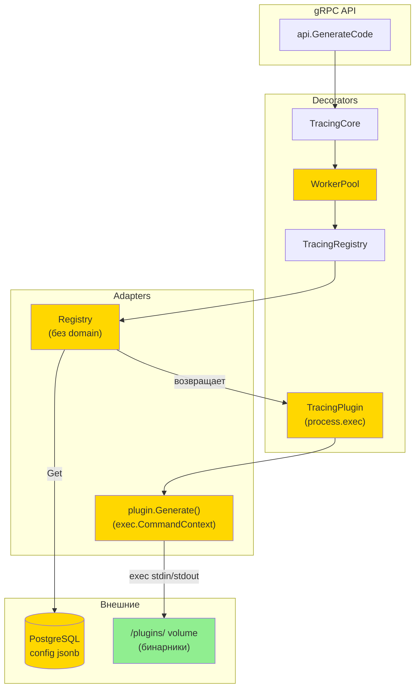

# Выполнение плагинов с диска — Дизайн

**Status:** Draft
**Author:** Antigravity
**Date:** 2026-05-24

## 2.1 Обзор

Переход от Docker-in-Docker к прямому запуску плагинов через `exec.CommandContext` внутри контейнера сервиса. Работа делится на 5 логических частей:

1. **Модель конфигурации** — замена `DockerConfig` на `PluginConfig` с `command`/`env`/`timeout`
2. **Выполнение плагина** — новая реализация `plugin.Generate()` через `exec.CommandContext`
3. **Инициализация** — упрощение `Registry.New()`, удаление `domain`
4. **WorkerPool и телеметрия** — адаптация `isTransient()` и `TracingPlugin`
5. **Dockerfile** — переход на `debian:bookworm-slim`, удаление Docker CLI

## 2.2 Архитектура



**Порядок реализации:**
1. `PluginConfig` (модель данных) + SQL-миграция
2. `Registry.New()` (убрать domain) + `Registry.Get()` (новый config parsing)
3. `plugin.Generate()` (exec вместо docker)
4. `isTransient()` (убрать Docker exit codes)
5. `TracingPlugin` (docker.exec → process.exec)
6. `Dockerfile` (debian + VOLUME)
7. `cmd/main.go` (убрать registryConfig.Domain, добавить pluginsDir)

## 2.3 Компоненты и интерфейсы

### Файлы, требующие изменений

| Файл | Тип | Описание |
|------|-----|----------|
| `internal/adapters/registry/registry.go` | `[MODIFIED]` | Удалить `DockerConfig`, `PluginConfig.Docker`. Новая `PluginConfig` с `Command`/`Env`/`Timeout`. Убрать `domain` из `Registry` и `plugin`. `New()` без параметра `domain`. `Generate()` — `exec.CommandContext` вместо `docker run`. Добавить `ValidateConfig()` |
| `internal/core/pool.go` | `[MODIFIED]` | `isTransient()` — убрать Docker exit codes (125/126/127) и Docker-специфичные подстроки (daemon, connection refused) |
| `internal/telemetry/tracing_plugin.go` | `[MODIFIED]` | Спан `docker.exec` → `process.exec`, атрибуты `docker.*` → `process.command`, `process.exit_code`. Убрать import `os/exec` (exit code извлекается в generate) |
| `cmd/main.go` | `[MODIFIED]` | Убрать `registryConfig.Domain`. Добавить `registryConfig.PluginsDir` (default `/plugins`), `registryConfig.MaxOutputSize` (default 64MB). Передать в `registry.New()` |
| `Dockerfile` | `[MODIFIED]` | `FROM debian:bookworm-slim` вместо `alpine:3.22`. Убрать `apk add docker-cli`. Добавить `VOLUME ["/plugins"]` |
| `migrate/5.disk_plugin_config.sql` | `[NEW]` | Миграция: `UPDATE plugins SET config = ...` — обновить seed-данные с Docker-формата на command-формат |

### Файлы, НЕ требующие изменений

| Файл | Причина |
|------|---------|
| `internal/core/domain.go` | Интерфейсы `Registry`, `Plugin`, `Service` не меняются — `Generate()` по-прежнему принимает `*pluginpb.CodeGeneratorRequest` и возвращает `*pluginpb.CodeGeneratorResponse` |
| `internal/core/core.go` | Бизнес-логика оперирует интерфейсами, не знает о способе выполнения |
| `internal/api/api.go` | gRPC handler не знает о способе выполнения плагина |
| `internal/telemetry/tracing_core.go` | Декоратор Core не привязан к Docker |
| `internal/telemetry/tracing_registry.go` | Декоратор Registry оборачивает `Get`/`List`/`Create`/`Update`/`Delete` — вызовы не меняются |
| `sdk/` | SDK работает с gRPC API, не знает о внутреннем исполнении |
| `api/generator/v1/*.proto` | gRPC контракт не меняется |
| `internal/grpchelper/` | Middleware не зависит от Docker |

### Сигнатуры

```go
// registry.go — новый конструктор
func New(_ context.Context, db *database.SQL, pluginsDir string, maxOutputSize int64) (*Registry, error)

// registry.go — валидация конфига
func ValidateConfig(config json.RawMessage, pluginsDir string) error

// registry.go — Registry struct (модифицированный)
type Registry struct {
    db            *database.SQL
    pluginsDir    string       // базовая директория плагинов
    maxOutputSize int64        // лимит stdout/stderr в байтах
}
```

## 2.4 Ключевые решения (ADR)

### Decision: command как массив вместо binary_path

- **Context:** Плагины могут быть Go-бинарниками, Python-скриптами или Node.js-модулями. Нужен единый формат конфигурации.
- **Options:** (A) `binary_path` — путь к файлу, (B) `command` — массив строк (аналог Docker ENTRYPOINT)
- **Decision:** Вариант B — `command` как массив
- **Rationale:** Универсально: `["/plugins/.../plugin"]` для Go, `["python3", "/plugins/.../plugin.py"]` для Python. Один механизм для всех языков. Знакомый паттерн (Docker, k8s). `args` не нужен как отдельное поле — входит в `command`.
- **Consequences:** Валидация сложнее — нужно проверить что хотя бы один элемент массива ссылается на файл внутри `plugins_dir`.

### Decision: Изоляция env — чистое окружение

- **Context:** `exec.Cmd` с `cmd.Env = nil` наследует все env vars сервиса (DATABASE_URL, ключи лицензий, секреты).
- **Options:** (A) Наследовать всё, (B) Наследовать + дополнить plugin env, (C) Чистое окружение + только plugin env
- **Decision:** Вариант C — чистое окружение
- **Rationale:** Безопасность: плагин не получает доступ к секретам сервиса. Явность: всё что нужно плагину указано в `config.env`.
- **Consequences:** Если плагину нужен PATH или другие системные переменные — их нужно явно указать в `config.env`. Это осознанное ограничение.

### Decision: Process group для kill

- **Context:** Плагин может форкнуть дочерние процессы. `cmd.Process.Kill()` убивает только родителя.
- **Options:** (A) Kill только родителя, (B) Kill process group
- **Decision:** Вариант B — kill process group
- **Rationale:** Защита от zombie-процессов и fork-бомб. `Setpgid: true` + `syscall.Kill(-pid, SIGKILL)`.
- **Consequences:** Требует Linux-specific `SysProcAttr`. На macOS (локальная разработка) работает аналогично.

### Decision: debian:bookworm-slim вместо alpine

- **Context:** Alpine использует musl libc. Python-плагины с native extensions, C/C++ плагины могут не работать.
- **Options:** (A) Alpine (musl, ~7MB), (B) Debian bookworm-slim (glibc, ~80MB), (C) Distroless (glibc, ~20MB)
- **Decision:** Вариант B — Debian bookworm-slim
- **Rationale:** glibc-совместимость как у PostgreSQL, Nginx, Node.js. Пользователь может добавить python3/node через `FROM`. Alpine потребовал бы `musl-dev` и пересборку.
- **Consequences:** Образ увеличивается с ~15MB до ~85MB. Приемлемо для серверного приложения.

### Decision: Breaking change в CRUD API config format

- **Context:** Формат `config` jsonb меняется с `{"docker": {...}}` на `{"command": [...]}`. Это breaking change.
- **Versioning strategy:** Нет версионирования — полная замена. Старый формат отклоняется.
- **Breaking change assessment:** Клиенты Create/Update API, отправляющие `{"docker": {...}}`, получат ошибку валидации. Существующие записи мигрируются миграцией `5.disk_plugin_config.sql`.
- **Migration path:** 1) Применить SQL-миграцию (seed-данные обновятся). 2) Обновить клиенты на новый формат `config`. 3) Обновить сервис.

## 2.5 Модели данных

```go
// [NEW] PluginConfig — конфигурация плагина (десериализуется из config jsonb)
// [REMOVED: DockerConfig, PluginConfig.Docker]
type PluginConfig struct {
    Command []string          `json:"command"`           // Команда запуска: ["python3", "/plugins/.../plugin.py"]
    Env     map[string]string `json:"env,omitempty"`     // Переменные окружения для процесса
    Timeout string            `json:"timeout,omitempty"` // Per-plugin таймаут, e.g. "30s" (парсится через time.ParseDuration)
}

// [MODIFIED] Registry — убрано поле domain, добавлены pluginsDir и maxOutputSize
type Registry struct {
    db            *database.SQL
    pluginsDir    string // Базовая директория плагинов (default "/plugins")
    maxOutputSize int64  // Лимит stdout/stderr в байтах (default 64MB)
}

// [MODIFIED] plugin — убрано поле domain, pluginConfig теперь новый PluginConfig
type plugin struct {
    ID        uuid.UUID       `db:"id"`
    GroupName string          `db:"group_name"`
    Name      string          `db:"name"`
    Version   string          `db:"version"`
    Config    json.RawMessage `db:"config"`
    Tags      pq.StringArray  `db:"tags"`
    CreatedAt time.Time       `db:"created_at"`

    pluginConfig PluginConfig `db:"-"` // Десериализованная конфигурация
}

// [MODIFIED] registryConfig в cmd/main.go — Domain → PluginsDir + MaxOutputSize
type registryConfig struct {
    PluginsDir    string `env:"PLUGINS_DIR, default=/plugins"       yaml:"plugins_dir"`
    MaxOutputSize int64  `env:"MAX_OUTPUT_SIZE, default=67108864"   yaml:"max_output_size"` // 64MB
}
```

**SQL-миграция `5.disk_plugin_config.sql`:**

```sql
-- up
UPDATE plugins SET config = jsonb_build_object(
    'command', jsonb_build_array(
        '/plugins/' || group_name || '/' || name || '/' || version || '/plugin'
    )
) WHERE config ? 'docker';

-- down
-- Обратная миграция невозможна без сохранения оригинальных Docker-конфигов.
-- Если нужен rollback — восстановить из бэкапа.
```

## 2.6 Свойства корректности

```
Property 1: Эквивалентность протокола
Category: Equivalence
Statement: For all валидных CodeGeneratorRequest, результат Generate() через exec.CommandContext идентичен результату через docker run при одном и том же бинарнике плагина
Validates: Requirements REQ-1.1, REQ-1.2
```

```
Property 2: Изоляция окружения
Category: Absence
Statement: For all выполнений плагина, переменные окружения сервиса (DATABASE_URL, LICENSE_KEY и т.д.) отсутствуют в env процесса плагина
Validates: Requirements REQ-1.7
```

```
Property 3: Завершение process group
Category: Absence
Statement: For all выполнений плагина с таймаутом или отменой, после kill process group не остаётся zombie-процессов от данного плагина
Validates: Requirements REQ-1.8
```

```
Property 4: Лимит output
Category: Absence
Statement: For all выполнений плагина, объём прочитанных данных из stdout и stderr не превышает maxOutputSize байт
Validates: Requirements REQ-1.9
```

```
Property 5: Различение ошибок файловой системы
Category: Exclusion
Statement: For all выполнений плагина, ошибка "файл не найден" (REQ-1.3) и ошибка "нет прав на исполнение" (REQ-1.10) никогда не возвращаются одновременно и различимы по типу
Validates: Requirements REQ-1.3, REQ-1.10
```

```
Property 6: Валидность конфига
Category: Absence
Statement: For all вызовов Create/Update, config с пустым command или с command[0] вне plugins_dir никогда не сохраняется в БД
Validates: Requirements REQ-2.2, REQ-2.4, REQ-2.5
```

```
Property 7: Path traversal защита
Category: Absence
Statement: For all вызовов ValidateConfig, путь вида "../../../bin/sh" или любой путь вне pluginsDir после filepath.Clean никогда не проходит валидацию
Validates: Requirements REQ-2.4, REQ-2.5
```

```
Property 8: Breaking change — старый формат
Category: Absence
Statement: For all вызовов Create/Update с config формата {"docker": {...}}, запрос никогда не принимается — всегда возвращается ошибка валидации
Validates: Requirements REQ-2.6
```

```
Property 9: Миграция seed-данных
Category: Propagation
Statement: For all записей в таблице plugins с config содержащим ключ "docker", после миграции 5.disk_plugin_config.sql config содержит ключ "command" с корректным путём к бинарнику
Validates: Requirements REQ-2.3
```

```
Property 10: Registry без domain
Category: Absence
Statement: For all экземпляров Registry и plugin, поле domain/URL Docker Registry отсутствует в структурах
Validates: Requirements REQ-3.1, REQ-3.2
```

```
Property 11: Нетранзиентные Docker-коды
Category: Absence
Statement: For all вызовов isTransient(), Docker exit codes 125/126/127 и подстроки "daemon"/"connection refused" не влияют на классификацию ошибки
Validates: Requirements REQ-4.1
```

```
Property 12: Сигнал — нетранзиентная ошибка
Category: Equivalence
Statement: For all завершений плагина по сигналу (SIGKILL, SIGTERM), isTransient() возвращает false
Validates: Requirements REQ-4.2
```

```
Property 13: Телеметрия process.exec
Category: Propagation
Statement: For all выполнений плагина, дочерний span имеет имя "process.exec" и содержит атрибуты process.command и process.exit_code
Validates: Requirements REQ-5.1
```

```
Property 14: Десериализация конфига
Category: Round-trip
Statement: For all валидных PluginConfig, json.Marshal → json.Unmarshal возвращает эквивалентную структуру
Validates: Requirements REQ-2.1
```

```
Property 15: Env передача
Category: Propagation
Statement: For all выполнений плагина с config.env != nil, процесс плагина получает все указанные переменные окружения
Validates: Requirements REQ-1.5
```

```
Property 16: Per-plugin timeout
Category: Propagation
Statement: For all выполнений плагина с config.timeout != "", контекст выполнения имеет deadline равный указанному timeout
Validates: Requirements REQ-1.6
```

```
Property 17: Hot reload
Category: Equivalence
Statement: For all обновлений бинарника в volume, следующий вызов Generate() использует обновлённый файл без перезапуска сервиса
Validates: Requirements REQ-7.1
```

## 2.7 Обработка ошибок

| Сценарий | Обнаружение | Действие |
|----------|-------------|----------|
| `command[0]` не найден | `exec.ErrNotFound` или `os.ErrNotExist` из `cmd.Start()` | Вернуть `fmt.Errorf("plugin binary not found: %s: %w", command[0], err)` |
| `command[0]` нет прав на исполнение | `os.ErrPermission` из `cmd.Start()` | Вернуть `fmt.Errorf("plugin binary not executable: %s: %w", command[0], err)` |
| Ненулевой exit code | `*exec.ExitError` из `cmd.Output()` | Вернуть `fmt.Errorf("plugin exited with code %d: stderr: %s", exitCode, stderr)` |
| Stdout превышает лимит | `io.LimitReader` + проверка `n == maxOutputSize` | Kill process group, вернуть `fmt.Errorf("plugin output exceeds %d bytes", maxOutputSize)` |
| Stderr превышает лимит | `io.LimitReader` на stderr pipe | Обрезать stderr до лимита, логировать warning |
| stdout не десериализуется как CodeGeneratorResponse | `proto.Unmarshal` ошибка | Вернуть `fmt.Errorf("proto.Unmarshal: %w, raw output size: %d", err, len(output))` |
| Таймаут (context deadline) | `context.DeadlineExceeded` | Kill process group (`syscall.Kill(-pgid, SIGKILL)`), вернуть ошибку таймаута |
| Процесс убит сигналом | `exitErr.ExitCode() == -1` и `exitErr.Sys().(syscall.WaitStatus).Signal()` | Вернуть ошибку с информацией о сигнале, `isTransient` = false |
| `command` пустой при Create/Update | `ValidateConfig()` — `len(config.Command) == 0` | Вернуть validation error, не сохранять в БД |
| `command` path traversal | `ValidateConfig()` — `filepath.Clean` + `strings.HasPrefix` check | Вернуть validation error с указанием что путь за пределами `pluginsDir` |
| config в старом Docker-формате | `ValidateConfig()` — `command` отсутствует | Вернуть validation error: "field 'command' is required, docker config format is no longer supported" |

## 2.8 Стратегия тестирования

**Test Style Source:** Tier 2
- Evidence: существующие тесты в `internal/core/pool_test.go`, `internal/adapters/registry/`
- Key patterns: стандартный `go test`, table-driven tests, моки через интерфейсы в test-файлах

**Project Commands:**

| Action   | Command                                 |
|----------|-----------------------------------------|
| Test     | `go test ./...`                         |
| Build    | `go build -o main ./cmd/main.go`        |
| Lint     | `golangci-lint run ./...`               |
| Generate | `easyp --cfg easyp.yaml generate`       |

### Unit Tests

| Test | Описание | Tags |
|------|----------|------|
| `TestGenerate_Success` | Вызов Generate с mock-бинарником (echo protobuf response в stdout), проверка корректного ответа | `Feature/Generate` |
| `TestGenerate_BinaryNotFound` | command[0] не существует, проверка ошибки "not found" | `Feature/Generate`, `Property/5` |
| `TestGenerate_PermissionDenied` | command[0] без +x, проверка ошибки "permission denied" | `Feature/Generate`, `Property/5` |
| `TestGenerate_NonZeroExit` | Mock-бинарник завершается с exit 1 и stderr, проверка ошибки | `Feature/Generate` |
| `TestGenerate_OutputSizeLimit` | Mock-бинарник пишет > maxOutputSize в stdout, проверка kill и ошибки | `Feature/Generate`, `Property/4` |
| `TestGenerate_EnvIsolation` | Mock-бинарник читает os.Environ(), проверка что env сервиса не наследуется | `Feature/Generate`, `Property/2` |
| `TestGenerate_CustomEnv` | config.env задан, mock-бинарник проверяет наличие переменных | `Feature/Generate`, `Property/15` |
| `TestGenerate_Timeout` | config.timeout = "100ms", mock-бинарник sleep 5s, проверка kill и ошибки timeout | `Feature/Generate`, `Property/16` |
| `TestGenerate_ProcessGroupKill` | Mock-бинарник форкает child, проверка что child тоже убит после timeout | `Feature/Generate`, `Property/3` |
| `TestValidateConfig_EmptyCommand` | command = [] → ошибка | `Feature/Validation`, `Property/6` |
| `TestValidateConfig_PathTraversal` | command содержит `../../bin/sh` → ошибка | `Feature/Validation`, `Property/7` |
| `TestValidateConfig_ValidPath` | command = ["/plugins/grpc/go/v1.5.1/plugin"] → ok | `Feature/Validation`, `Property/6` |
| `TestValidateConfig_PythonInterpreter` | command = ["python3", "/plugins/.../plugin.py"] → ok (python3 вне plugins_dir, но скрипт внутри) | `Feature/Validation`, `Property/7` |
| `TestIsTransient_NoDockerCodes` | ExitError с кодами 125/126/127 → isTransient = false (больше не транзиентные) | `Feature/WorkerPool`, `Property/11` |
| `TestIsTransient_Signal` | Процесс убит SIGKILL → isTransient = false | `Feature/WorkerPool`, `Property/12` |
| `TestRegistryNew_NoDomain` | New() вызывается без domain, Registry создаётся успешно | `Feature/Registry`, `Property/10` |
| `TestPluginConfig_RoundTrip` | Marshal → Unmarshal PluginConfig → равенство | `Feature/Config`, `Property/14` |

### Property-Based Tests

PBT unavailable в стандартном Go — используем targeted unit tests как замену.

| Test | Property | Генератор | Tags |
|------|----------|-----------|------|
| `TestProp_EnvNeverLeaks` | CP-2 | Набор env vars сервиса (DATABASE_URL, SECRET_KEY и т.д.) | `Property/2` |
| `TestProp_PathTraversalVariants` | CP-7 | Набор атак: `../`, `..%2f`, symlinks, `//`, trailing spaces | `Property/7` |
| `TestProp_ConfigRoundTrip` | CP-14 | Набор PluginConfig с разными комбинациями полей | `Property/14` |
| `TestProp_OldDockerFormatRejected` | CP-8 | Набор Docker-конфигов: `{"docker": {"network": "none"}}`, пустой docker, вложенный docker | `Property/8` |
