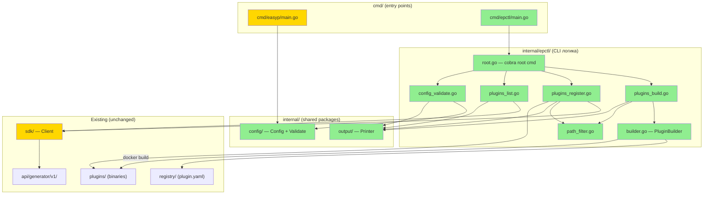

# epctl CLI — Design

## 2.1 Обзор

Реализация CLI-утилиты `epctl` как отдельного бинарника. Задача делится на 5 логических частей:

1. **Рефакторинг структуры** — перенос `cmd/main.go` → `cmd/easyp/main.go`, фиксация namespace
2. **CLI-каркас** — `cmd/epctl/main.go` на cobra с глобальными флагами (`--output`)
3. **Команды plugins** — `build`, `register`, `list` с path-filter и JSON-выводом
4. **Команда config validate** — структурная валидация YAML
5. **Инфраструктура** — обновление Dockerfile, Taskfile, удаление bash-скриптов

## 2.2 Архитектура



**Порядок реализации:**
1. `internal/config/` — shared config types + `Validate()` (REQ-5.*)
2. `internal/output/` — shared `Printer` (REQ-6.*)
3. `cmd/easyp/main.go` — переезд + namespace + вызов `cfg.Validate()` при старте (REQ-1.*)
4. `internal/epctl/path_filter.go` + `builder.go` — инфраструктурный слой
5. `cmd/epctl/` + `internal/epctl/root.go` — CLI-каркас
6. `plugins build` → `plugins register` → `plugins list` → `config validate`
7. SDK: `CreatePlugin` метод
8. Dockerfile, Taskfile, удаление скриптов

## 2.3 Компоненты и интерфейсы

### Файлы, требующие изменений

| Файл | Тип | Описание |
|------|-----|----------|
| `internal/config/config.go` | `[NEW]` | Shared-пакет: типы Config, Server, Ports, etc. + метод `Validate()`. Используется и сервером, и `epctl` |
| `internal/output/printer.go` | `[NEW]` | Shared-пакет: `Printer` — абстракция вывода text/JSON. Используется `epctl`, может использоваться сервером |
| `cmd/easyp/main.go` | `[NEW]` | Перенос из `cmd/main.go`. `const serviceNamespace = "easyp"`, импорт `internal/config`, вызов `cfg.Validate()` при старте |
| `cmd/main.go` | `[DELETED]` | Перемещён в `cmd/easyp/main.go` |
| `cmd/epctl/main.go` | `[NEW]` | Entry point CLI: `epctl.Execute()` |
| `internal/epctl/root.go` | `[NEW]` | Cobra root command, глобальные флаги `--output` |
| `internal/epctl/path_filter.go` | `[NEW]` | `PathFilter` — фильтрация по `group` или `group/name` |
| `internal/epctl/builder.go` | `[NEW]` | `PluginBuilder` — сборка плагинов (порт legacy builder) |
| `internal/epctl/plugins_build.go` | `[NEW]` | Cobra command `plugins build` |
| `internal/epctl/plugins_register.go` | `[NEW]` | Cobra command `plugins register` |
| `internal/epctl/plugins_list.go` | `[NEW]` | Cobra command `plugins list` |
| `internal/epctl/config_validate.go` | `[NEW]` | Cobra command `config validate` |
| `sdk/client.go` | `[MODIFIED]` | Добавление метода `CreatePlugin(ctx, group, name, version string, config map[string]any, tags []string)` |
| `Dockerfile` | `[MODIFIED]` | `go build -o easyp ./cmd/easyp/`, путь COPY |
| `Taskfile.yml` | `[MODIFIED]` | Замена `./build-plugins.sh` → `go run ./cmd/epctl plugins build`, `./register-plugins.sh` → `go run ./cmd/epctl plugins register` |
| `build-plugins.sh` | `[DELETED]` | Заменён на `epctl plugins build` |
| `register-plugins.sh` | `[DELETED]` | Заменён на `epctl plugins register` |

### Файлы, НЕ требующие изменений

| Файл | Причина |
|------|---------|
| `api/generator/v1/generator.proto` | Protobuf API не изменяется |
| `api/generator/v1/*.pb.go` | Сгенерированный код, не трогаем |
| `internal/core/` | Domain-логика не затрагивается |
| `internal/api/` | gRPC handlers не изменяются |
| `internal/adapters/registry/` | Адаптер не изменяется |
| `cmd/mcp-smoke/main.go` | Остаётся как есть (deferred) |
| `sdk/filter.go`, `sdk/health.go`, `sdk/retry.go` | Существующий SDK код не меняется |
| `registry/` | Plugin.yaml и Dockerfiles не изменяются |
| `config.yml`, `config.local.yml` | Формат конфига не изменяется |

### Интерфейсы

```go
// internal/output/printer.go
// Shared-пакет: используется и epctl, и потенциально сервером
// (например, для CLI-вывода health/status информации).

// Printer абстрагирует вывод результатов в text или JSON формат.
type Printer struct {
    format string // "text" | "json"
    w      io.Writer
}

func NewPrinter(format string, w io.Writer) *Printer
func (p *Printer) Table(headers []string, rows [][]string) error
func (p *Printer) JSON(v any) error
func (p *Printer) Message(msg string) error
func (p *Printer) Error(err error) error
```

```go
// internal/epctl/path_filter.go

// PathFilter фильтрует плагины по group и опционально name.
type PathFilter struct {
    Group string // Обязательное (если фильтр задан)
    Name  string // Опциональное
}

// ParsePathFilter парсит "group" или "group/name" в PathFilter.
func ParsePathFilter(arg string) (PathFilter, error)

// Match проверяет, подходит ли plugin path под фильтр.
func (f PathFilter) Match(group, name string) bool
```

```go
// internal/config/config.go
// Shared-пакет: используется cmd/easyp/ (сервер вызывает Validate при старте)
// и internal/epctl/config_validate.go (команда epctl config validate).

// Validate выполняет структурную валидацию конфигурации.
// Вызывается:
// 1. При старте сервера (cmd/easyp/main.go → start() → cfg.Validate())
// 2. Из CLI команды (epctl config validate <path>)
func (c *Config) Validate() error

// LoadAndValidate загружает YAML из файла и валидирует.
// Используется в epctl config validate.
func LoadAndValidate(path string) (*Config, []string, error)
// Возвращает: конфиг, список warnings (unknown fields), ошибку.
```

```go
// internal/epctl/builder.go

// PluginConfig — конфигурация плагина из plugin.yaml.
type PluginConfig struct {
    Binary    string            `yaml:"binary"`
    BuildArgs map[string]string `yaml:"build_args,omitempty"`
    Versions  []VersionEntry    `yaml:"versions"`
}

// VersionEntry поддерживает строковый и map-формат версий.
type VersionEntry struct {
    Version string
}

// BuildJob представляет одну задачу сборки плагина.
type BuildJob struct {
    Group, Name, Version, Binary string
    BuildArgs                    map[string]string
    PluginDir, OutputDir         string
}

// BuildResult — результат сборки одного плагина.
type BuildResult struct {
    Job     BuildJob
    Success bool
    Cached  bool
    Size    string
    Error   error
    Duration time.Duration
}

// BuildSummary — итоговый отчёт сборки.
type BuildSummary struct {
    Total, Built, Failed, Cached int
    Elapsed                      time.Duration
    Results                      []BuildResult
}

// PluginBuilder собирает плагины из registry/.
type PluginBuilder struct {
    registryDir     string
    outputDir       string
    parallelism     int
    continueOnError bool
}

func NewPluginBuilder(registryDir, outputDir string, parallelism int, continueOnError bool) *PluginBuilder

// DiscoverJobs находит все BuildJob из plugin.yaml файлов, применяя фильтр.
func (b *PluginBuilder) DiscoverJobs(filter *PathFilter) ([]BuildJob, error)

// Build выполняет сборку всех jobs.
func (b *PluginBuilder) Build(ctx context.Context, jobs []BuildJob) (*BuildSummary, error)
```

```go
// sdk/client.go (дополнение)

// CreatePlugin registers a new plugin in the service.
func (c *Client) CreatePlugin(
    ctx context.Context,
    group, name, version string,
    config map[string]any,
    tags []string,
) (*generator.PluginInfo, error)
```

## 2.4 Ключевые решения (ADR)

### Decision: CLI-фреймворк — urfave/cli v3

- **Context:** Нужен фреймворк для вложенных подкоманд: `epctl plugins build`, `epctl plugins list`
- **Options:** (A) stdlib `flag` + ручной роутинг, (B) cobra, (C) urfave/cli v3
- **Decision:** urfave/cli v3 (C)
- **Rationale:** Пользователь выбрал urfave/cli v3 во время имплементации. Нативная поддержка вложенных подкоманд, help generation, fluent API. Легче cobra, меньше зависимостей
- **Consequences:** Зависимость `github.com/urfave/cli/v3` в `go.mod`

### Decision: Отдельный пакет `internal/epctl/` для CLI-логики

- **Context:** Где размещать логику команд — в `cmd/epctl/` или в отдельном internal-пакете?
- **Options:** (A) Всё в `cmd/epctl/main.go`, (B) `internal/epctl/` с тонким `cmd/epctl/main.go`
- **Decision:** (B) — `internal/epctl/`
- **Rationale:** Тестируемость: логику `PluginBuilder`, `PathFilter`, `Printer` можно юнит-тестировать без запуска cobra. `cmd/epctl/main.go` остаётся 10-строчным entry point
- **Consequences:** Больше файлов, но каждый фокусированный и тестируемый

### Decision: Параллельная сборка через errgroup с контролируемым прерыванием

- **Context:** Legacy builder использует `errgroup.SetLimit(3)` и всегда `return nil`. Нужен режим fail-fast и `--continue-on-error`
- **Options:** (A) Всегда fail-fast, (B) Всегда continue, (C) Флаг `--continue-on-error`
- **Decision:** (C) — по умолчанию fail-fast, с флагом для продолжения
- **Rationale:** Fail-fast безопаснее для CI/CD (обнаруживаем проблему быстро). Continue полезен для локальной разработки (собираем что можем)
- **Consequences:** `PluginBuilder` принимает `continueOnError bool`. При fail-fast используется `context.WithCancel` для остановки других горутин

### Decision: Shared-пакеты для переиспользования между сервером и CLI

- **Context:** `Printer` и `Config` нужны и серверу, и CLI. Типы конфига (`config`, `server`, `ports`, etc.) сейчас в `cmd/main.go` (package `main`), сервер не валидирует конфиг при старте
- **Options:** (A) Дублировать типы в `internal/epctl/`, (B) Вынести в shared internal-пакеты, (C) Импортировать из `cmd/easyp/` (невозможно — package main)
- **Decision:** (B) — `internal/config/` и `internal/output/`
- **Rationale:** Единый источник правды. Сервер вызывает `cfg.Validate()` при старте (fail-fast при невалидном конфиге). CLI переиспользует тот же `Printer` что доступен серверу. Нет дублирования
- **Consequences:** Рефакторинг `cmd/easyp/main.go` — типы переезжают в `internal/config/config.go`, `Printer` живёт в `internal/output/printer.go`. Сервер добавляет вызов `cfg.Validate()` в `start()` до инициализации компонентов

### Decision: Backward compatibility — немедленная замена bash-скриптов

- **Context:** Оставить скрипты для переходного периода или удалить сразу?
- **Options:** (A) Оставить как fallback, (B) Удалить сразу
- **Decision:** (B) — удалить сразу (пользователь подтвердил)
- **Rationale:** Два способа делать одно и то же — source of confusion. Taskfile обновляется одновременно
- **Consequences:** Breaking change для операторов, использующих скрипты напрямую. Mitigation: документация в CHANGELOG

## 2.5 Модели данных

```go
// [NEW] internal/config/config.go
// Shared-пакет: используется сервером и CLI.
// Перенос типов из cmd/main.go + добавление Validate() и LoadAndValidate().

type Config struct {
    Server     Server           `env:", prefix=SERVER_"      yaml:"server"`
    DB         DBConfig         `env:", prefix=DB_"          yaml:"db"`
    Registry   RegistryConfig   `env:", prefix=REGISTRY_"    yaml:"registry"`
    Telemetry  TelemetryConfig  `env:", prefix=TELEMETRY_"   yaml:"telemetry"`
    WorkerPool WorkerPoolConfig `env:", prefix=WORKER_POOL_" yaml:"worker_pool"`
    License    LicenseConfig    `env:", prefix=LICENSE_"      yaml:"license"`
    RateLimit  RateLimitConfig  `env:", prefix=RATE_LIMIT_"  yaml:"rate_limit"`
}

// Validate выполняет структурную валидацию конфигурации.
// Используется:
// - сервером при старте (cmd/easyp/main.go)
// - CLI командой (epctl config validate)
func (c *Config) Validate() error

// LoadAndValidate загружает YAML из файла, парсит с KnownFields(true),
// возвращает Config, warnings (unknown fields), error.
// Используется в epctl config validate.
func LoadAndValidate(path string) (*Config, []string, error)
```

```go
// [NEW] internal/epctl/builder.go
// PluginConfig, VersionEntry, BuildJob, BuildResult, BuildSummary —
// определены в §2.3 Components.
```

## 2.6 Тестирование

> **Deferred (v2).** Тесты будут добавлены отдельным этапом. Текущий скоуп — только реализация функциональности.

**Project Commands (для ручной верификации):**

| Действие | Команда |
|----------|---------|
| Build (server) | `go build -o easyp ./cmd/easyp/` |
| Build (CLI) | `go build -o epctl ./cmd/epctl/` |
| Lint | `golangci-lint run ./...` |

