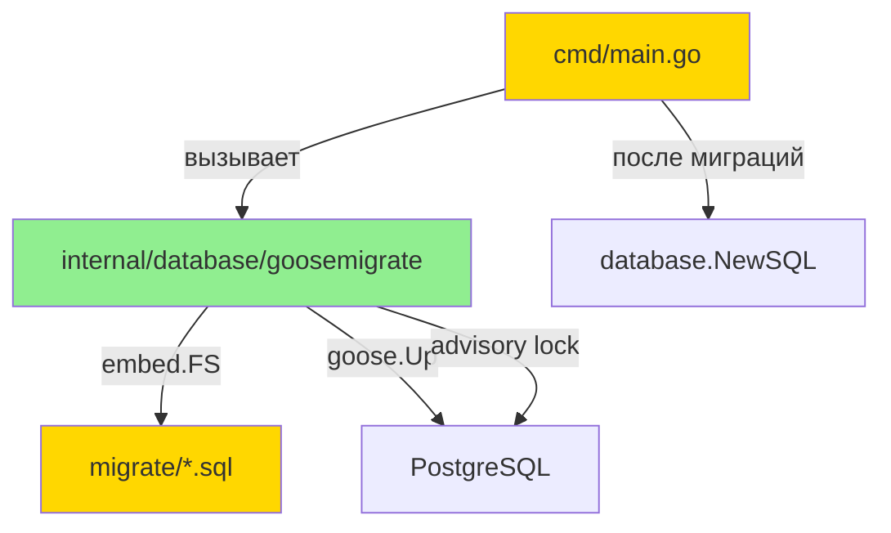

# Переход на goose — Дизайн

**Status:** Draft
**Date:** 2026-05-26

## 2.1 Обзор

Замена самописного миграционного движка на `pressly/goose/v3`. Три логические части:

1. **Конвертация миграций** — переформатировать 5 SQL-файлов в `migrate/` под goose-формат
2. **Новый миграционный модуль** — пакет `internal/database/goosemigrate/` с embed.FS + goose API + advisory lock
3. **Очистка** — удалить `internal/database/migrations/`, убрать `MigrateDir` из конфига, убрать volume mount из docker-compose

## 2.2 Архитектура



**Порядок реализации:**
1. Конвертировать SQL-файлы (`migrate/`)
2. Создать `internal/database/goosemigrate/`
3. Обновить `cmd/main.go` — заменить вызов миграций
4. Удалить `internal/database/migrations/`
5. Обновить конфиги и docker-compose

## 2.3 Компоненты и интерфейсы

### Файлы, требующие изменений

| Файл | Тип изменения | Описание |
|------|--------------|----------|
| `internal/database/goosemigrate/goosemigrate.go` | `[NEW]` | Пакет с функцией `Up(ctx, dsn)` — embed.FS, goose.Up, advisory lock |
| `migrate/00001_init.sql` | `[NEW]` | Переименована из `1.init.sql`, маркеры заменены на goose-формат |
| `migrate/00002_example_plugins.sql` | `[NEW]` | Переименована из `2.example_plugins.sql` |
| `migrate/00003_audit_log.sql` | `[NEW]` | Переименована из `3.audit_log.sql` |
| `migrate/00004_plugin_tags.sql` | `[NEW]` | Переименована из `4.plugin_tags.sql` |
| `migrate/00005_disk_plugin_config.sql` | `[NEW]` | Переименована из `5.disk_plugin_config.sql` |
| `migrate/1.init.sql` | `[DELETED]` | Заменена на `00001_init.sql` |
| `migrate/2.example_plugins.sql` | `[DELETED]` | Заменена на `00002_example_plugins.sql` |
| `migrate/3.audit_log.sql` | `[DELETED]` | Заменена на `00003_audit_log.sql` |
| `migrate/4.plugin_tags.sql` | `[DELETED]` | Заменена на `00004_plugin_tags.sql` |
| `migrate/5.disk_plugin_config.sql` | `[DELETED]` | Заменена на `00005_disk_plugin_config.sql` |
| `cmd/main.go` | `[MODIFIED]` | Удаляет импорт `migrations` и `connectors`, заменяет вызов на `goosemigrate.Up(ctx, cfg.DB.Postgres)`, удаляет поле `MigrateDir` из `dbConfig` |
| `internal/database/migrations/commands.go` | `[DELETED]` | Весь пакет удаляется |
| `internal/database/migrations/migration.go` | `[DELETED]` | Весь пакет удаляется |
| `internal/database/migrations/parser.go` | `[DELETED]` | Весь пакет удаляется |
| `internal/database/migrations/errors.go` | `[DELETED]` | Весь пакет удаляется |
| `internal/database/migrations/command_string.go` | `[DELETED]` | Весь пакет удаляется |
| `internal/database/migrations/generate.go` | `[DELETED]` | Весь пакет удаляется |
| `config.yml` | `[MODIFIED]` | Удаляет строку `migrate_dir: "migrate"` |
| `config.local.yml` | `[MODIFIED]` | Удаляет строку `migrate_dir: "migrate"` |
| `docker-compose.yml` | `[MODIFIED]` | Удаляет volume mount `./migrate:/migrate:ro` |

### Файлы, НЕ требующие изменений

| Файл | Причина |
|------|--------|
| `internal/database/sql.go` | DB wrapper не зависит от миграционного движка |
| `internal/database/metrics.go` | Метрики DAL не зависят от миграций |
| `internal/database/connectors/raw.go` | Connector по-прежнему нужен для `database.NewSQL`; goose получает DSN напрямую |
| `internal/adapters/registry/` | Адаптер работает с готовой схемой, не зависит от мигратора |
| `Dockerfile` | `COPY . /app` уже копирует `migrate/` в build context; embed.FS вкомпилирует файлы в бинарник |
| `Taskfile.yml` | Команды запуска не зависят от мигратора |

### Интерфейс нового пакета

```go
// Package goosemigrate provides database migration using embedded SQL files and goose.
package goosemigrate

// Up applies all pending migrations to the database at the given DSN.
// It uses PostgreSQL advisory locking to prevent concurrent migration execution.
// Migrations are embedded via embed.FS and applied in a transaction per migration.
func Up(ctx context.Context, dsn string) error
```

Предусловия:
- `dsn` — валидная PostgreSQL connection string
- PostgreSQL доступен по указанному DSN

Постусловия:
- Все pending миграции применены
- Таблица `goose_db_version` содержит записи обо всех применённых миграциях
- Соединение с БД закрыто (функция создаёт и закрывает свой `*sql.DB`)

## 2.4 Ключевые решения (ADR)

### Decision: Отдельный пакет `goosemigrate` vs inline в `cmd/main.go`

- **Context:** Миграционный вызов можно разместить inline в `main.go` (5 строк goose API) или вынести в отдельный пакет
- **Options considered:**
  1. Inline в `cmd/main.go` — минимум кода, но embed.FS должен быть в `cmd` пакете
  2. Отдельный пакет `internal/database/goosemigrate/` — инкапсулирует embed.FS и goose-логику
- **Decision:** Отдельный пакет
- **Rationale:** `embed.FS` привязан к пакету, где объявлена директива `//go:embed`. Вынос в отдельный пакет позволяет: (a) не загромождать `cmd/main.go` embed-директивой, (b) переиспользовать в тестах, (c) держать `cmd/main.go` тонким (только оркестрация)
- **Consequences:** Один дополнительный пакет с 1 файлом; `migrate/` директория должна быть доступна relative path от нового пакета — решается через `go:embed` с `../../migrate/*.sql`... Нет — `go:embed` не поддерживает `..`. Значит embed.FS объявляется в `cmd/main.go` (рядом с `migrate/`), а функция `Up` принимает `fs.FS` как параметр.

**Уточнённое решение:** embed.FS объявляется в корневом пакете проекта (или в `cmd/`), функция `Up(ctx, dsn, migrateFS)` принимает `fs.FS`.

### Decision: embed.FS объявление — корень проекта vs `cmd/main.go`

- **Context:** `go:embed` может ссылаться только на файлы в текущем пакете или поддиректориях. `migrate/` находится в корне проекта. `cmd/main.go` находится в `cmd/`, поэтому `//go:embed ../migrate` не сработает.
- **Options considered:**
  1. Создать файл `migrate/embed.go` с embed-директивой — экспортировать `FS` из пакета `migrate`
  2. Создать файл `migrations.go` в корне проекта (пакет `main` не подходит — корень это `module root`, не package)
  3. Переместить `migrate/` внутрь `internal/database/goosemigrate/migrations/`
- **Decision:** Вариант 3 — переместить SQL-файлы в `internal/database/goosemigrate/migrations/`
- **Rationale:** embed.FS объявляется в `goosemigrate` пакете, файлы лежат рядом. Чисто, не нужны хаки с корневыми пакетами. Миграции — деталь реализации, логично что они в internal.
- **Consequences:** `migrate/` директория в корне удаляется. Docker volume mount `./migrate:/migrate:ro` удаляется. Все SQL-файлы перемещаются в `internal/database/goosemigrate/migrations/`.

### Decision: Версионирование схемы — breaking change

- **Context:** Переход с самописной таблицы `migration` на goose `goose_db_version` — несовместимое изменение
- **Options considered:**
  1. Bootstrap-миграция для переноса state
  2. Clean break — все среды пересоздаются
- **Decision:** Clean break
- **Rationale:** Пользователь подтвердил, что production state не важен, все среды пересоздаются с нуля
- **Consequences:** При деплое на среду со старой таблицей `migration` — она просто останется, но не будет использоваться. goose создаст свою `goose_db_version`.

## 2.5 Модели данных

Новых типов нет. goose использует свою внутреннюю таблицу `goose_db_version`:

```sql
-- Создаётся goose автоматически
CREATE TABLE goose_db_version (
    id         SERIAL PRIMARY KEY,
    version_id BIGINT NOT NULL,
    is_applied BOOLEAN NOT NULL,
    tstamp     TIMESTAMP DEFAULT now()
);
```

Удаляемый тип:

```go
// [REMOVED: Migration] — заменён на goose internal state
// [REMOVED: Migrations] — заменён на goose internal state  
// [REMOVED: Command] — заменён на goose API
```

## 2.6 Correctness Properties

**Property 1: Миграции встроены в бинарник**
Category: Equivalence
Statement: For all сборок проекта, набор SQL-файлов доступных через embed.FS идентичен набору файлов в `internal/database/goosemigrate/migrations/`
Validates: Requirements 1.1

**Property 2: Удаление конфигурации MigrateDir**
Category: Absence
Statement: For all конфигурационных файлов и структур, поле `MigrateDir` / `migrate_dir` отсутствует
Validates: Requirements 1.2

**Property 3: Миграции применяются до connection pool**
Category: Propagation
Statement: For all запусков сервиса, `goosemigrate.Up()` завершается до вызова `database.NewSQL()`
Validates: Requirements 2.1

**Property 4: Идемпотентность миграций**
Category: Equivalence
Statement: For all состояний БД где все миграции уже применены, повторный вызов `goosemigrate.Up()` завершается без ошибки и не изменяет схему
Validates: Requirements 2.2

**Property 5: Ошибка миграции прерывает запуск**
Category: Propagation
Statement: For all миграций, если выполнение SQL завершается ошибкой, `goosemigrate.Up()` возвращает non-nil error и сервис не стартует
Validates: Requirements 2.3

**Property 6: Advisory lock предотвращает параллельное выполнение**
Category: Exclusion
Statement: For all пар одновременных вызовов `goosemigrate.Up()`, только один выполняет миграции, второй ожидает release lock
Validates: Requirements 2.4

**Property 7: Формат файлов goose**
Category: Equivalence
Statement: For all SQL-файлов в `migrations/`, файл содержит маркер `-- +goose Up` и имя соответствует паттерну `NNNNN_name.sql`
Validates: Requirements 3.1

**Property 8: Транзакционность миграций**
Category: Absence
Statement: For all миграций, при ошибке SQL внутри миграции частично применённые изменения откатываются (goose default behavior)
Validates: Requirements 3.2

**Property 9: Отсутствие старого кода**
Category: Absence
Statement: For all файлов проекта, путь `internal/database/migrations/` не существует и импорт `internal/database/migrations` отсутствует
Validates: Requirements 4.1, 4.2

**Property 10: Таблица goose_db_version**
Category: Propagation
Statement: For all применённых миграций, таблица `goose_db_version` содержит запись с соответствующим `version_id` и `is_applied=true`
Validates: Requirements 5.1, 5.2

## 2.7 Обработка ошибок

| Сценарий | Обнаружение | Действие |
|----------|------------|----------|
| PostgreSQL недоступен при запуске миграций | `sql.Open` или `db.PingContext` возвращает ошибку | `goosemigrate.Up()` возвращает error, сервис не стартует |
| Невалидный DSN | `sql.Open` возвращает ошибку | `goosemigrate.Up()` возвращает error, сервис не стартует |
| SQL-ошибка в миграции (напр. таблица уже существует без IF NOT EXISTS) | goose перехватывает ошибку exec, откатывает транзакцию | `goosemigrate.Up()` возвращает error с номером и именем миграции |
| Параллельный запуск двух инстансов | Advisory lock блокирует второй инстанс | Второй инстанс ожидает release lock, затем проверяет state и пропускает уже применённые миграции |
| Нет pending миграций | goose проверяет `goose_db_version` | `goosemigrate.Up()` возвращает nil — no-op |
| Corrupted embed.FS (теоретически) | goose не может прочитать файл | `goosemigrate.Up()` возвращает error |

## 2.8 Стратегия тестирования

**Test Style Source:** Tier 3
- Тестовые файлы в проекте отсутствуют (`find . -name "*_test.go"` — пусто)
- PBT (property-based testing) недоступна — используем targeted unit tests как замену

**Project Commands:**

| Действие | Команда |
|----------|---------|
| Test | `go test ./...` |
| Build | `go build ./cmd/main.go` |
| Lint | `go vet ./...` |

### Unit Tests

| Test | Описание | Tags |
|------|---------|------|
| `TestUp_AppliesMigrations` | Запуск `Up()` на чистой БД — все миграции применяются, таблицы создаются | `Feature/goose-migration` |
| `TestUp_Idempotent` | Двойной запуск `Up()` — второй вызов не ошибается | `Feature/goose-migration` |
| `TestUp_InvalidDSN` | Вызов с невалидным DSN — возвращает ошибку | `Feature/goose-migration` |

### Property-Based Tests

PBT недоступна — используем targeted unit tests:

| Test | Property | Описание проверки | Tags |
|------|----------|-------------------|------|
| `TestProp_EmbedFSContainsAllMigrations` | CP-1 | Проверяет что embed.FS содержит ровно 5 файлов с паттерном `NNNNN_*.sql` | `Property/1` |
| `TestProp_NoMigrateDirInConfig` | CP-2 | Проверяет что структура `dbConfig` не содержит поле `MigrateDir` (через reflection) | `Property/2` |
| `TestProp_MigrationsBeforePool` | CP-3 | Верифицируется через code review — порядок вызовов в `cmd/main.go` | `Property/3` |
| `TestProp_IdempotentUp` | CP-4 | Запускает `Up()` дважды на одной БД — без ошибок | `Property/4` |
| `TestProp_ErrorStopsStartup` | CP-5 | Подаёт DSN с невалидной БД — `Up()` возвращает error | `Property/5` |
| `TestProp_AdvisoryLock` | CP-6 | Верифицируется через наличие `goose.NewPostgresSessionLocker` в коде (integration test требует 2 инстанса) | `Property/6` |
| `TestProp_GooseFileFormat` | CP-7 | Проверяет содержимое каждого файла через embed.FS — наличие `-- +goose Up`, формат имени | `Property/7` |
| `TestProp_TransactionRollback` | CP-8 | Верифицируется через goose default behavior — документируется, не тестируется отдельно | `Property/8` |
| `TestProp_NoOldMigrationsPackage` | CP-9 | `go build ./...` не ссылается на `internal/database/migrations` — проверяется компиляцией | `Property/9` |
| `TestProp_GooseDBVersion` | CP-10 | После `Up()` проверяет наличие таблицы `goose_db_version` с 5 записями | `Property/10` |
