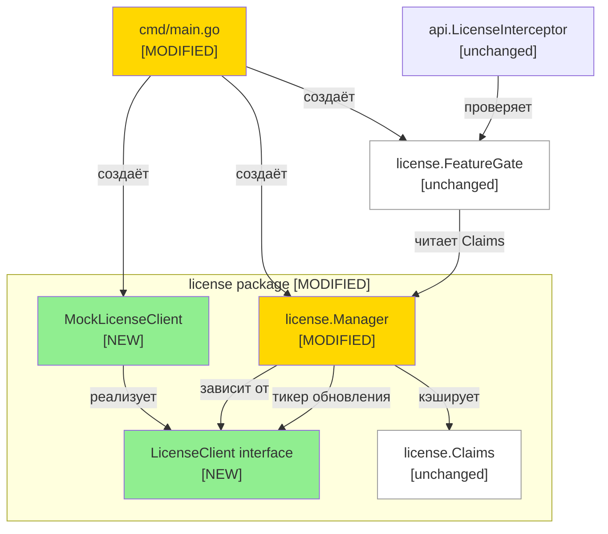

# Remote License Validation — Дизайн

## 2.1 Обзор

Реализация делится на две логические части:

1. **Рефакторинг `license.Manager`** — замена PASETO-логики на зависимость от интерфейса `LicenseClient`. Manager больше не знает о криптографии; он только кэширует `Claims`, полученные от клиента, и запускает тикер обновления.
2. **Реализация `MockLicenseClient`** — единственная реализация `LicenseClient` на текущем этапе. Хардкодит Enterprise-ответ без сетевых вызовов. Все production-пути используют этот мок до появления реального gRPC-клиента.
3. **Очистка сборки** — удаление `licensePublicKey` var, PASETO-импорта, `ARG LICENSE_PUBLIC_KEY` из `Dockerfile`, полей `key`/`file` из конфига.

---

## 2.2 Архитектура



**Порядок реализации:**
1. Определить интерфейс `LicenseClient` и тип `MockLicenseClient` в `internal/license/client.go`
2. Переписать `license.Manager` — убрать PASETO, принять `LicenseClient` в конструктор
3. Обновить `license.Config` — убрать `Key`/`File`, добавить `CacheTTL`
4. Обновить `cmd/main.go` — убрать `licensePublicKey`, создавать `MockLicenseClient`
5. Удалить PASETO-логику (методы `ParseToken`, `FormatToken`, `extractClaims`, `applyToken`, `loadToken`)
6. Обновить `Dockerfile`

---

## 2.3 Компоненты и интерфейсы

### Файлы, требующие изменений

| Файл | Тип изменения | Описание |
|------|--------------|----------|
| `internal/core/domain.go` | `[MODIFIED]` | Добавляет интерфейс `LicenseClient` и тип `LicenseClaims` (перенос и переименование из `license.Claims`) |
| `internal/license/client.go` | `[NEW]` | Реализация `MockLicenseClient` — имплементирует `core.LicenseClient` |
| `internal/license/manager.go` | `[MODIFIED]` | Удаляет всю PASETO-логику; принимает `core.LicenseClient` в конструктор; кэширует `core.LicenseClaims`; тикер вызывает `client.ValidateLicense()` |
| `internal/license/claims.go` | `[MODIFIED]` | Структура `Claims` заменяется на псевдоним или удаляется — переходим на `core.LicenseClaims`; `CommunityDefaults()` переносится в `core` |
| `internal/license/gate.go` | `[MODIFIED]` | Обновляет типы: `manager.Claims()` теперь возвращает `core.LicenseClaims` |
| `internal/license/errors.go` | `[MODIFIED]` | Удаляет `ErrInvalidToken`, `ErrSignatureInvalid`, `ErrTokenExpired`, `ErrInvalidClaims`, `ErrFileNotFound`; оставляет только `ErrNoClient` |
| `internal/license/manager.go` (Config) | `[MODIFIED]` | Убирает поля `Key`/`File`, добавляет `CacheTTL duration` |
| `cmd/main.go` | `[MODIFIED]` | Удаляет `var licensePublicKey string`; создаёт `license.MockLicenseClient`; убирает ldflags-зависимость |
| `Dockerfile` | `[MODIFIED]` | Удаляет `ARG LICENSE_PUBLIC_KEY` и `-ldflags "-X main.licensePublicKey=..."` из команды `go build` |
| `go.mod` / `go.sum` | `[MODIFIED]` | Удалить зависимость `aidanwoods.dev/go-paseto` (после удаления импортов) |

### Файлы, не требующие изменений

| Файл | Причина |
|------|---------|
| `internal/license/features.go` | Enum `feature`, `IsEnterprise()`, `Valid()` — приватная деталь реализации, не затронута |
| `internal/license/metrics.go` | Метрики и их регистрация остаются без изменений |
| `internal/api/license_interceptor.go` | Зависит только от `core.FeatureGate` — не затронут |
| `internal/license/features_test.go` | Тестирует enum feature — PASETO не используется, тест выживает |

> **Тест переезжает:** `internal/license/claims_test.go` → `internal/core/claims_test.go` (тестирует `core.CommunityLicenseClaims()` и `core.LicenseClaims`).

---

### Интерфейсы и сигнатуры

#### `core.LicenseClient` интерфейс (новый, `internal/core/domain.go`)

```go
// LicenseClient определяет контракт для получения данных лицензии.
// Текущая реализация — license.MockLicenseClient.
// TODO: replace with real gRPC client when license server is available.
type LicenseClient interface {
    // ValidateLicense возвращает LicenseClaims для текущей инсталляции.
    // При ошибке возвращает нулевые Claims и ненулевой error.
    ValidateLicense(ctx context.Context) (LicenseClaims, error)
}

// LicenseClaims содержит данные лицензии, возвращаемые LicenseClient.
type LicenseClaims struct {
    Tier       string    // "community" или "enterprise"
    Features   []Feature // включённые фичи (используется публичный Feature из core)
    MaxWorkers int       // лимит воркеров (-1 = не ограничен)
    MaxPlugins int       // лимит плагинов (-1 = не ограничен)
}
```

#### `license.MockLicenseClient` (новый, `internal/license/client.go`)

```go
// MockLicenseClient — временная реализация core.LicenseClient.
// Всегда возвращает Enterprise-Claims без сетевых вызовов.
// TODO: replace with real gRPC client when license server is available.
type MockLicenseClient struct{}

func NewMockLicenseClient() *MockLicenseClient

// ValidateLicense(ctx context.Context) (core.LicenseClaims, error)
// Возвращает: LicenseClaims{Tier: "enterprise", MaxWorkers: -1, MaxPlugins: -1, все фичи}
// Ошибка: всегда nil
```

#### `Manager` конструктор (изменённый)

```go
// NewManager создаёт Manager с переданным core.LicenseClient.
// При client == nil паникует.
// Сразу вызывает client.ValidateLicense() для первичной загрузки Claims.
// При ошибке первого вызова — запускается с CommunityDefaults(), логирует предупреждение.
func NewManager(
    client core.LicenseClient,
    cfg Config,
    logger *slog.Logger,
    reg *prometheus.Registry,
    namespace string,
) *Manager
```

#### `Config` (изменённый)

```go
// Config содержит параметры лицензирования.
type Config struct {
    CacheTTL time.Duration `env:"CACHE_TTL,default=5m" yaml:"cache_ttl"`
}
```

---

## 2.4 Ключевые решения (ADR)

### ADR-1: Где определить интерфейс `LicenseClient`

**Контекст:** Интерфейс может жить в пакете `license` или `core`. Проектное соглашение (AGENTS.md): «Domain types and interfaces live in `internal/core/domain.go` — single source of truth». Все существующие интерфейсы проекта (`Metrics`, `Registry`, `AuditLog`, `FeatureGate`, `Service`) объявлены в `core`.

**Ограничение:** `core` не может импортировать `license` (обратный импорт создаёт цикл). Поэтому если `LicenseClient.ValidateLicense()` возвращает тип из `license` — интерфейс не может жить в `core`. Решение: вынести `LicenseClaims` (доменный тип) тоже в `core`.

**Варианты:**
- A) `LicenseClient` в `internal/license`, `Claims` остаётся в `license` — нарушает проектное соглашение
- B) `LicenseClient` и `LicenseClaims` в `internal/core/domain.go`, реализация `MockLicenseClient` в `internal/license` — следует соглашению

**Решение:** Вариант B.

**Обоснование:** Все интерфейсы проекта объявляются в `core`. `LicenseClaims` — доменный тип (тир, фичи, лимиты), а не деталь реализации PASETO. Перенос в `core` согласуется с существующим паттерном (аналогично `FeatureGate` → `core`, реализация → `license`).

**Последствия:** `license.Claims` (старый) и `CommunityDefaults()` переносятся в `core` как `core.LicenseClaims` и `core.CommunityLicenseClaims()`. Тест `internal/license/claims_test.go` переезжает в `internal/core/`. Пакет `license` импортирует `core` (уже делает это) — цикла нет.

---

### ADR-2: Стратегия обновления Claims в Manager

**Контекст:** Старый Manager проверял истечение PASETO-токена по полю `ExpiresAt`. Новый Manager получает Claims от внешнего клиента и должен периодически их обновлять.

**Варианты:**
- A) Тикер с фиксированным интервалом (60s, как было)
- B) Тикер с конфигурируемым `CacheTTL` (default 5m)
- C) Обновление только при каждом вызове `Claims()`

**Решение:** Вариант B — тикер с `CacheTTL`.

**Обоснование:** Конфигурируемый интервал даёт гибкость без сложности варианта C (синхронный сетевой вызов на каждый запрос создаёт задержки). Mock всегда возвращает успех, поэтому тикер не нагружает систему.

**Последствия:** Поле `CacheTTL` добавляется в `Config`. Метод `StartExpirationWatcher` переименовывается в `StartRefreshWatcher` и меняет логику.

---

### ADR-3: Backward-compatibility конфига

**Контекст:** Поля `license.key` и `license.file` в `config.yml` удаляются. Это breaking change для операторов, которые передавали PASETO-токен.

**Варианты:**
- A) Мягкое удаление: поля остаются в struct, но игнорируются (deprecated)
- B) Жёсткое удаление: struct меняется, старый YAML вызывает ошибку unmarshalling (или молча игнорируется yaml-декодером)

**Решение:** Жёсткое удаление (вариант B).

**Обоснование:** PASETO-механизм полностью убирается. Оставление полей создаёт ложное ощущение, что они что-то делают. Go yaml-декодер по умолчанию игнорирует неизвестные ключи — оператор не получит ошибку, но и токен обрабатываться не будет. Это приемлемо для Phase 1, так как реальный сервер всё равно не существует.

**Последствия:** Операторы, обновляющие сервис, должны удалить `license.key`/`license.file` из конфигов. Нужно отметить в CHANGELOG или документации.

---

## 2.5 Модели данных

Структуры `Claims` и `Config` — единственные модели, затрагиваемые изменением.

```go
// [NEW, in internal/core/domain.go]
// LicenseClaims — доменный тип данных лицензии.
// Заменяет license.Claims (который удаляется).
type LicenseClaims struct {
    Tier       string    // "community" или "enterprise"
    Features   []Feature // включённые фичи (публичный core.Feature)
    MaxWorkers int       // лимит воркеров (-1 = не ограничен)
    MaxPlugins int       // лимит плагинов (-1 = не ограничен)
}

// [NEW, in internal/core/domain.go]
// CommunityLicenseClaims возвращает стандартные Claims для Community-режима.
func CommunityLicenseClaims() LicenseClaims

// [REMOVED: license.Claims] — заменён на core.LicenseClaims
// [REMOVED: license.CommunityDefaults()] — заменён на core.CommunityLicenseClaims()

// [MODIFIED, in internal/license/manager.go, was: Config{Key string, File string}]
type Config struct {
    CacheTTL time.Duration `env:"CACHE_TTL,default=5m" yaml:"cache_ttl"`
}
```

---

## 2.6 Свойства корректности

```
Property 1: MockClient всегда возвращает Enterprise
Category: Absence
Statement: For all вызовов MockLicenseClient.ValidateLicense(), возвращаемые Claims имеют Tier=enterprise и error=nil
Validates: Requirements REQ-1.2, REQ-1.3
```

```
Property 2: Manager кэширует успешный ответ
Category: Propagation
Statement: For all успешных вызовов LicenseClient.ValidateLicense(), возвращаемые Claims становятся текущими Claims Manager (читаемыми через Manager.Claims())
Validates: Requirements REQ-3.1
```

```
Property 3: Ошибка клиента не меняет кэш
Category: Absence
Statement: For all вызовов LicenseClient.ValidateLicense() возвращающих ошибку, Manager.Claims() возвращает те же Claims, что и до вызова
Validates: Requirements REQ-2.4, REQ-3.3
```

```
Property 4: Первый вызов при ошибке → Community
Category: Equivalence
Statement: For all запусков Manager где первый вызов ValidateLicense() возвращает ошибку, Manager.Claims() эквивалентен CommunityDefaults()
Validates: Requirements REQ-4.1
```

```
Property 5: Пустой ключ → Community без вызова клиента
Category: Absence
Statement: For all конфигураций где license_key пустой, LicenseClient.ValidateLicense() не вызывается и Manager.Claims() возвращает CommunityDefaults()
Validates: Requirements REQ-4.2

[ASSUMPTION: поле license_key убрано из Config в Phase 1 — мок всегда отвечает Enterprise, поэтому REQ-4.2 реализуется как: если URL не сконфигурирован — используется мок, который возвращает Enterprise. Строгая Community-без-вызова семантика применяется в Phase 2 с реальным клиентом]
```

```
Property 6: Интерфейс FeatureGate не меняется
Category: Equivalence
Statement: For all вызовов FeatureGate.Enabled(), MaxWorkers(), MaxPlugins() — сигнатуры и возвращаемые типы идентичны pre-refactoring
Validates: Requirements REQ-7.2
```

```
Property 7: Метрики обновляются после успешного получения Claims
Category: Propagation
Statement: For all успешных вызовов ValidateLicense(), метрика license_valid принимает значение соответствующее тиру Claims
Validates: Requirements REQ-7.1
```

```
Property 8: Сборка не требует ldflags
Category: Absence
Statement: For all запусков `go build ./cmd/main.go` без флага `-ldflags`, бинарник компилируется без ошибок
Validates: Requirements REQ-6.1
```

```
Property 9: PASETO не импортируется
Category: Absence
Statement: For all файлов в пакете `internal/license`, ни один не содержит импорта `aidanwoods.dev/go-paseto`
Validates: Requirements REQ-6.3
```

---

## 2.7 Обработка ошибок

| Сценарий | Обнаружение | Действие |
|---------|------------|---------|
| Первый вызов `ValidateLicense()` при старте вернул ошибку | `err != nil` в `NewManager` | Запустить с `CommunityDefaults()`, залогировать `Warn`, продолжить работу |
| Периодический тикер: `ValidateLicense()` вернул ошибку | `err != nil` в goroutine тикера | Оставить текущий кэш без изменений, залогировать `Warn` |
| `ValidateLicense()` вернул Claims с изменённым тиром | `oldTier != newTier` | Обновить кэш, залогировать `Info` с указанием старого и нового тира |
| `client == nil` в `NewManager` | проверка перед инициализацией | `panic("license: client must not be nil")` — программная ошибка конфигурации |
| `CacheTTL <= 0` в конфиге | проверка в `NewManager` | Использовать default 5m, залогировать `Warn` |

---

## 2.8 Стратегия тестирования

**Test Style Source:** Tier 2
- Evidence: `internal/license/claims_test.go`, `internal/license/features_test.go`
- Паттерны: стандартный `testing` пакет (stdlib), `testify/assert` для assertions, table-driven tests (`tests := []struct{...}`), тесты в том же пакете (`package license`)

**Project Commands:**

| Действие | Команда |
|----------|---------|
| Тест | `go test ./...` |
| Сборка | `go build ./cmd/main.go` |
| Lint | `golangci-lint run` |

---

### Unit Tests

| Тест | Описание | Tags |
|------|---------|------|
| `TestMockLicenseClient_ValidateLicense` | Вызов возвращает Claims с `Tier=enterprise`, `MaxWorkers=-1`, `MaxPlugins=-1`, error=nil | `Feature/MockClient` |
| `TestMockLicenseClient_AllFeaturesEnabled` | Возвращаемые Claims содержат все фичи, включая Enterprise | `Feature/MockClient` |
| `TestManager_InitSuccess` | При успешном первом ValidateLicense Claims сохраняются в кэш | `Feature/Manager` |
| `TestManager_InitError_FallbackCommunity` | При ошибке первого ValidateLicense Manager запускается с CommunityDefaults | `Feature/Manager` |
| `TestManager_Refresh_UpdatesClaims` | После тика тикера Claims обновляются при успешном ответе клиента | `Feature/Manager` |
| `TestManager_Refresh_ErrorPreservesCache` | При ошибке ValidateLicense кэшированные Claims не изменяются | `Feature/Manager` |
| `TestManager_TierChange_Logged` | При смене тира после обновления регистрируется лог Info | `Feature/Manager` |
| `TestManager_NilClient_Panics` | `NewManager(nil, ...)` вызывает panic | `Feature/Manager` |
| `TestManager_ZeroCacheTTL_UsesDefault` | `CacheTTL=0` заменяется на 5m | `Feature/Manager` |
| `TestConfig_Defaults` | Дефолтный `CacheTTL` равен 5 минутам | `Feature/Config` |

### Property-Based Tests (заменены targeted unit tests — PBT-библиотека не используется в проекте)

**Test Style Source note:** PBT unavailable — using targeted unit tests as substitute.

| Тест | Property | Генератор / Входные данные | Tags |
|------|---------|--------------------------|------|
| `prop_MockAlwaysEnterprise` | CP-1 | N вызовов MockLicenseClient с разными ctx | `Property/1` |
| `prop_SuccessUpdatesCache` | CP-2 | Мок клиент с несколькими разными Claims | `Property/2` |
| `prop_ErrorPreservesCache` | CP-3 | Мок клиент возвращающий ошибку, проверка до/после | `Property/3` |
| `prop_FirstErrorCommunity` | CP-4 | Мок клиент всегда ошибка, проверка Claims | `Property/4` |
| `prop_FeatureGateSignatureUnchanged` | CP-6 | Вызовы Enabled/MaxWorkers/MaxPlugins на FeatureGate | `Property/6` |
| `prop_MetricsUpdatedAfterSuccess` | CP-7 | Успешный ValidateLicense, проверка метрики | `Property/7` |
| `prop_BuildWithoutLdflags` | CP-8 | `go build ./cmd/main.go` без ldflags | `Property/8` |
| `prop_NoPasetoImport` | CP-9 | Grep по файлам пакета license на отсутствие paseto-импорта | `Property/9` |
