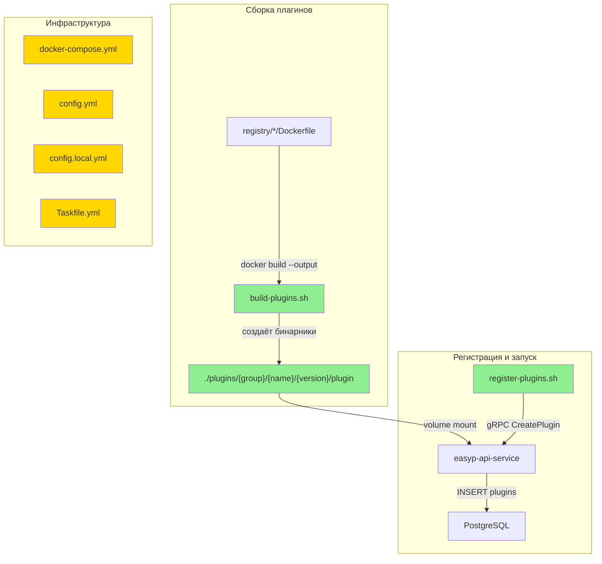

# local-test-env — Design

**Status:** Draft
**Date:** 2026-05-24

## 2.1 Обзор

Проектирование локального тестового окружения для сервиса EasyP после миграции на disk-plugin-execution. Задача делится на 4 логические части:

1. **Dockerfile-ы** — переделка 4 файлов в `registry/` для сборки бинарников через `docker build --output`.
2. **Скрипты** — `build-plugins.sh` (сборка) и `register-plugins.sh` (регистрация через gRPC API).
3. **Инфраструктура** — очистка `docker-compose.yml`, обновление конфигов, Taskfile.
4. **Очистка** — удаление `push.sh`.

---

## 2.2 Архитектура



**Порядок реализации:**
1. Dockerfile-ы (фундамент — без них скрипт сборки не работает)
2. `build-plugins.sh` (зависит от Dockerfile-ов)
3. Инфраструктура (config, docker-compose, Taskfile — параллельно)
4. `register-plugins.sh` (зависит от работающего сервиса)
5. Очистка (удаление `push.sh`)

---

## 2.3 Компоненты и интерфейсы

### Файлы, требующие изменений

| File | Change Type | Description |
|------|-------------|-------------|
| `registry/protocolbuffers/go/v1.36.10/Dockerfile` | `[MODIFIED]` | Убрать второй стейдж с `ENTRYPOINT`/`USER`/`passwd`. Финальный стейдж: `FROM scratch` + `COPY --from=0 /go/bin/protoc-gen-go /plugin` |
| `registry/grpc/go/v1.5.1/Dockerfile` | `[MODIFIED]` | Аналогично: `COPY --from=0 /go/bin/protoc-gen-go-grpc /plugin` |
| `registry/grpc-ecosystem/gateway/v2.27.3/Dockerfile` | `[MODIFIED]` | Аналогично: `COPY --from=0 /go/bin/protoc-gen-grpc-gateway /plugin` |
| `registry/grpc-ecosystem/openapiv2/v2.27.3/Dockerfile` | `[MODIFIED]` | Аналогично: `COPY --from=0 /go/bin/protoc-gen-openapiv2 /plugin` |
| `build-plugins.sh` | `[NEW]` | Bash-скрипт: `find registry -name Dockerfile`, для каждого `docker build --output`. `set -e`. |
| `register-plugins.sh` | `[NEW]` | Bash-скрипт: обход `plugins/`, для каждого вызов `grpcurl` → `CreatePlugin`. `ALREADY_EXISTS` → skip. |
| `config.yml` | `[MODIFIED]` | Секция `registry:` — заменить `domain: "localhost:5005"` на `plugins_dir: "/plugins"` и `max_output_size: 67108864` |
| `config.local.yml` | `[MODIFIED]` | Секция `registry:` — заменить `domain: "localhost:5005"` на `plugins_dir: "./plugins"` и `max_output_size: 67108864` |
| `docker-compose.yml` | `[MODIFIED]` | Удалить сервис `registry`, volume `registry-data`. В `service`: убрать `docker.sock`, добавить `./plugins:/plugins:ro`. |
| `Taskfile.yml` | `[MODIFIED]` | Удалить `local-push-registry`, `local-push-required`. Добавить `build-plugins`, `register-plugins`. Обновить deps в `run`. |
| `push.sh` | `[DELETED]` | Устаревший скрипт для пуша образов в Docker Registry. |

### Файлы, НЕ требующие изменений

| File | Reason Unchanged |
|------|-----------------|
| `cmd/main.go` | Структура `registryConfig` уже использует `PluginsDir` и `MaxOutputSize` (обновлена в `disk-plugin-execution`) |
| `internal/adapters/registry/registry.go` | Логика `Generate()` уже работает с exec — не затрагивается |
| `internal/core/domain.go` | Доменная модель не меняется |
| `internal/core/pool.go` | WorkerPool не затрагивается |
| `api/generator/v1/generator.proto` | API контракт не меняется |
| `Dockerfile` (корневой) | Сервисный Dockerfile уже переделан в `disk-plugin-execution` (debian, VOLUME /plugins) |
| `migrate/*.sql` | Миграция `5.disk_plugin_config.sql` уже существует |
| `.gitignore` | `plugins/` уже добавлен (строка 9) |

---

## 2.4 Ключевые решения (ADR)

### Decision: Формат выходного бинарника — `/plugin`

- **Context:** Каждый Dockerfile собирает плагин с уникальным именем (`protoc-gen-go`, `protoc-gen-go-grpc` и т.д.). Нужен единый путь для бинарника в финальном стейдже.
- **Options considered:**
  1. Оставить оригинальное имя (`/protoc-gen-go`) — разные имена для каждого плагина.
  2. Использовать единое имя `/plugin` — одинаковая структура для всех.
- **Decision:** Единое имя `/plugin`.
- **Rationale:** Скрипт `build-plugins.sh` не нужно учить маппинг "Dockerfile → имя бинарника". Путь всегда `plugins/{group}/{name}/{version}/plugin`. Конфигурация в БД тоже единообразна: `"command": ["/plugins/{group}/{name}/{version}/plugin"]`.
- **Consequences:** Имя файла не несёт семантики, но она закодирована в пути директории.

### Decision: Разделение скриптов сборки и регистрации

- **Context:** Сборка плагинов не требует запущенного сервиса. Регистрация требует.
- **Options considered:**
  1. Один скрипт `build-and-register.sh` — удобно, но требует сервиса для сборки.
  2. Два скрипта: `build-plugins.sh` + `register-plugins.sh`.
- **Decision:** Два отдельных скрипта.
- **Rationale:** Разделение ответственности. `build-plugins.sh` можно запускать до `docker compose up`. `register-plugins.sh` — после запуска сервиса. Разные точки отказа, разные зависимости.
- **Consequences:** Две отдельные таски в Taskfile, но workflow `task run` их оркестрирует.

### Decision: Монтирование `./plugins` как read-only

- **Context:** Плагины — статичные бинарники. Сервис только читает их.
- **Options considered:**
  1. Read-write mount (`./plugins:/plugins`).
  2. Read-only mount (`./plugins:/plugins:ro`).
- **Decision:** Read-only (`:ro`).
- **Rationale:** Принцип наименьших привилегий. Сервис не должен модифицировать плагины. Защищает от случайной перезаписи.
- **Consequences:** Если понадобится hot-reload плагинов — потребуется убрать `:ro`.

---

## 2.5 Модели данных

Новых типов данных нет. Существующие типы (`PluginConfig`, `plugin`, `Registry`) были обновлены в `disk-plugin-execution` и не требуют дополнительных изменений.

---

## 2.6 Корректностные свойства

```
Property 1: Dockerfile output
Category: Equivalence
Statement: For all Dockerfile-ов в `registry/`, `docker build --output=<dir>` создаёт исполняемый файл `<dir>/plugin`.
Validates: Requirements 1.1, 1.3
```

```
Property 2: UPX compression
Category: Propagation
Statement: For all собранных plugin binary, размер файла меньше размера несжатого бинарника (UPX применён).
Validates: Requirements 1.2
```

```
Property 3: Build script fail-fast
Category: Absence
Statement: For all запусков `build-plugins.sh`, при ошибке `docker build` для любого плагина скрипт завершается немедленно с ненулевым exit-кодом. Частично собранные наборы невозможны.
Validates: Requirements 2.2
```

```
Property 4: Build script completeness
Category: Equivalence
Statement: For all Dockerfile-ов в `registry/`, `build-plugins.sh` создаёт соответствующий `plugins/{group}/{name}/{version}/plugin`.
Validates: Requirements 2.1, 2.3
```

```
Property 5: Registration idempotency
Category: Absence
Statement: For all вызовов `register-plugins.sh` для уже зарегистрированных плагинов, ошибка `ALREADY_EXISTS` не приводит к аварийному завершению скрипта.
Validates: Requirements 3.2
```

```
Property 6: Registration completeness
Category: Propagation
Statement: For all плагинов в `plugins/`, `register-plugins.sh` вызывает `CreatePlugin` с корректными `group`, `name`, `version` и `config.command`.
Validates: Requirements 3.1
```

```
Property 7: Registration fail-fast
Category: Absence
Statement: For all ошибок gRPC (кроме `ALREADY_EXISTS`), `register-plugins.sh` немедленно завершается с ненулевым exit-кодом.
Validates: Requirements 3.3
```

```
Property 8: Config correctness
Category: Propagation
Statement: For all конфигурационных файлов (`config.yml`, `config.local.yml`), секция `registry` содержит `plugins_dir` и `max_output_size`, а не `domain`.
Validates: Requirements 4.1, 4.2, 4.3
```

```
Property 9: Docker compose cleanup
Category: Absence
Statement: For all содержимого `docker-compose.yml`, отсутствуют: сервис `registry`, volume `registry-data`, mount `docker.sock`.
Validates: Requirements 5.1, 5.2
```

```
Property 10: Plugins volume mount
Category: Propagation
Statement: For all запусков `docker compose up`, сервис `service` имеет read-only volume mount `./plugins:/plugins:ro`.
Validates: Requirements 5.1
```

```
Property 11: Taskfile cleanup
Category: Absence
Statement: For all содержимого `Taskfile.yml`, отсутствуют таски `local-push-registry` и `local-push-required`.
Validates: Requirements 6.4
```

```
Property 12: Taskfile new tasks
Category: Equivalence
Statement: For all запусков `task build-plugins` и `task register-plugins`, вызываются `build-plugins.sh` и `register-plugins.sh` соответственно.
Validates: Requirements 6.1, 6.2
```

```
Property 13: Task run deps
Category: Propagation
Statement: For all запусков `task run`, зависимость `local-push-registry` заменена на `build-plugins`.
Validates: Requirements 6.3
```

```
Property 14: Push script removal
Category: Absence
Statement: For all файлов в корне репозитория, `push.sh` не существует.
Validates: Requirements 7.1
```

---

## 2.7 Обработка ошибок

| Сценарий | Обнаружение | Действие |
|----------|------------|---------|
| `docker build` падает для одного из Dockerfile-ов | Non-zero exit code от `docker build` | `build-plugins.sh` завершается немедленно (`set -e`) |
| Docker daemon не запущен | `docker build` возвращает ошибку "Cannot connect to the Docker daemon" | Скрипт падает с понятной ошибкой |
| BuildKit не включён | `--output` не поддерживается | Скрипт устанавливает `DOCKER_BUILDKIT=1` перед вызовом |
| gRPC сервис не доступен | `grpcurl` возвращает ошибку connection refused | `register-plugins.sh` падает с ненулевым exit-кодом |
| Плагин уже зарегистрирован | gRPC возвращает `ALREADY_EXISTS` | `register-plugins.sh` логирует warning и продолжает |
| gRPC вызов возвращает другую ошибку | Non-zero exit от `grpcurl` + статус != `ALREADY_EXISTS` | `register-plugins.sh` немедленно завершается |
| Директория `plugins/` пуста при регистрации | Нет поддиректорий с бинарниками | `register-plugins.sh` завершается с warning (ничего не зарегистрировано) |

---

## 2.8 Стратегия тестирования

**Test Style Source:** Tier 2
- Evidence: `internal/adapters/registry/registry_test.go` (удалён в `disk-plugin-execution`, но паттерны из него доступны), `internal/core/pool_test.go` (удалён)
- Key patterns: стандартный `go test`, table-driven tests. PBT unavailable — using targeted unit tests as substitute.

**Project Commands:**

| Action | Command |
|--------|---------|
| Test | `go test ./...` |
| Build | `go build -o main ./cmd/main.go` |
| Lint | `golangci-lint run ./...` |
| Generate | `easyp --cfg easyp.yaml generate` |

NOTE: Эта фича в основном затрагивает скрипты и конфиги (bash, YAML, Dockerfile), а не Go-код. Основная верификация — ручная/интеграционная: запуск скриптов, проверка файлов, запуск сервиса. Go-тесты проверяют, что существующий код не сломан.

### Unit Tests

| Test | Description | Tags |
|------|-------------|------|
| `TestBuild_GoCompiles` | `go build -o main ./cmd/main.go` компилируется без ошибок после обновления конфигов | `Feature/build` |
| `TestExisting_GoTests` | Все существующие Go-тесты проходят: `go test ./...` | `Feature/regression` |

### Property-Based Tests (manual verification scripts)

| Test | Property | Generator description | Tags |
|------|----------|-----------------------|------|
| `verify_dockerfile_output` | CP-1 | Для каждого Dockerfile: `docker build --output=/tmp/test_plugin/ registry/{path}/`, проверить что `/tmp/test_plugin/plugin` существует и исполняем | `Property/1` |
| `verify_upx_compression` | CP-2 | Для собранного бинарника: проверить что `file plugin` показывает "UPX compressed" или размер < порога | `Property/2` |
| `verify_build_failfast` | CP-3 | Создать невалидный Dockerfile, запустить `build-plugins.sh`, проверить что exit code != 0 | `Property/3` |
| `verify_build_completeness` | CP-4 | Запустить `build-plugins.sh`, проверить что для каждого Dockerfile есть `plugins/{...}/plugin` | `Property/4` |
| `verify_register_idempotent` | CP-5 | Запустить `register-plugins.sh` дважды, проверить что второй запуск завершается успешно (exit 0) | `Property/5` |
| `verify_register_completeness` | CP-6 | Запустить `register-plugins.sh`, через `grpcurl` вызвать `Plugins`, проверить наличие всех плагинов | `Property/6` |
| `verify_register_failfast` | CP-7 | Запустить `register-plugins.sh` без работающего сервиса, проверить что exit code != 0 | `Property/7` |
| `verify_config_fields` | CP-8 | Проверить что `config.yml` и `config.local.yml` содержат `plugins_dir` и `max_output_size`, не содержат `domain` | `Property/8` |
| `verify_compose_cleanup` | CP-9 | Проверить что `docker-compose.yml` не содержит `registry`, `registry-data`, `docker.sock` | `Property/9` |
| `verify_compose_volume` | CP-10 | Проверить что `docker-compose.yml` содержит `./plugins:/plugins:ro` | `Property/10` |
| `verify_taskfile_cleanup` | CP-11 | Проверить что `Taskfile.yml` не содержит `local-push-registry`, `local-push-required` | `Property/11` |
| `verify_taskfile_new` | CP-12 | Проверить что `Taskfile.yml` содержит `build-plugins` и `register-plugins` | `Property/12` |
| `verify_run_deps` | CP-13 | Проверить что таска `run` зависит от `build-plugins` а не от `local-push-registry` | `Property/13` |
| `verify_push_deleted` | CP-14 | Проверить что `push.sh` не существует в корне репозитория | `Property/14` |
