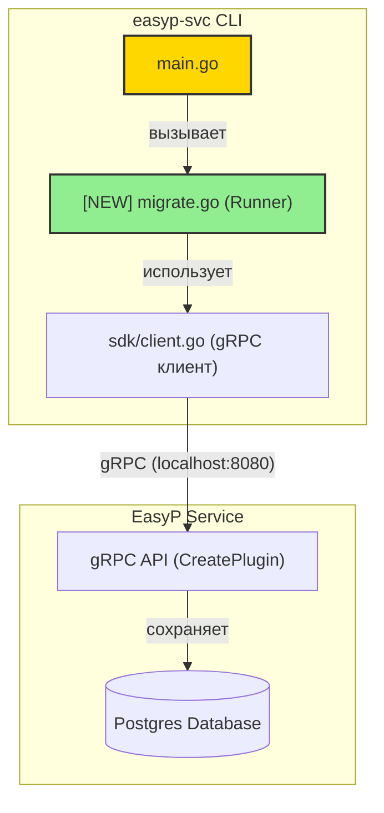

# Проектирование: plugin-migration-cli

**Статус:** Draft
**Автор:** Antigravity
**Дата:** 2026-06-21

## 2.1 Обзор
Необходимо разработать команду `easyp-svc plugins migrate <path>`, которая рекурсивно обходит указанную директорию, находит скомпилированные бинарники плагинов по структуре `{group}/{name}/{version}/plugin` и регистрирует их на сервере EasyP через gRPC API.
Команда поддерживает интерактивный режим (динамические спиннеры, прогресс-бар) и неинтерактивный режим (для CI/CD).

## 2.2 Архитектура

Ниже представлена архитектура взаимодействия компонентов мигратора и сервера:



### Порядок реализации
1. **Реализация парсинга путей и фильтрации** (`migrate.go`): Сканирование директорий и фильтрация плагинов с помощью glob-шаблонов.
2. **Реализация взаимодействия с gRPC** (`migrate.go`): Интеграция с `sdk.Client` для вызова метода `CreatePlugin`.
3. **Реализация интерфейса (UI/UX)**: Разработка динамического TTY-рендерера и плоского текстового вывода для логов.
4. **Интеграция в cli.Command** (`main.go`): Добавление флагов и связывание аргументов с раннером.

---

## 2.3 Компоненты и интерфейсы

### Файлы, требующие изменений

| Файл | Тип изменения | Описание |
|------|-------------|-------------|
| `cmd/easyp-svc/main.go` | `[MODIFIED]` | Добавляет флаги `--addr`, `--filter`, `--non-interactive`, `--plugins-prefix` и подключает вызов функции `runPluginsMigrate`. |
| `cmd/easyp-svc/migrate.go` | `[NEW]` | Реализует логику сканирования директорий, парсинг версий, фильтрацию по glob-шаблонам, интерактивный вывод в консоль и вызовы к gRPC-клиенту. |
| `cmd/easyp-svc/migrate_test.go` | `[NEW]` | Содержит юнит-тесты для проверки парсинга путей, фильтрации и логики миграции плагинов с моками. |

### Файлы, НЕ требующие изменений

| Файл | Причина сохранения без изменений |
|------|---------------------------------|
| `sdk/client.go` | Готовый gRPC-клиент уже предоставляет метод `CreatePlugin`, модификация не требуется. |
| `internal/adapters/registry/registry.go` | Прямого обращения к БД из CLI делать не нужно, так как регистрация идет по gRPC API. |

### Интерфейсы функций
В новом файле `cmd/easyp-svc/migrate.go` будут объявлены следующие основные функции:

```go
// runPluginsMigrate запускает полный процесс миграции плагинов.
// Получает аргументы командной строки и возвращает ошибку в случае критического сбоя.
func runPluginsMigrate(ctx context.Context, path string, addr string, filter string, pluginsPrefix string, nonInteractive bool) error

// parsePluginPath парсит путь к бинарнику плагина и возвращает группу, имя и версию.
// На входе ожидает путь относительно переданной директории, на выходе проверяет структуру
// и возвращает ошибку, если путь некорректен.
func parsePluginPath(basePath string, fullPath string) (group string, name string, version string, err error)

// matchFilter проверяет соответствие плагина glob-фильтру.
func matchFilter(group string, name string, version string, pattern string) bool
```

---

## 2.4 Ключевые решения (ADR)

### Решение: Легковесный динамический интерфейс (Mini-TUI) в консоли
- **Контекст**: Требуется отображать динамический прогресс-бар и спиннеры выполнения при интерактивной работе пользователя, но обеспечивать чистые логи для CI/CD-пайплайнов.
- **Рассмотренные варианты**:
  - Вариант 1: Полноэкранный TUI на базе `bubbletea`.
  - Вариант 2: Динамический вывод поверх текущей строки терминала с использованием `\r` (Carriage Return) и управляющих ANSI-символов.
- **Решение**: Выбран Вариант 2.
- **Обоснование**: Вариант 2 дает отличный визуальный отклик, оставляет отчет в истории терминала (что удобно для скроллинга), имеет нулевой вес (нет внешних зависимостей) и очень прост в интеграции с неинтерактивными пайплайнами (CI/CD).
- **Последствия**: Код отрисовки пишется вручную без затягивания внешних библиотек. Вывод переключается на плоский текст при обнаружении неинтерактивного окружения.

---

## 2.5 Модели данных
В рамках мигратора новые модели данных не создаются. Используются существующие структуры из `sdk` и сгенерированные gRPC protobuf-типы.

---

## 2.6 Свойства корректности (Correctness Properties)

```
Property 1: Absence of Directory Traversal during scanning
Category: Absence
Statement: For all scanned plugin paths, the path must be properly checked and must not allow directory traversal or registration of binaries outside of the scanned root path.
Validates: Requirements REQ-1.2, REQ-1.3

Property 2: Equivalence of parsed plugin metadata
Category: Equivalence
Statement: For all directories containing a file "plugin" and matching "{group}/{name}/{version}/plugin", the parsed group, name, and version must be equal to the corresponding path elements.
Validates: Requirements REQ-1.2, REQ-1.3

Property 3: Propagation of AlreadyExists gRPC responses
Category: Propagation
Statement: For all CreatePlugin gRPC calls returning codes.AlreadyExists, the system must increment the skipped counter and must not abort execution.
Validates: Requirement REQ-3.2

Property 4: Exclusion of filtered plugins
Category: Exclusion
Statement: For all plugins found during scanning, if the plugin name does not match the glob filter, the gRPC registration call must not be executed.
Validates: Requirement REQ-4.1

Property 5: Exclusion of interactive sequences in non-TTY mode
Category: Exclusion
Statement: For all runs where stdout is not a TTY or --non-interactive is true, the console output must not contain carriage returns (\r) or ANSI escape sequences.
Validates: Requirement REQ-5.2
```

---

## 2.7 Обработка ошибок

| Сценарий | Обнаружение | Действие |
|----------|-----------|--------|
| Отсутствует аргумент `<path>` | `len(args) < 1` | Вывод инструкции в stderr, возврат ошибки, завершение с кодом 1. |
| Директория не существует | `os.Stat(path)` возвращает ошибку `os.ErrNotExist` | Вывод понятной ошибки в stderr, завершение с кодом 1. |
| gRPC сервер недоступен | `sdk.NewClient` возвращает ошибку подключения | Вывод ошибки в консоль, прекращение миграции, завершение с кодом 1. |
| Сервер вернул `AlreadyExists` | Ошибка gRPC имеет статус `codes.AlreadyExists` | Плагин регистрируется как «пропущенный» (skipped), выполнение продолжается. |
| Сервер вернул любую другую ошибку | Любой иной статус ошибки gRPC | Ошибка фиксируется в логах, плагин помечается как «ошибка» (failed), выполнение продолжается для следующих плагинов. |

---

## 2.8 Стратегия тестирования

### Test Style Source: Tier 3
- В директории `cmd/easyp-svc/` отсутствуют тестовые файлы.
- Мы будем следовать правилам создания тестов, изложенным в `go-testing` skill (использование табличных тестов, `t.Parallel()`, самописные моки и библиотека `testify`).

**Проектные команды:**
| Действие | Команда |
|----------|---------|
| Test     | `go test ./...` |
| Build    | `go build -o easyp-svc ./cmd/easyp-svc/` |
| Lint     | `golangci-lint run ./...` |

### Юнит-тесты

| Тест | Описание | Теги |
|------|-------------|------|
| `Test_runPluginsMigrate_EmptyPath` | Проверяет, что запуск без пути возвращает ошибку. | `Feature/plugin-migration-cli` |
| `Test_parsePluginPath` | Проверяет корректный разбор путей плагинов и обработку неверных форматов путей. | `Property/2` |
| `Test_matchFilter` | Проверяет фильтрацию плагинов по glob-шаблонам с различными масками (например, `*`, `group/*`, `group/name`). | `Property/4` |
| `Test_migrateExecution_Success` | Проверяет успешную регистрацию плагинов через мок gRPC-клиента. | `Feature/plugin-migration-cli`, `Property/3` |
| `Test_migrateExecution_AlreadyExists` | Проверяет, что при ошибке `AlreadyExists` плагин пропускается и счетчик skipped увеличивается. | `Property/3` |
| `Test_migrateExecution_GrpcError` | Проверяет, что прочие ошибки gRPC инкрементируют счетчик ошибок и не останавливают миграцию. | `Feature/plugin-migration-cli` |
